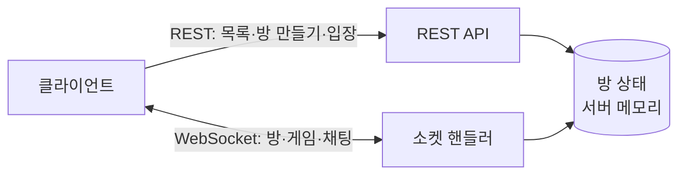
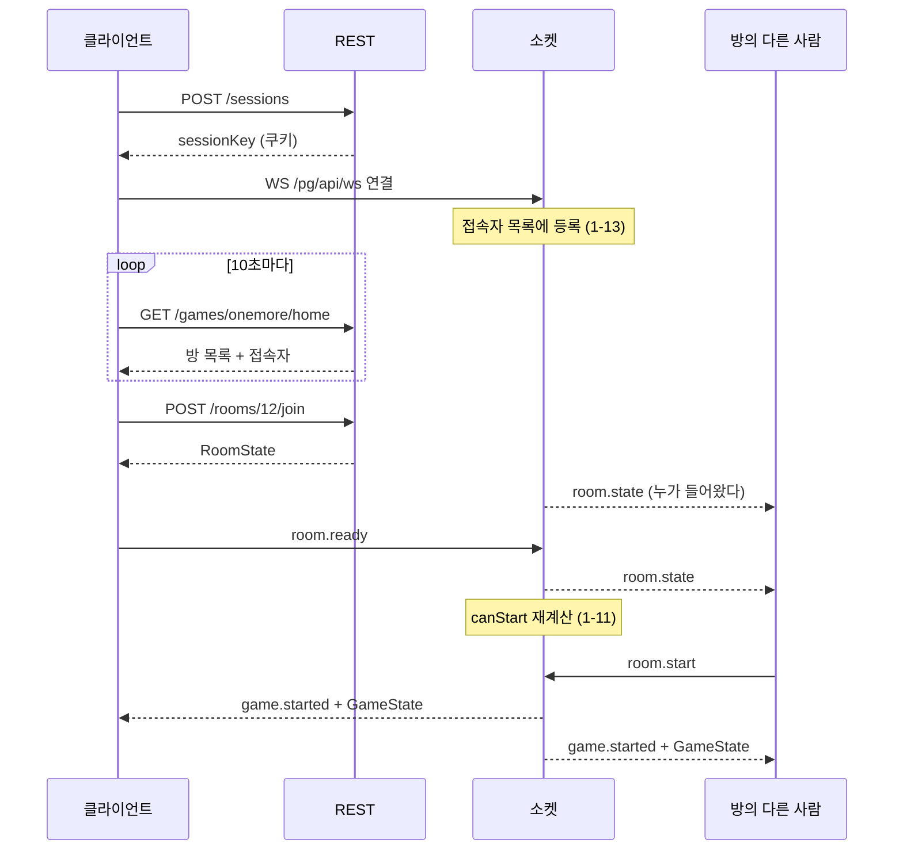
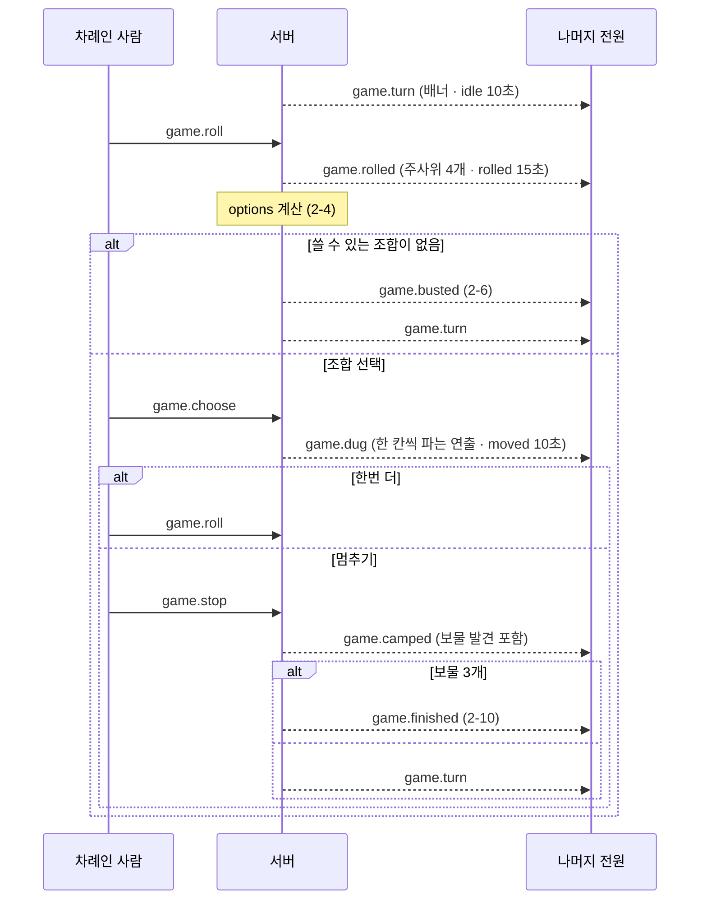

# 놀이터(playground) — API 명세서

2026-09-25 · [기능 명세서 v2](../planning/planning.md) · [ERD](../erd/erd.md) 기준

## 1. 개요

이 문서는 클라이언트와 서버가 주고받는 것을 정의한다. 각 항목에 붙은 `1-11`, `2-9` 같은 번호는 기능 명세서의 항목 번호이고, 세 문서가 같은 번호로 이어진다.

### 통신을 둘로 나눈다

| 방식 | 쓰는 곳 | 이유 |
| --- | --- | --- |
| **REST** | 놀이터 게임 목록, 방 목록·접속자 폴링, 방 만들기·입장 | 단발성 질의·응답이고, 실패 사유를 HTTP 상태로 돌려주기 좋다 |
| **WebSocket** (원시, STOMP 아님) | 대기실·게임 안의 모든 것, 채팅 | 남이 한 행동이 내 화면에 즉시 반영돼야 한다 (5-1) |

소켓은 **앱에 들어오자마자 연결해 끝까지 유지한다.** 방에 들어갈 때 여는 게 아니다. 접속자 목록(1-13)과 끊김 감지(5-2)가 이 연결 하나에 달려 있기 때문이다. 소켓이 끊기면 그 사람은 접속자 목록에서 사라지고, 방에 있었다면 방에서도 나간다.

> **방 목록은 소켓이 열려 있어도 REST로 폴링한다.** 소켓이 있으니 푸시하고 싶어지지만, 명세에서 폴링으로 정했다(M-4). 홈에 있는 사람 전원에게 방 목록 변경을 푸시하면 방이 하나 생길 때마다 접속자 전원에게 브로드캐스트가 나간다. 10초 폴링이 더 싸고 단순하다.



### 판정은 전부 서버가 한다

클라이언트가 보낸 값은 믿지 않는다. 특히 아래 셋은 **클라이언트가 계산해서 보내면 안 된다.**

| 항목 | 이유 |
| --- | --- |
| 주사위 값 | 조작하면 게임이 성립하지 않는다 (2-3) |
| 가능한 조합 | "쓸 수 있는 만큼 많이 쓴다"는 최대 사용 규칙(2-4)을 클라이언트가 다시 구현하면 두 벌이 어긋난다. 서버가 계산해 `options`로 내려준다 |
| 시작 가능 여부 | 팀 인원 조건(1-11)도 마찬가지다. 서버가 `canStart`와 막힌 이유를 내려준다 |

클라이언트는 **조합을 고를 때 합이 아니라 서버가 준 목록의 인덱스를 보낸다.** 임의의 숫자를 보낼 수 없게 된다.

---

## 2. 공통 규약

### Base URL

```
https://playground.app/pg/api
```

이 문서의 모든 경로는 이 주소 뒤에 붙는다. 예를 들어 `POST /sessions`는 실제로 `POST https://playground.app/pg/api/sessions`다.

> 도메인은 아직 정해지지 않았다. 로컬 개발은 `http://localhost:8080/pg/api`를 쓴다.
>
> **버전 경로(`/v1`)는 두지 않는다.** 클라이언트와 서버를 같이 배포하는 단일 서비스라 구버전 클라이언트를 따로 받칠 일이 없다. 나중에 필요해지면 `/pg/api` 뒤가 아니라 앞에 붙인다(`/pg/v2/api`).

WebSocket은 같은 접두사 아래 `/ws`로 연결한다.

```
wss://playground.app/pg/api/ws
```

### 인증

**로그인이 없다.** 계정도 토큰도 없고, 대신 **세션 쿠키**로 신원을 확인한다.

```
Cookie: sessionKey=s_9f3a…
```

| 항목 | 값 |
| --- | --- |
| 발급 | `POST /sessions` |
| 수명 | 소켓 연결이 끊어질 때까지. 갱신(refresh) 개념이 없다 |
| 쿠키 속성 | `HttpOnly`, `Secure`, `SameSite=Lax`, `Path=/pg/api` |

`Auth Required: Yes`인 엔드포인트는 이 쿠키가 있어야 한다. 이 문서에서 "Auth"는 **세션 쿠키 유무**를 뜻하며, 권한 등급은 없다.

> 토큰을 쓰지 않는 이유: 보호할 계정이 없다. 세션 쿠키는 "지금 이 브라우저가 누구인지"만 알면 되고, 훔쳐도 얻을 수 있는 것이 남의 닉네임으로 방에 들어가는 정도다. 여기에 액세스·리프레시 토큰 쌍을 두는 것은 지키는 것 없이 복잡도만 늘린다.

### 응답 형식

**성공**

```json
{ "success": true, "data": { } }
```

**실패**

```json
{
  "success": false,
  "error": {
    "code":    "ROOM_FULL",
    "message": "정원이 가득 찼습니다"
  }
}
```

- 본문이 없는 성공 응답은 `204 No Content`로 반환합니다.
- 무언가를 생성하는 성공 응답은 `201 CREATED`로 반환합니다.
- 모든 본문은 `application/json; charset=utf-8`입니다.
- 시각은 **ISO-8601 UTC** 문자열(`2026-09-25T10:03:14Z`), 식별자는 숫자입니다.

`error.message`는 **화면에 그대로 띄울 수 있는 한국어**다. 클라이언트가 코드별 문구를 따로 갖고 있지 않아도 되고, 팀 인원처럼 상황마다 달라지는 안내(1-11)를 서버가 만들어 보낼 수 있다.

### 공통 에러

아래 에러는 모든 엔드포인트에서 공통으로 발생할 수 있어, 개별 명세에서는 생략합니다.

| Status | code | 설명 |
| --- | --- | --- |
| `400` | `INVALID_REQUEST` | 요청 형식 오류(JSON 파싱 실패 등) |
| `400` | `VALIDATION_ERROR` | 필드 값이 제약을 벗어남 |
| `401` | `SESSION_REQUIRED` | 세션 쿠키 없음 |
| `401` | `SESSION_INVALID` | 세션이 서버에 없음(소켓이 끊겨 정리됨) |
| `429` | `TOO_MANY_REQUESTS` | 요청 한도 초과 |
| `500` | `INTERNAL_ERROR` | 서버 내부 오류 |

---

## 3. REST API

| 번호 | 메서드 | 경로 | Auth | 설명 |
| --- | --- | --- | --- | --- |
| 0-7 | `POST` | `/sessions` | No | 프로필 등록 · 세션 발급 |
| 0-7 | `PATCH` | `/sessions/me` | Yes | 이름·아바타 변경 |
| 0-6 | `GET` | `/games` | No | 놀이터 게임 목록 |
| 1-2, 1-13 | `GET` | `/games/{gameCode}/home` | Yes | 방 목록 + 접속자 (10초 폴링) |
| 1-1 | `POST` | `/games/{gameCode}/rooms` | Yes | 방 만들기 |
| 1-2, 1-3 | `POST` | `/rooms/{roomId}/join` | Yes | 방 입장 |

---

### POST /sessions

> 앱에 처음 들어왔을 때 프로필을 등록하고 세션을 발급받습니다. 로그인이 없으므로 이것이 신원 등록을 대신합니다. (0-7)

**Auth Required:** No

**Request:**

```json
{ "nickname": "두더지4821", "avatar": "⛏" }
```

| 필드 | 타입 | 필수 | 설명 |
| --- | --- | --- | --- |
| nickname | string(1~20) | ✓ | 브라우저가 만든 이름. **중복을 막지 않습니다** (M-8) |
| avatar | string | ✓ | 이모지 한 글자 |

**Response `201`:**

```json
{
  "success": true,
  "data": {
    "sessionKey": "s_9f3a…",
    "nickname":   "두더지4821",
    "avatar":     "⛏"
  }
}
```

`sessionKey`는 응답 본문과 **`Set-Cookie` 헤더 양쪽으로** 내려준다. 이후 REST 요청과 소켓 핸드셰이크가 이 쿠키로 신원을 확인한다.

이 시점에는 아직 "접속 중"이 아니다. **소켓이 연결돼야 접속자 목록(1-13)에 뜬다.**

---

### PATCH /sessions/me

> 내 이름이나 아바타를 바꿉니다. 바꿀 필드만 보냅니다. (0-7)

**Auth Required:** Yes

**Request:**

```json
{ "nickname": "곡괭이1007" }
```

| 필드 | 타입 | 필수 | 설명 |
| --- | --- | --- | --- |
| nickname | string(1~20) |  | 생략하면 그대로 |
| avatar | string |  | 생략하면 그대로 |

**Response `200`:**

```json
{
  "success": true,
  "data": {
    "sessionKey": "s_9f3a…",
    "nickname":   "곡괭이1007",
    "avatar":     "⛏"
  }
}
```

방 안에 있는 동안 바꿔도 **그 방의 표시 이름은 그대로다.** 참여자 이름은 입장 시점 스냅샷이기 때문이다 ([ERD의 `room_players`](../erd/omt.md#room_players-방-참여자-1-4)). 접속자 목록(1-13)에는 즉시 반영된다.

---

### GET /games

> 놀이터 첫 화면의 게임 카드 목록을 조회합니다. (0-6)

**Auth Required:** No

**Response `200`:**

```json
{
  "success": true,
  "data": {
    "games": [
      {
        "code":          "onemore",
        "name":          "한번더",
        "nameEn":        "OneMoreTime",
        "description":   "주사위 4개로 11개의 갱도를 파내려가…",
        "thumbnailUrl":  "https://cdn.playground.app/games/omt-thumb.webp",
        "minPlayers":    2,
        "maxPlayers":    6,
        "playMinutes":   "15~20분",
        "playable":      true,
        "tags":          ["주사위", "운과 배짱", "쉬운 규칙"]
      },
      {
        "code":          "game2",
        "name":          "게임 2",
        "nameEn":        "Coming Soon",
        "description":   "다음 게임을 준비하고 있습니다",
        "thumbnailUrl":  "https://cdn.playground.app/games/coming-soon.webp",
        "minPlayers":    0,
        "maxPlayers":    0,
        "playMinutes":   null,
        "playable":      false,
        "tags":          []
      }
    ]
  }
}
```

정렬된 순서로 내려준다. 클라이언트는 받은 순서대로 카드를 배치한다. `playable: false`면 "준비 중" 배지와 비활성 버튼.

---

### GET /games/{gameCode}/home

> 한번더 홈 화면의 방 목록과 접속자 목록을 한 번에 조회합니다. 홈에 머무는 동안 10초마다 호출합니다. (1-2, 1-13, M-9)

**Auth Required:** Yes

**Query Parameters:**

| 이름 | 타입 | 기본 | 설명 |
| --- | --- | --- | --- |
| page | int | 0 | 0부터. 한 페이지 6개 고정 (1-14) |

**Response `200`:**

```json
{
  "success": true,
  "data": {
    "rooms": {
      "page":       0,
      "totalPages": 3,
      "items": [
        {
          "roomId":       12,
          "title":        "초보 환영",
          "hostNickname": "두더지4821",
          "mode":         "team",
          "maxPlayers":   6,
          "playerCount":  4,
          "secret":       true,
          "status":       "waiting"
        }
      ]
    },
    "online": {
      "total": 17,
      "items": [
        { "nickname": "두더지4821", "avatar": "⛏", "status": "idle",    "me": true  },
        { "nickname": "곡괭이",     "avatar": "💎", "status": "playing", "me": false }
      ]
    }
  }
}
```

| 필드 | 설명 |
| --- | --- |
| rooms.items[].status | `waiting`(대기 중) / `full`(정원 초과) / `playing`(게임 중). **`waiting`만 입장 가능** |
| online.items | **놀이터 전체 접속자.** 이 게임 참여자만이 아니다 (M-5) |
| online.items[].me | 본인 표시. 맨 위에 고정해 보여준다 |

- `full`은 저장된 값이 아니라 `playerCount >= maxPlayers`로 서버가 계산해 내려준다
- `page`가 범위를 넘으면 **마지막 페이지를 돌려준다.** 폴링 중 방이 줄어도 오류가 나지 않게 하기 위해서다 (1-14)
- 비밀번호는 어떤 형태로도 내려주지 않는다. `secret: true`로 자물쇠 표시만 한다

**Errors:**

| Status | code | 설명 |
| --- | --- | --- |
| `404` | `GAME_NOT_FOUND` | 없는 게임 코드 |

**두 목록을 한 요청으로 합친 이유** — 주기가 같은데 요청을 나누면 10초마다 왕복이 두 번이 되고, 두 목록이 서로 다른 시점을 보여줄 수 있다.

---

### POST /games/{gameCode}/rooms

> 새 게임방을 만들고 방장이 되어 입장합니다. (1-1)

**Auth Required:** Yes

**Request:**

```json
{
  "title":      "초보 환영",
  "mode":       "team",
  "maxPlayers": 6,
  "secret":     true,
  "password":   "1234"
}
```

| 필드 | 타입 | 필수 | 설명 |
| --- | --- | --- | --- |
| title | string(1~30) | ✓ | 방 제목 |
| mode | `solo` \| `team` | ✓ | 게임 모드 |
| maxPlayers | int | ✓ | 개인전 `2~6`, **팀전 `2·4·6·8`만** |
| secret | boolean | ✓ | 비밀방 여부 |
| password | string(1~20) | `secret`이면 ✓ | 서버가 해시해 보관합니다 |

**Response `201`:** [`RoomState`](#roomstate)

```json
{
  "success": true,
  "data": { "roomId": 12, "title": "초보 환영", "…": "RoomState 전체" }
}
```

만든 사람이 방장이 되고 곧바로 참여자로 들어간다. 응답 직후 서버가 그 세션에 소켓으로 `room.state`를 한 번 더 보낸다. **REST 응답과 소켓 스냅샷이 같은 모양**이라 클라이언트는 한 경로로만 렌더링하면 된다.

**Errors:**

| Status | code | 설명 |
| --- | --- | --- |
| `400` | `TITLE_REQUIRED` | 제목이 비었음 |
| `400` | `PASSWORD_REQUIRED` | 비밀방인데 비밀번호가 비었음 |
| `400` | `INVALID_MAX_PLAYERS` | 모드에 맞지 않는 정원 |
| `404` | `GAME_NOT_FOUND` | 없는 게임 코드 |
| `409` | `ALREADY_IN_ROOM` | 이미 다른 방에 있음 |

---

### POST /rooms/{roomId}/join

> 열려 있는 방에 입장합니다. 비밀방이면 비밀번호를 함께 보냅니다. (1-2, 1-3)

**Auth Required:** Yes

**Request:**

```json
{ "password": "1234" }
```

| 필드 | 타입 | 필수 | 설명 |
| --- | --- | --- | --- |
| password | string | 비밀방이면 ✓ | 일반 방이면 생략 |

**Response `200`:** [`RoomState`](#roomstate)

입장에 성공하면 **방 안의 다른 사람들에게 소켓으로 `room.state`가 나간다.** 색(1-7)은 남은 색 중 하나가 자동 배정되고, 팀전이면 팀 자리도 자동 배정된다 (1-6).

**Errors:**

| Status | code | 설명 | 클라이언트 처리 |
| --- | --- | --- | --- |
| `401` | `PASSWORD_MISMATCH` | 비밀번호가 틀림 | **모달을 유지**하고 입력칸만 비웁니다 (1-3) |
| `404` | `ROOM_NOT_FOUND` | 방이 사라짐 | 목록을 새로 불러옵니다 |
| `409` | `ROOM_FULL` | 정원이 가득 참 | 거절 안내 |
| `409` | `ROOM_PLAYING` | 이미 게임 중 | 거절 안내 |
| `409` | `ALREADY_IN_ROOM` | 이미 다른 방에 있음 | — |

> 비밀번호가 틀렸을 때 **몇 번 틀렸는지 세지 않는다.** 방 비밀번호는 계정 비밀번호가 아니고, 잠그면 방장이 손쓸 방법이 없다. 대신 공통 에러의 `TOO_MANY_REQUESTS`로 초당 시도 횟수만 제한한다.

---

## 4. WebSocket

**STOMP를 쓰지 않는다.** Spring의 원시 WebSocket(`TextWebSocketHandler`) 위에 아래 JSON 봉투를 직접 얹는다. 이유는 [부록 C](#부록-c-구현-전-확인할-것)에 적었다.

### 연결

```
GET wss://playground.app/pg/api/ws
Cookie: sessionKey=s_9f3a…
```

**Auth Required:** Yes

| 상황 | 동작 |
| --- | --- |
| 세션 쿠키 없음·무효 | `4401`로 닫는다 |
| 연결 성공 | **접속자 목록(1-13)에 등록**된다 |
| 연결 끊김 | 접속자에서 제거하고, 방에 있었다면 방에서도 내보낸다 (5-2) |

쿠키는 `HandshakeInterceptor`에서 읽어 세션 속성에 담는다. 핸드셰이크 이후에는 HTTP 요청이 없으므로, **이 시점에 신원을 확정해 두지 않으면 이후에 알 방법이 없다.**

> 하트비트는 30초 간격 ping/pong으로 둔다. 브라우저 탭이 백그라운드로 가도 소켓은 유지되지만, 프록시가 유휴 연결을 끊는 경우가 있다.

### 방 전파

서버는 **방마다 세션 집합을 직접 들고 있다가** 그 방 사람들에게만 보낸다.

```java
Map<Long, Set<WebSocketSession>> roomSessions   // ConcurrentHashMap
```

브로커가 없으므로 **구독이라는 개념이 없고, 따라서 남의 방을 구독해 엿볼 방법도 없다.** 서버가 등록한 세션에만 쓴다.

#### 같은 세션에 두 스레드가 동시에 쓰지 않게 할 것

`WebSocketSession.sendMessage()`는 **스레드 안전하지 않다.** 이 서비스에서는 반드시 겹친다.

제한 시간이 끝나 **타이머 스레드**가 자동 멈추기를 보내는 순간, 마침 같은 사람이 보낸 명령을 **요청 스레드**가 처리하고 있을 수 있다. 두 스레드가 한 세션에 겹쳐 쓰면 프레임이 섞여 깨진다.

세션을 등록할 때 감싸 둔다.

```java
new ConcurrentWebSocketSessionDecorator(session, SEND_TIME_LIMIT_MS, BUFFER_SIZE_LIMIT)
```

전송이 직렬화되고, 느린 클라이언트 하나가 서버를 붙잡는 것도 버퍼 한도로 끊어준다. **원시 WebSocket을 쓸 때 가장 빠뜨리기 쉬운 부분이다.**

### 메시지 봉투

REST의 `success`/`data` 봉투는 쓰지 않는다. 소켓은 요청·응답이 아니라 **이름 붙은 사건의 흐름**이라, `type`으로 갈라지는 편이 다루기 쉽다.

**클라이언트 → 서버**

```json
{ "type": "game.roll", "payload": { } }
```

**서버 → 클라이언트** — 두 필드가 더 붙는다

```json
{ "type": "game.rolled", "seq": 118, "at": "2026-09-25T10:03:14Z", "payload": { } }
```

| 필드 | 설명 |
| --- | --- |
| seq | 방 단위로 1씩 증가. 순서가 뒤집히거나 중복된 메시지를 걸러낸다 |
| at | 서버 시각. 클라이언트 시계가 틀려도 타이머를 맞출 수 있다 |

오류는 `error` 타입으로 오고, **본문은 REST의 `error` 객체와 같은 모양**이다.

```json
{ "type": "error", "seq": 119, "at": "…",
  "payload": { "code": "NOT_YOUR_TURN", "message": "지금은 내 차례가 아닙니다" } }
```

---

### 클라이언트 → 서버

| 번호 | type | payload | 설명 |
| --- | --- | --- | --- |
| 1-5 | `room.mode` | `{ "mode": "team" }` | 게임 모드 변경 (방장만) |
| 1-6, 1-7 | `room.seat` | `{ "color": "red" }` 또는 `{ "team": "A", "seat": 0 }` | 개인전은 색, 팀전은 팀 자리 |
| 1-8 | `room.ready` | `{ "ready": true }` | 준비 토글 |
| 1-9 | `room.kick` | `{ "playerId": 43 }` | 내보내기 (방장만) |
| 1-11 | `room.start` | `{}` | 게임 시작 (방장만) |
| 1-12 | `room.leave` | `{}` | 방 나가기 |
| 0-8 | `chat.send` | `{ "body": "안녕하세요~" }` | 채팅 (최대 60자). **보낸 사람은 담지 않는다** — 서버가 세션으로 안다 |
| 2-3 | `game.roll` | `{}` | 주사위 굴리기 |
| 2-4 | `game.choose` | `{ "optionIndex": 1, "playIndex": 0 }` | 조합 선택 |
| 2-8 | `game.stop` | `{}` | 멈추기 |

모든 명령은 서버가 **보낸 사람과 현재 단계를 확인한 뒤** 처리한다. 내 차례가 아닌데 `game.roll`을 보내면 `error`로 거절한다.

### 서버 → 클라이언트

| 번호 | type | 언제 | payload |
| --- | --- | --- | --- |
| 1-4 | `room.state` | 입장·퇴장·설정 변경 때마다 | [`RoomState`](#roomstate) |
| 0-8 | `chat.message` | 채팅이 올 때 | [`ChatMessage`](#chatmessage) 한 건. 목록과 말풍선(0-8)을 이걸로 그린다 |
| 1-11 | `game.started` | 시작 직후 | `{ "state": GameState }` |
| 2-3 | `game.rolled` | 주사위가 정해졌을 때 | `{ "dice": [3,4,5,6], "state": GameState }` |
| 2-4, 2-5 | `game.dug` | 조합을 골랐을 때 | `{ "steps": [7, 11], "state": GameState }` |
| 2-6 | `game.busted` | 붕괴 | `{ "state": GameState }` |
| 2-8, 2-9 | `game.camped` | 멈추기 | `{ "claimed": [4], "state": GameState }` |
| 2-2 | `game.turn` | 차례가 넘어갈 때 | `{ "state": GameState }` |
| 2-10 | `game.finished` | 승자가 나왔을 때 | `{ "winnerSideId": 2, "state": GameState }` |
| 5-2 | `player.left` | 누가 나가거나 끊겼을 때 | `{ "playerId": 43, "reason": "disconnected" }` |
| — | `error` | 명령이 거절됐을 때 | `{ "code": "…", "message": "…" }` · **보낸 사람에게만** |

#### 왜 이벤트마다 전체 상태를 같이 보내는가

`game.dug`에 "7번 갱도가 한 칸 내려갔다"만 보내면 클라이언트가 상태를 직접 누적해야 하고, 메시지를 하나라도 놓치면 그때부터 화면이 어긋난다. 어긋난 걸 알아챌 방법도 없다.

전체 상태를 같이 보내면 **클라이언트는 받은 걸 그대로 그리면 된다.** 어긋날 수가 없다. 상태는 참여자 8명 기준 몇 KB 수준이라 한 판에 수백 번 보내도 부담이 안 된다.

그러면 `steps`나 `dice` 같은 필드는 왜 따로 있나. **연출 때문이다.** 상태만 보면 "결과가 이렇다"는 알지만 "무슨 일이 있었나"는 모른다. 주사위 굴러가는 애니메이션, 한 칸씩 파고 내려가는 연출(2-5)이 이 필드를 쓴다.

> 나중에 최적화가 필요해지면 델타로 바꾸되, **재동기화용 스냅샷 경로는 남겨야 한다.**

---

## 5. 데이터 모양

### RoomState

대기실 화면 하나를 그리는 데 필요한 전부다. `POST /rooms/{id}/join`의 `data`이자 소켓 `room.state`의 `payload`다.

```json
{
  "roomId":     12,
  "gameCode":   "onemore",
  "title":      "초보 환영",
  "mode":       "team",
  "maxPlayers": 6,
  "secret":     true,
  "status":     "waiting",
  "meId":       41,
  "players": [
    {
      "id":       41,
      "nickname": "두더지4821",
      "avatar":   "⛏",
      "color":    "red",
      "team":     "A",
      "seat":     0,
      "host":     true,
      "ready":    true
    }
  ],
  "canStart":         false,
  "startBlockReason": "팀마다 인원이 같아야 합니다 (빨강 팀 2명 · 파랑 팀 1명)",
  "chat": [
    {
      "id":       301,
      "playerId": 42,
      "nickname": "곡괭이",
      "avatar":   "💎",
      "color":    "blue",
      "body":     "안녕하세요~",
      "at":       "2026-09-25T10:01:02Z"
    }
  ]
}
```

| 필드 | 설명 |
| --- | --- |
| meId | 받는 사람 자신의 `playerId`. 클라이언트가 "나"를 찾으려고 닉네임을 비교하지 않아도 된다 (중복 허용이라 비교하면 틀린다) |
| players | 방장이 먼저 오도록 정렬해 보낸다 (1-4) |
| canStart | 시작 조건(1-11) 판정 결과. 방장 화면의 버튼 활성/비활성에 그대로 쓴다 |
| startBlockReason | 막힌 이유. **어느 팀이 몇 명인지까지** 담는다. 버튼 툴팁과 토스트에 그대로 띄운다 |
| chat | 입장 시점까지의 **전체 대화**. 원소는 [`ChatMessage`](#chatmessage)이고, 개수 제한이 없다 (M-6) |

> `canStart`를 서버가 내려주는 이유: 팀 인원 규칙(1-11)을 클라이언트가 다시 구현하면 두 벌이 생기고, 한쪽만 고치면 버튼은 눌리는데 서버가 거절하는 상태가 된다.
>
> `chat`을 스냅샷에 통째로 싣는 것은 대화가 길어지면 무거워진다. 지금은 한 방의 수명이 짧아 문제가 없지만, 길어지면 최근 N건만 싣고 `GET /rooms/{id}/chat?before=`로 과거를 따로 가져오는 방식으로 바꾼다.

---

### ChatMessage

채팅 한 건. 소켓 `chat.message`의 `payload`이자 [`RoomState`](#roomstate)`.chat[]`의 원소다. **같은 모양이라 클라이언트는 새 채팅과 과거 기록을 같은 코드로 그린다.**

```json
{
  "id":       301,
  "playerId": 42,
  "nickname": "곡괭이",
  "avatar":   "💎",
  "color":    "blue",
  "body":     "안녕하세요~",
  "at":       "2026-09-25T10:01:02Z"
}
```

| 필드 | 타입 | 설명 |
| --- | --- | --- |
| id | number | 방 안에서 증가하는 번호. 정렬 키이자 중복 방지용 |
| playerId | number | **보낸 사람.** `RoomState.players[].id`와 같은 값 |
| nickname | string | 보낸 시점 이름 스냅샷 |
| avatar | string | 보낸 시점 아바타 스냅샷 |
| color | string | 말풍선·프로필에 쓸 색 |
| body | string(1~60) | 본문 |
| at | string | 보낸 시각 |

#### 보낸 사람을 왜 이렇게 싣는가

`chat.send`에는 보낸 사람이 없다. **서버가 세션으로 알기 때문**이고, 클라이언트가 보내게 두면 남의 이름을 사칭할 수 있다. 대신 브로드캐스트되는 `chat.message`에는 받는 쪽이 필요한 것이 다 들어 있어야 한다.

| 화면 | 쓰는 필드 |
| --- | --- |
| 내 글은 오른쪽, 남의 글은 왼쪽 (0-8) | `playerId`를 `RoomState.meId`와 비교 |
| 남의 글 옆 아바타·이름 | `avatar`, `nickname` |
| 캐릭터 위 말풍선 (0-8) | `playerId`로 대기실의 어느 캐릭터인지 찾는다 |
| 말풍선·프로필 색 | `color` |

**닉네임으로 "나"를 판별하면 안 된다.** 이름 중복을 허용하므로(M-8) 같은 이름이 둘이면 남의 글이 내 글로 보인다. 반드시 `playerId`로 비교한다.

이름·아바타를 매번 싣는 것은 중복처럼 보이지만, **보낸 사람이 방을 나간 뒤에도 그 글이 온전히 보이게** 하기 위해서다. `playerId`로 참여자 목록을 조회하는 방식이면 나간 사람의 글이 "알 수 없음"이 된다. 같은 이유로 ERD의 `chat_messages`도 값을 복사해 둔다.

---

### GameState

게임 화면 하나를 그리는 데 필요한 전부다. 모든 `game.*` 이벤트의 `payload.state`로 실려 온다.

```json
{
  "roundId":          7,
  "phase":            "rolled",
  "phaseDeadlineAt":  "2026-09-25T10:03:29Z",
  "turn":             { "no": 2, "playerId": 43, "sideId": 2 },
  "dice":             [3, 4, 5, 6],
  "options": [
    { "a": 7, "b": 11, "faces": [[3,4],[5,6]], "plays": [[7,11]] },
    { "a": 8, "b": 10, "faces": [[3,5],[4,6]], "plays": [[8]] },
    { "a": 9, "b": 9,  "faces": [[3,6],[4,5]], "plays": [] }
  ],
  "sides": [
    {
      "id":        1,
      "no":        0,
      "label":     "빨강 팀",
      "color":     "red",
      "team":      "A",
      "memberIds": [41, 42],
      "treasures": 1,
      "busts":     2,
      "maxStreak": 4
    }
  ],
  "camps":        [ { "sideId": 1, "shaft": 7, "depth": 5 } ],
  "claims":       [ { "shaft": 4, "sideId": 2 } ],
  "runners":      [ { "shaft": 7, "depth": 6 } ],
  "winnerSideId": null
}
```

| 필드 | 설명 |
| --- | --- |
| phase | `idle` `rolling` `rolled` `digging` `moved` `bust` `wait` ([ERD 부록 B](../erd/omt.md#부록-b-phase-값)) |
| phaseDeadlineAt | 이 단계가 끝나는 **시각**. 남은 초가 아니다. 제한 없는 단계는 `null` |
| turn | 지금 차례인 사람과 사이드. `playerId == meId`일 때만 조작 버튼을 보여준다 (5-1) |
| dice | 마지막으로 굴린 4개. 굴리기 전이면 `null` |
| options | 2+2로 나누는 **3가지**. 서버가 계산해 내려준다 |
| options[].plays | 그 조합에서 실제로 팔 수 있는 합. 비었으면 못 쓰는 조합 |
| options[].faces | 주사위 눈 모양으로 표시하기 위한 원본 값 |
| sides | 참여자 칩(2-2)과 결과 통계(3-2)가 이걸 쓴다 |
| runners | 이번 턴의 탐험가. **최대 3개** (2-5) |

#### plays를 서버가 계산하는 이유

최대 사용 규칙(2-4)은 눈에 보이는 것보다 까다롭다. 둘 다 쓸 수 있으면 둘 다 써야 하고, 하나만 되면 그 하나를 쓰며, 쓰는 순서에 따라 결과가 갈릴 때만 고르게 해야 한다. 이걸 클라이언트가 다시 구현하면 반드시 어긋난다.

`plays`의 길이가 UI를 결정한다.

| plays | 화면 |
| --- | --- |
| `[]` | 못 쓰는 조합. 흐리게 |
| `[[7, 11]]` | 줄 전체가 버튼 하나. 누르면 둘 다 판다 |
| `[[7], [11]]` | 둘 중 하나만 쓸 수 있는데 어느 쪽인지 고를 수 있다. 반쪽씩 나눠 그린다 |

`game.choose`가 합이 아니라 `optionIndex`/`playIndex`를 보내는 이유도 같다. **서버가 방금 내려준 목록 안에서만 고를 수 있다.**

#### 타이머를 그리는 법 (5-3)

서버는 `phaseDeadlineAt`만 준다. 남은 초를 매초 보내지 않는다.

```
남은 시간 = phaseDeadlineAt - (서버 시각 기준 지금)
```

서버 시각은 메시지의 `at`으로 보정한다. `phaseDeadlineAt`이 `null`이면 제한 없는 단계이므로 막대를 그 자리에 멈춘다.

시간이 지나면 **서버가 알아서 처리하고 결과 이벤트를 보낸다.** 클라이언트는 자기 타이머가 0이 됐다고 아무것도 하지 않는다. 각자 시계가 조금씩 달라도 판정은 서버 하나뿐이다.

| 단계 | 초과하면 서버가 |
| --- | --- |
| `idle`, `moved` | 자동 멈추기 → `game.camped` |
| `rolled` | 첫 번째 가능한 조합 선택 → `game.dug` |

---

## 6. 주요 흐름

### 방에 들어가 게임을 시작하기까지



### 한 턴



---

## 7. 부록

### 부록 A: 에러 코드 모음

공통 에러는 [2장](#공통-에러)에 있다. 아래는 개별 엔드포인트·소켓 명령에서만 나는 것들이다.

| Status | code | 문구 | 나는 곳 |
| --- | --- | --- | --- |
| `400` | `TITLE_REQUIRED` | 방 제목을 입력해 주세요 | 방 만들기 |
| `400` | `PASSWORD_REQUIRED` | 비밀번호를 입력해 주세요 | 방 만들기 |
| `400` | `INVALID_MAX_PLAYERS` | 팀전 정원은 2·4·6·8명입니다 | 방 만들기 |
| `400` | `INVALID_OPTION` | 고를 수 없는 조합입니다 | `game.choose` |
| `401` | `PASSWORD_MISMATCH` | 비밀번호가 맞지 않습니다 | 방 입장 |
| `403` | `NOT_HOST` | 방장만 할 수 있습니다 | `room.mode` `room.kick` `room.start` |
| `403` | `NOT_YOUR_TURN` | 지금은 내 차례가 아닙니다 | `game.roll` `game.choose` `game.stop` |
| `404` | `GAME_NOT_FOUND` | 없는 게임입니다 | 홈 조회, 방 만들기 |
| `404` | `ROOM_NOT_FOUND` | 방이 사라졌습니다 | 방 입장 |
| `409` | `ROOM_FULL` | 정원이 가득 찼습니다 | 방 입장 |
| `409` | `ROOM_PLAYING` | 이미 게임이 진행 중인 방입니다 | 방 입장 |
| `409` | `ALREADY_IN_ROOM` | 이미 다른 방에 있습니다 | 방 만들기, 방 입장 |
| `409` | `NOT_READY` | 전원이 준비해야 시작할 수 있습니다 | `room.start` |
| `409` | `TEAM_SIZE_MISMATCH` | 팀마다 인원이 같아야 합니다 (빨강 팀 2명 · 파랑 팀 1명) | `room.start` |
| `409` | `PLAYER_COUNT` | 개인전은 2명부터 시작할 수 있습니다 | `room.start` |
| `409` | `SEAT_TAKEN` | 다른 참여자가 쓰는 색입니다 | `room.seat` |
| `409` | `WRONG_PHASE` | 지금 할 수 없는 동작입니다 | 모든 `game.*` |

소켓에는 HTTP 상태가 없지만, **코드를 REST와 공유**하고 표의 Status는 같은 상황을 REST로 표현하면 무엇인지 적어 둔 것이다. 클라이언트가 처리 분기를 한 벌로 쓸 수 있다.

### 부록 B: 명세 번호 ↔ API 대응

| 번호 | 기능 | API |
| --- | --- | --- |
| 0-6 | 놀이터 게임 선택 | `GET /games` |
| 0-7 | 내 프로필 | `POST /sessions`, `PATCH /sessions/me` |
| 0-8 | 채팅 | `chat.send` → `chat.message` |
| 1-1 | 방 만들기 | `POST /games/{code}/rooms` |
| 1-2 | 방 목록 | `GET /games/{code}/home` |
| 1-3 | 비밀방 입장 | `POST /rooms/{id}/join` |
| 1-4 | 참여자 목록 | `room.state` |
| 1-5 | 게임 모드 | `room.mode` |
| 1-6, 1-7 | 팀·색 선택 | `room.seat` |
| 1-8 | 준비 | `room.ready` |
| 1-9 | 내보내기 | `room.kick` |
| 1-10 | 턴 순서 | `game.started`의 `GameState` |
| 1-11 | 게임 시작 | `room.start`, `RoomState.canStart` |
| 1-12 | 방 나가기 | `room.leave` |
| 1-13 | 접속자 목록 | `GET /games/{code}/home` |
| 1-14 | 페이지 이동 | `?page=` |
| 2-1 | 보드 | `GameState.camps/claims/runners` |
| 2-2 | 현재 차례 | `GameState.turn`, `game.turn` |
| 2-3 | 주사위 | `game.roll` → `game.rolled` |
| 2-4 | 조합 선택 | `game.choose`, `GameState.options` |
| 2-5 | 탐험가 이동 | `game.dug`의 `steps` |
| 2-6 | 붕괴 | `game.busted` |
| 2-7 | 한번 더 | `game.roll` (같은 명령) |
| 2-8 | 멈추기 | `game.stop` → `game.camped` |
| 2-9 | 보물 발견 | `game.camped`의 `claimed` |
| 2-10 | 승리 판정 | `game.finished` |
| 2-11 | 게임 나가기 | `room.leave` |
| 3-1, 3-2 | 결과·통계 | `game.finished`의 `GameState.sides` |
| 3-3 | 다시 하기 | `room.state` (같은 방으로 복귀) |
| 4-1 | 규칙 보기 | 없음 (외부 영상 링크) |
| 5-1 | 실시간 동기화 | 모든 소켓 이벤트 |
| 5-2 | 연결 끊김 | `player.left` |
| 5-3 | 제한 시간 | `GameState.phaseDeadlineAt` |

### 부록 C: 구현 전 확인할 것

| 항목 | 메모 |
| --- | --- |
| `spring-boot-starter-websocket` | `playgroundback/build.gradle`에 **아직 없다.** 추가해야 한다 |
| 방 동시성 | 같은 방에 여러 소켓이 동시에 명령을 보낸다. 방 단위 락 또는 방마다 단일 스레드 처리가 필요하다 |
| 타이머 스레드 | 방마다 타이머가 돈다. 방이 사라질 때 확실히 취소하지 않으면 샌다 |
| 빈 방 정리 | 마지막 참여자가 나가면 방·채팅·타이머를 함께 지운다 (M-6) |
| Base URL 도메인 | 아직 미정 |
| 접두사 설정 | `/pg/api`는 Spring의 `server.servlet.context-path`로 한 번에 건다. 컨트롤러마다 `@RequestMapping("/pg/api/…")`를 붙이면 빠뜨리기 쉽다 |
| 소켓 경로 | context-path를 쓰면 소켓 등록도 `/ws`로만 적는다. 실제 경로는 `/pg/api/ws`가 된다 |
| 전송 직렬화 | `ConcurrentWebSocketSessionDecorator`로 감싼다. 타이머 스레드와 요청 스레드가 같은 세션에 겹쳐 쓴다 ([4장](#같은-세션에-두-스레드가-동시에-쓰지-않게-할-것)) |

### 부록 C-1: STOMP를 쓰지 않기로 한 이유

검토했으나 **원시 WebSocket으로 정했다.** 나중에 다시 논의되지 않도록 근거를 남긴다.

STOMP의 장점은 이 프로젝트에서 **하나도 발동하지 않는다.** 브로커 릴레이·다중 인스턴스는 [ERD의 저장 결정](../erd/erd.md#결정-단일-인스턴스와-서버-메모리)대로 단일 인스턴스를 쓰므로 해당이 없고, SockJS 폴백은 PC 브라우저 전용이라 필요 없다. 방 브로드캐스트 하나뿐인 전파 패턴에 범용 pub/sub 추상을 얹는 셈이다.

반면 STOMP를 쓰면 챙길 것이 셋 생긴다.

| 위험 | 내용 |
| --- | --- |
| **구독 권한** | 클라이언트가 `SUBSCRIBE /topic/rooms/99`를 아무 방에나 보낼 수 있다. 비밀번호는 입장(1-3)에만 걸려 있고 구독에는 안 걸리므로, 검사를 빠뜨리면 **비밀방이 사실상 뚫린다** |
| `Principal` 부재 | 로그인이 없어 기본값이 `null`이다. `/user/**` 목적지가 조용히 아무 데도 가지 않는다 |
| 멤버십 이중화 | "누가 이 방에 있나"를 구독 레지스트리와 방 객체가 따로 알게 되어 어긋날 수 있다 |

원시 WebSocket은 이 셋이 **구조적으로 발생하지 않는다.** 서버가 등록한 세션에만 쓰기 때문이다. 대신 방 세션 레지스트리와 전송 직렬화를 직접 써야 하는데, 합쳐서 수십 줄이고 위 위험들보다 다루기 쉽다.

명세서의 이벤트 이름·payload·에러 코드는 어느 쪽이든 같다. **전송 방식만 다르다.**

### 부록 D: 이번 범위에 없는 것

| 항목 | 이유 |
| --- | --- |
| 액세스·리프레시 토큰 | 로그인이 없다. 세션 쿠키가 전부다 |
| 재접속 복구 | 새로고침하면 방에서 나간다 (0-4) |
| 전적 조회 | 계정이 없어 누구의 전적인지 묶을 수 없다 ([ERD 부록 B](../erd/erd.md#부록-b-확장-여지)) |
| 방 목록 소켓 푸시 | 폴링으로 정했다 (M-4) |
| 페이지 크기 조절 | 6개 고정 (1-2) |
