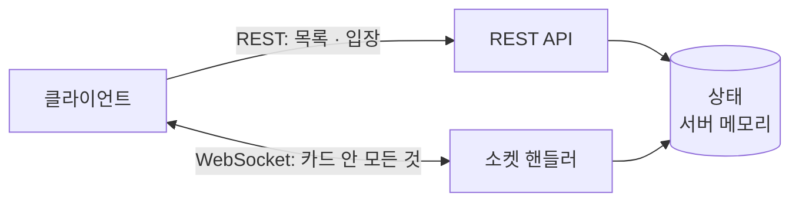

# 놀이터(playground) — 허브 API 명세서

2026-09-25 · [허브 명세](../planning/planning.md) · [허브 ERD](../erd/erd.md) 기준

## 1. 개요

허브 자체와 **카드가 공유하는 규약**만 다룬다. 카드별 엔드포인트와 소켓 이벤트는 카드 문서에 있다.

| 문서 | 다루는 것 |
| --- | --- |
| 이 문서 | 공통 규약, 세션, 카드 목록, 소켓 연결 |
| [omt.md](omt.md) | 한번더 — 방·게임 |
| [playground.md](playground.md) | 놀이터 — 광장·음악 |

### 통신을 둘로 나눈다

| 방식 | 쓰는 곳 | 이유 |
| --- | --- | --- |
| **REST** | 카드 목록, 세션 발급, 방·광장 입장 | 단발성 질의·응답이고, 실패 사유를 HTTP 상태로 돌려주기 좋다 |
| **WebSocket** (원시, STOMP 아님) | 카드 안에서 벌어지는 모든 것 | 남이 한 행동이 내 화면에 즉시 반영돼야 한다 |

소켓은 **앱에 들어오자마자 연결해 끝까지 유지한다.** 카드에 들어갈 때 여는 게 아니다. 접속자 목록과 끊김 감지가 이 연결 하나에 달려 있기 때문이다. 소켓이 끊기면 접속자에서 사라지고, 어딘가에 들어가 있었다면 거기서도 나간다 (0-4).



### 판정은 전부 서버가 한다

클라이언트가 보낸 값은 믿지 않는다. 카드마다 판정할 것이 다르지만 원칙은 같다.

| 카드 | 클라이언트가 계산해 보내면 안 되는 것 |
| --- | --- |
| 한번더 | 주사위 값, 가능한 조합, 시작 가능 여부 |
| 놀이터 | 기구 자리 배정, 정원 초과 여부, 곡의 재생 위치 |

---

## 2. 공통 규약

### Base URL

```
https://playground.app/pg/api
```

이 문서의 모든 경로는 이 주소 뒤에 붙는다. 예를 들어 `POST /sessions`는 실제로 `POST https://playground.app/pg/api/sessions`다.

> 도메인은 아직 정해지지 않았다. 로컬 개발은 `http://localhost:8080/pg/api`를 쓴다.
>
> **버전 경로(`/v1`)는 두지 않는다.** 클라이언트와 서버를 같이 배포하는 단일 서비스라 구버전 클라이언트를 따로 받칠 일이 없다. 나중에 필요해지면 `/pg/api` 뒤가 아니라 앞에 붙인다(`/pg/v2/api`).

WebSocket은 같은 접두사 아래 `/ws`로 연결한다.

```
wss://playground.app/pg/api/ws
```

### 인증

**로그인이 없다.** 계정도 토큰도 없고, 대신 **세션 쿠키**로 신원을 확인한다.

```
Cookie: sessionKey=s_9f3a…
```

| 항목 | 값 |
| --- | --- |
| 발급 | `POST /sessions` |
| 수명 | 소켓 연결이 끊어질 때까지. 갱신(refresh) 개념이 없다 |
| 쿠키 속성 | `HttpOnly`, `Secure`, `SameSite=Lax`, `Path=/pg/api` |

`Auth Required: Yes`인 엔드포인트는 이 쿠키가 있어야 한다. 이 문서에서 "Auth"는 **세션 쿠키 유무**를 뜻하며, 권한 등급은 없다.

> 토큰을 쓰지 않는 이유: 보호할 계정이 없다. 세션 쿠키는 "지금 이 브라우저가 누구인지"만 알면 되고, 훔쳐도 얻을 수 있는 것이 남의 닉네임으로 방에 들어가는 정도다. 여기에 액세스·리프레시 토큰 쌍을 두는 것은 지키는 것 없이 복잡도만 늘린다.

### 응답 형식

**성공**

```json
{ "success": true, "data": { } }
```

**실패**

```json
{
  "success": false,
  "error": {
    "code":    "ROOM_FULL",
    "message": "정원이 가득 찼습니다"
  }
}
```

- 본문이 없는 성공 응답은 `204 No Content`로 반환합니다.
- 무언가를 생성하는 성공 응답은 `201 CREATED`로 반환합니다.
- 모든 본문은 `application/json; charset=utf-8`입니다.
- 시각은 **ISO-8601 UTC** 문자열(`2026-09-25T10:03:14Z`), 식별자는 숫자입니다.

`error.message`는 **화면에 그대로 띄울 수 있는 한국어**다. 클라이언트가 코드별 문구를 따로 갖고 있지 않아도 되고, 팀 인원처럼 상황마다 달라지는 안내(1-11)를 서버가 만들어 보낼 수 있다.

### 공통 에러

아래 에러는 모든 엔드포인트에서 공통으로 발생할 수 있어, 개별 명세에서는 생략합니다.

| Status | code | 설명 |
| --- | --- | --- |
| `400` | `INVALID_REQUEST` | 요청 형식 오류(JSON 파싱 실패 등) |
| `400` | `VALIDATION_ERROR` | 필드 값이 제약을 벗어남 |
| `401` | `SESSION_REQUIRED` | 세션 쿠키 없음 |
| `401` | `SESSION_INVALID` | 세션이 서버에 없음(소켓이 끊겨 정리됨) |
| `429` | `TOO_MANY_REQUESTS` | 요청 한도 초과 |
| `500` | `INTERNAL_ERROR` | 서버 내부 오류 |

---

## 3. REST API

| 번호 | 메서드 | 경로 | Auth | 설명 |
| --- | --- | --- | --- | --- |
| 0-7 | `POST` | `/sessions` | No | 프로필 등록 · 세션 발급 |
| 0-7 | `PATCH` | `/sessions/me` | Yes | 이름·아바타 변경 |
| 0-6, 0-9 | `GET` | `/games` | No | 카드 목록 |

카드별 엔드포인트는 [omt.md](omt.md) · [playground.md](playground.md) 에 있다.

---

### POST /sessions

> 앱에 처음 들어왔을 때 프로필을 등록하고 세션을 발급받습니다. 로그인이 없으므로 이것이 신원 등록을 대신합니다. (0-7)

**Auth Required:** No

**Request:**

```json
{ "nickname": "두더지4821", "avatar": "⛏" }
```

| 필드 | 타입 | 필수 | 설명 |
| --- | --- | --- | --- |
| nickname | string(1~20) | ✓ | 브라우저가 만든 이름. **중복을 막지 않습니다** (M-8) |
| avatar | string | ✓ | 이모지 한 글자 |

**Response `201`:**

```json
{
  "success": true,
  "data": {
    "sessionKey": "s_9f3a…",
    "nickname":   "두더지4821",
    "avatar":     "⛏"
  }
}
```

`sessionKey`는 응답 본문과 **`Set-Cookie` 헤더 양쪽으로** 내려준다. 이후 REST 요청과 소켓 핸드셰이크가 이 쿠키로 신원을 확인한다.

이 시점에는 아직 "접속 중"이 아니다. **소켓이 연결돼야 접속자 목록(1-13)에 뜬다.**

---

### PATCH /sessions/me

> 내 이름이나 아바타를 바꿉니다. 바꿀 필드만 보냅니다. (0-7)

**Auth Required:** Yes

**Request:**

```json
{ "nickname": "곡괭이1007" }
```

| 필드 | 타입 | 필수 | 설명 |
| --- | --- | --- | --- |
| nickname | string(1~20) |  | 생략하면 그대로 |
| avatar | string |  | 생략하면 그대로 |

**Response `200`:**

```json
{
  "success": true,
  "data": {
    "sessionKey": "s_9f3a…",
    "nickname":   "곡괭이1007",
    "avatar":     "⛏"
  }
}
```

방 안에 있는 동안 바꿔도 **그 방의 표시 이름은 그대로다.** 참여자 이름은 입장 시점 스냅샷이기 때문이다 ([ERD의 `room_players`](../erd/omt.md#room_players-방-참여자-1-4)). 접속자 목록(1-13)에는 즉시 반영된다.

---

### GET /games

> 놀이터 첫 화면의 게임 카드 목록을 조회합니다. (0-6)

**Auth Required:** No

**Response `200`:**

```json
{
  "success": true,
  "data": {
    "games": [
      {
        "code":          "onemore",
        "name":          "한번더",
        "nameEn":        "OneMoreTime",
        "description":   "주사위 4개로 11개의 갱도를 파내려가…",
        "thumbnailUrl":  "https://cdn.playground.app/games/omt-thumb.webp",
        "minPlayers":    2,
        "maxPlayers":    6,
        "playMinutes":   "15~20분",
        "playable":      true,
        "tags":          ["주사위", "운과 배짱", "쉬운 규칙"],
        "liveCount":     null,
        "capacity":      null
      },
      {
        "code":          "game2",
        "name":          "게임 2",
        "nameEn":        "Coming Soon",
        "description":   "다음 게임을 준비하고 있습니다",
        "thumbnailUrl":  "https://cdn.playground.app/games/coming-soon.webp",
        "minPlayers":    0,
        "maxPlayers":    0,
        "playMinutes":   null,
        "playable":      false,
        "tags":          [],
        "liveCount":     null,
        "capacity":      null
      }
    ]
  }
}
```

정렬된 순서로 내려준다. 클라이언트는 받은 순서대로 카드를 배치한다. `playable: false`면 "준비 중" 배지와 비활성 버튼.

| 필드 | 설명 |
| --- | --- |
| liveCount | **지금 그 카드 안에 있는 사람 수.** 셀 수 없는 카드는 `null` |
| capacity | 정원. 없으면 `null` |

놀이터 카드는 `liveCount: 8, capacity: 20` 처럼 내려와 카드에 `8 / 20명` 으로 표시된다 (P-22). 한번더처럼 방이 여럿인 카드는 지금 `null` 이다.

**카드 인원을 별도 엔드포인트로 두지 않는다.** 허브는 어차피 이 목록을 부르므로, 같이 실어 보내면 왕복이 늘지 않는다.

---

---

## 4. WebSocket

**STOMP를 쓰지 않는다.** Spring의 원시 WebSocket(`TextWebSocketHandler`) 위에 아래 JSON 봉투를 직접 얹는다. 이유는 [부록 C](#부록-c-구현-전-확인할-것)에 적었다.

### 연결

```
GET wss://playground.app/pg/api/ws
Cookie: sessionKey=s_9f3a…
```

**Auth Required:** Yes

| 상황 | 동작 |
| --- | --- |
| 세션 쿠키 없음·무효 | `4401`로 닫는다 |
| 연결 성공 | **접속자 목록(1-13)에 등록**된다 |
| 연결 끊김 | 접속자에서 제거하고, 방에 있었다면 방에서도 내보낸다 (5-2) |

쿠키는 `HandshakeInterceptor`에서 읽어 세션 속성에 담는다. 핸드셰이크 이후에는 HTTP 요청이 없으므로, **이 시점에 신원을 확정해 두지 않으면 이후에 알 방법이 없다.**

> 하트비트는 30초 간격 ping/pong으로 둔다. 브라우저 탭이 백그라운드로 가도 소켓은 유지되지만, 프록시가 유휴 연결을 끊는 경우가 있다.

### 방 전파

서버는 **방마다 세션 집합을 직접 들고 있다가** 그 방 사람들에게만 보낸다.

```java
Map<Long, Set<WebSocketSession>> roomSessions   // ConcurrentHashMap
```

브로커가 없으므로 **구독이라는 개념이 없고, 따라서 남의 방을 구독해 엿볼 방법도 없다.** 서버가 등록한 세션에만 쓴다.

#### 같은 세션에 두 스레드가 동시에 쓰지 않게 할 것

`WebSocketSession.sendMessage()`는 **스레드 안전하지 않다.** 이 서비스에서는 반드시 겹친다.

제한 시간이 끝나 **타이머 스레드**가 자동 멈추기를 보내는 순간, 마침 같은 사람이 보낸 명령을 **요청 스레드**가 처리하고 있을 수 있다. 두 스레드가 한 세션에 겹쳐 쓰면 프레임이 섞여 깨진다.

세션을 등록할 때 감싸 둔다.

```java
new ConcurrentWebSocketSessionDecorator(session, SEND_TIME_LIMIT_MS, BUFFER_SIZE_LIMIT)
```

전송이 직렬화되고, 느린 클라이언트 하나가 서버를 붙잡는 것도 버퍼 한도로 끊어준다. **원시 WebSocket을 쓸 때 가장 빠뜨리기 쉬운 부분이다.**

### 메시지 봉투

REST의 `success`/`data` 봉투는 쓰지 않는다. 소켓은 요청·응답이 아니라 **이름 붙은 사건의 흐름**이라, `type`으로 갈라지는 편이 다루기 쉽다.

**클라이언트 → 서버**

```json
{ "type": "game.roll", "payload": { } }
```

**서버 → 클라이언트** — 두 필드가 더 붙는다

```json
{ "type": "game.rolled", "seq": 118, "at": "2026-09-25T10:03:14Z", "payload": { } }
```

| 필드 | 설명 |
| --- | --- |
| seq | 방 단위로 1씩 증가. 순서가 뒤집히거나 중복된 메시지를 걸러낸다 |
| at | 서버 시각. 클라이언트 시계가 틀려도 타이머를 맞출 수 있다 |

오류는 `error` 타입으로 오고, **본문은 REST의 `error` 객체와 같은 모양**이다.

```json
{ "type": "error", "seq": 119, "at": "…",
  "payload": { "code": "NOT_YOUR_TURN", "message": "지금은 내 차례가 아닙니다" } }
```

---

### 카드별 이벤트

`type` 접두사로 어느 카드의 이벤트인지 갈린다.

| 접두사 | 카드 | 문서 |
| --- | --- | --- |
| `room.*` `game.*` `chat.*` | 한번더 | [omt.md](omt.md) |
| `plaza.*` | 놀이터 | [playground.md](playground.md) |
| `error` | 공통 | 아래 |

오류는 `error` 타입으로 오고, **본문은 REST의 `error` 객체와 같은 모양**이다.

```json
{ "type": "error", "seq": 119, "at": "…",
  "payload": { "code": "NOT_YOUR_TURN", "message": "지금은 내 차례가 아닙니다" } }
```

### 카드마다 상태를 보내는 방식이 다르다

같은 소켓을 쓰지만 **무엇을 실어 보낼지는 카드가 정한다.**

| 카드 | 방식 | 이유 |
| --- | --- | --- |
| 한번더 | **이벤트마다 전체 상태** | 상태가 작고, 한 번 어긋나면 판이 틀어진다. 받은 걸 그대로 그리면 어긋날 수가 없다 |
| 놀이터 | **바뀐 것만 묶어서 주기적으로** | 위치가 초당 여러 번 바뀐다. 전체를 매번 보내면 낭비고, 조금 어긋나도 1초 보정으로 따라잡는다 |

정확성이 중요한 쪽은 스냅샷, 양이 많은 쪽은 델타다. 자세한 내용은 각 카드 문서에 있다.

---

## 5. 데이터 모양

### ChatMessage

두 카드가 **같은 모양**을 쓴다. 한번더의 `chat.message` 와 놀이터의 `plaza.chat` 이 이 형태로 온다.

```json
{
  "id":       301,
  "playerId": 42,
  "nickname": "곡괭이",
  "avatar":   "💎",
  "color":    "blue",
  "body":     "안녕하세요~",
  "at":       "2026-09-25T10:01:02Z"
}
```

| 필드 | 타입 | 설명 |
| --- | --- | --- |
| id | number | 그 공간 안에서 증가하는 번호. 정렬 키이자 중복 방지용 |
| playerId | number | **보낸 사람.** 그 공간의 참여자 id |
| nickname | string | 보낸 시점 이름 스냅샷 |
| avatar | string | 보낸 시점 아바타 스냅샷 |
| color | string | 말풍선·프로필에 쓸 색 |
| body | string(1~60) | 본문 |
| at | string | 보낸 시각 |

#### 보낸 사람을 왜 이렇게 싣는가

보내는 쪽 명령에는 작성자가 없다. **서버가 세션으로 알기 때문**이고, 클라이언트가 보내게 두면 남의 이름을 사칭할 수 있다. 대신 브로드캐스트에는 받는 쪽이 필요한 것이 다 들어 있어야 한다.

**닉네임으로 "나"를 판별하면 안 된다.** 이름 중복을 허용하므로(M-8) 같은 이름이 둘이면 남의 글이 내 글로 보인다. 반드시 `playerId` 로 비교한다.

이름·아바타를 매번 싣는 것은 중복처럼 보이지만, **보낸 사람이 나간 뒤에도 그 글이 온전히 보이게** 하기 위해서다.

---

## 6. 부록

### 부록 A: 공통 에러 코드

모든 엔드포인트·소켓 명령에서 날 수 있다. 카드별 코드는 각 카드 문서에 있다.

| Status | code | 문구 |
| --- | --- | --- |
| `400` | `INVALID_REQUEST` | 요청 형식이 올바르지 않습니다 |
| `400` | `VALIDATION_ERROR` | 값이 올바르지 않습니다 |
| `401` | `SESSION_REQUIRED` | 세션이 없습니다 |
| `401` | `SESSION_INVALID` | 세션이 만료되었습니다 |
| `404` | `GAME_NOT_FOUND` | 없는 카드입니다 |
| `409` | `ALREADY_IN_ROOM` | 이미 다른 곳에 있습니다 |
| `429` | `TOO_MANY_REQUESTS` | 잠시 후 다시 시도해 주세요 |
| `500` | `INTERNAL_ERROR` | 서버 오류가 발생했습니다 |

`ALREADY_IN_ROOM` 은 방과 광장 **양쪽에 걸린다.** 한 사람은 한 번에 한 곳에만 있을 수 있다.

### 부록 B: 명세 번호 ↔ API 대응

| 번호 | 기능 | API |
| --- | --- | --- |
| 0-1 | 화면 전환 | 클라이언트 전용 |
| 0-2 | 토스트 | 클라이언트 전용 |
| 0-3 | 상태 보관 | 서버 메모리 |
| 0-4 | 이탈 처리 | 소켓 연결 끊김 |
| 0-5 | 사운드 | 클라이언트 전용 |
| 0-6, 0-9 | 카드 선택·목록 | `GET /games` |
| 0-7 | 내 프로필 | `POST /sessions`, `PATCH /sessions/me` |
| 0-8 | 채팅 | 카드별 이벤트 · [ChatMessage](#chatmessage) 공유 |
| 0-10 | 카드 상태 배지 | `GET /games` 의 `playable` · `liveCount` |

### 부록 C: 구현 전 확인할 것

| 항목 | 메모 |
| --- | --- |
| `spring-boot-starter-websocket` | `playgroundback/build.gradle`에 **아직 없다.** 추가해야 한다 |
| 방 동시성 | 같은 방에 여러 소켓이 동시에 명령을 보낸다. 방 단위 락 또는 방마다 단일 스레드 처리가 필요하다 |
| 타이머 스레드 | 방마다 타이머가 돈다. 방이 사라질 때 확실히 취소하지 않으면 샌다 |
| 빈 방 정리 | 마지막 참여자가 나가면 방·채팅·타이머를 함께 지운다 (M-6) |
| Base URL 도메인 | 아직 미정 |
| 접두사 설정 | `/pg/api`는 Spring의 `server.servlet.context-path`로 한 번에 건다. 컨트롤러마다 `@RequestMapping("/pg/api/…")`를 붙이면 빠뜨리기 쉽다 |
| 소켓 경로 | context-path를 쓰면 소켓 등록도 `/ws`로만 적는다. 실제 경로는 `/pg/api/ws`가 된다 |
| 전송 직렬화 | `ConcurrentWebSocketSessionDecorator`로 감싼다. 타이머 스레드와 요청 스레드가 같은 세션에 겹쳐 쓴다 ([4장](#같은-세션에-두-스레드가-동시에-쓰지-않게-할-것)) |

### 부록 C-1: STOMP를 쓰지 않기로 한 이유

검토했으나 **원시 WebSocket으로 정했다.** 나중에 다시 논의되지 않도록 근거를 남긴다.

STOMP의 장점은 이 프로젝트에서 **하나도 발동하지 않는다.** 브로커 릴레이·다중 인스턴스는 [ERD의 저장 결정](../erd/erd.md#결정-단일-인스턴스와-서버-메모리)대로 단일 인스턴스를 쓰므로 해당이 없고, SockJS 폴백은 PC 브라우저 전용이라 필요 없다. 방 브로드캐스트 하나뿐인 전파 패턴에 범용 pub/sub 추상을 얹는 셈이다.

반면 STOMP를 쓰면 챙길 것이 셋 생긴다.

| 위험 | 내용 |
| --- | --- |
| **구독 권한** | 클라이언트가 `SUBSCRIBE /topic/rooms/99`를 아무 방에나 보낼 수 있다. 비밀번호는 입장(1-3)에만 걸려 있고 구독에는 안 걸리므로, 검사를 빠뜨리면 **비밀방이 사실상 뚫린다** |
| `Principal` 부재 | 로그인이 없어 기본값이 `null`이다. `/user/**` 목적지가 조용히 아무 데도 가지 않는다 |
| 멤버십 이중화 | "누가 이 방에 있나"를 구독 레지스트리와 방 객체가 따로 알게 되어 어긋날 수 있다 |

원시 WebSocket은 이 셋이 **구조적으로 발생하지 않는다.** 서버가 등록한 세션에만 쓰기 때문이다. 대신 방 세션 레지스트리와 전송 직렬화를 직접 써야 하는데, 합쳐서 수십 줄이고 위 위험들보다 다루기 쉽다.

명세서의 이벤트 이름·payload·에러 코드는 어느 쪽이든 같다. **전송 방식만 다르다.**

### 부록 D: 이번 범위에 없는 것

| 항목 | 이유 |
| --- | --- |
| 액세스·리프레시 토큰 | 로그인이 없다. 세션 쿠키가 전부다 |
| 재접속 복구 | 새로고침하면 방에서 나간다 (0-4) |
| 전적 조회 | 계정이 없어 누구의 전적인지 묶을 수 없다 ([ERD 부록 B](../erd/erd.md#부록-b-확장-여지)) |
| 방 목록 소켓 푸시 | 폴링으로 정했다 (M-4) |
| 페이지 크기 조절 | 6개 고정 (1-2) |
