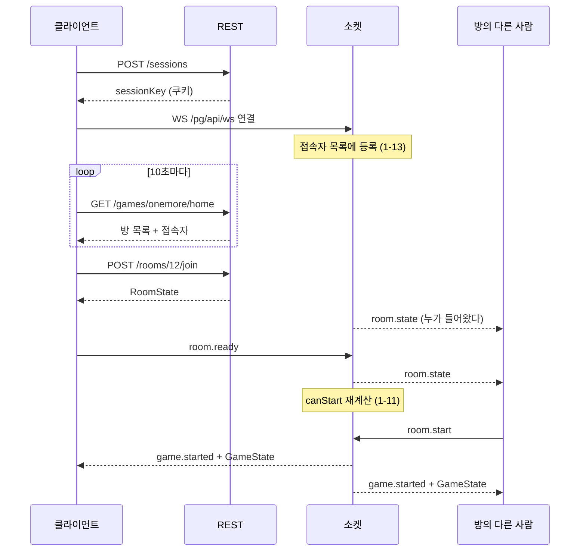
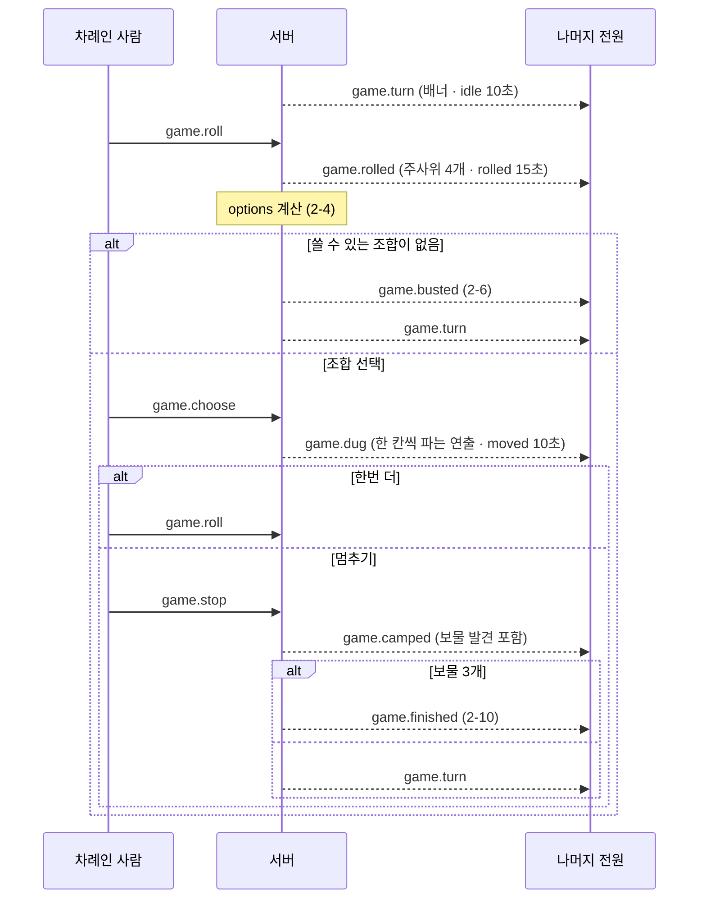

# 한번더(OneMoreTime) — API 명세서

2026-09-25 · [한번더 명세](../planning/omt.md) · [한번더 ERD](../erd/omt.md) 기준 · 허브 API는 [api.md](api.md)

## 1. 개요

한번더의 **방과 게임 진행**을 다룬다. 공통 규약(Base URL·인증·응답 형식·공통 에러)과 소켓 연결·봉투는 [허브 API](api.md)에 있고, 여기서는 되풀이하지 않는다.

### 클라이언트가 계산해 보내면 안 되는 것

| 항목 | 이유 |
| --- | --- |
| 주사위 값 | 조작하면 게임이 성립하지 않는다 (2-3) |
| 가능한 조합 | "쓸 수 있는 만큼 많이 쓴다"는 최대 사용 규칙(2-4)을 클라이언트가 다시 구현하면 두 벌이 어긋난다. 서버가 계산해 `options`로 내려준다 |
| 시작 가능 여부 | 팀 인원 조건(1-11)도 마찬가지다. 서버가 `canStart`와 막힌 이유를 내려준다 |

클라이언트는 **조합을 고를 때 합이 아니라 서버가 준 목록의 인덱스를 보낸다.** 임의의 숫자를 보낼 수 없게 된다.

---

## 2. REST API

| 번호 | 메서드 | 경로 | Auth | 설명 |
| --- | --- | --- | --- | --- |
| 1-2, 1-13 | `GET` | `/games/{gameCode}/home` | Yes | 방 목록 + 접속자 (10초 폴링) |
| 1-1 | `POST` | `/games/{gameCode}/rooms` | Yes | 방 만들기 |
| 1-2, 1-3 | `POST` | `/rooms/{roomId}/join` | Yes | 방 입장 |

---

### GET /games/{gameCode}/home

> 한번더 홈 화면의 방 목록과 접속자 목록을 한 번에 조회합니다. 홈에 머무는 동안 10초마다 호출합니다. (1-2, 1-13, M-9)

**Auth Required:** Yes

**Query Parameters:**

| 이름 | 타입 | 기본 | 설명 |
| --- | --- | --- | --- |
| page | int | 0 | 0부터. 한 페이지 6개 고정 (1-14) |

**Response `200`:**

```json
{
  "success": true,
  "data": {
    "rooms": {
      "page":       0,
      "totalPages": 3,
      "items": [
        {
          "roomId":       12,
          "title":        "초보 환영",
          "hostNickname": "두더지4821",
          "mode":         "team",
          "maxPlayers":   6,
          "playerCount":  4,
          "secret":       true,
          "status":       "waiting"
        }
      ]
    },
    "online": {
      "total": 17,
      "items": [
        { "nickname": "두더지4821", "avatar": "⛏", "status": "idle",    "me": true  },
        { "nickname": "곡괭이",     "avatar": "💎", "status": "playing", "me": false }
      ]
    }
  }
}
```

| 필드 | 설명 |
| --- | --- |
| rooms.items[].status | `waiting`(대기 중) / `full`(정원 초과) / `playing`(게임 중). **`waiting`만 입장 가능** |
| online.items | **놀이터 전체 접속자.** 이 게임 참여자만이 아니다 (M-5) |
| online.items[].me | 본인 표시. 맨 위에 고정해 보여준다 |

- `full`은 저장된 값이 아니라 `playerCount >= maxPlayers`로 서버가 계산해 내려준다
- `page`가 범위를 넘으면 **마지막 페이지를 돌려준다.** 폴링 중 방이 줄어도 오류가 나지 않게 하기 위해서다 (1-14)
- 비밀번호는 어떤 형태로도 내려주지 않는다. `secret: true`로 자물쇠 표시만 한다

**Errors:**

| Status | code | 설명 |
| --- | --- | --- |
| `404` | `GAME_NOT_FOUND` | 없는 게임 코드 |

**두 목록을 한 요청으로 합친 이유** — 주기가 같은데 요청을 나누면 10초마다 왕복이 두 번이 되고, 두 목록이 서로 다른 시점을 보여줄 수 있다.

---

### POST /games/{gameCode}/rooms

> 새 게임방을 만들고 방장이 되어 입장합니다. (1-1)

**Auth Required:** Yes

**Request:**

```json
{
  "title":      "초보 환영",
  "mode":       "team",
  "maxPlayers": 6,
  "secret":     true,
  "password":   "1234"
}
```

| 필드 | 타입 | 필수 | 설명 |
| --- | --- | --- | --- |
| title | string(1~30) | ✓ | 방 제목 |
| mode | `solo` \| `team` | ✓ | 게임 모드 |
| maxPlayers | int | ✓ | 개인전 `2~6`, **팀전 `2·4·6·8`만** |
| secret | boolean | ✓ | 비밀방 여부 |
| password | string(1~20) | `secret`이면 ✓ | 서버가 해시해 보관합니다 |

**Response `201`:** [`RoomState`](#roomstate)

```json
{
  "success": true,
  "data": { "roomId": 12, "title": "초보 환영", "…": "RoomState 전체" }
}
```

만든 사람이 방장이 되고 곧바로 참여자로 들어간다. 응답 직후 서버가 그 세션에 소켓으로 `room.state`를 한 번 더 보낸다. **REST 응답과 소켓 스냅샷이 같은 모양**이라 클라이언트는 한 경로로만 렌더링하면 된다.

**Errors:**

| Status | code | 설명 |
| --- | --- | --- |
| `400` | `TITLE_REQUIRED` | 제목이 비었음 |
| `400` | `PASSWORD_REQUIRED` | 비밀방인데 비밀번호가 비었음 |
| `400` | `INVALID_MAX_PLAYERS` | 모드에 맞지 않는 정원 |
| `404` | `GAME_NOT_FOUND` | 없는 게임 코드 |
| `409` | `ALREADY_IN_ROOM` | 이미 다른 방에 있음 |

---

### POST /rooms/{roomId}/join

> 열려 있는 방에 입장합니다. 비밀방이면 비밀번호를 함께 보냅니다. (1-2, 1-3)

**Auth Required:** Yes

**Request:**

```json
{ "password": "1234" }
```

| 필드 | 타입 | 필수 | 설명 |
| --- | --- | --- | --- |
| password | string | 비밀방이면 ✓ | 일반 방이면 생략 |

**Response `200`:** [`RoomState`](#roomstate)

입장에 성공하면 **방 안의 다른 사람들에게 소켓으로 `room.state`가 나간다.** 색(1-7)은 남은 색 중 하나가 자동 배정되고, 팀전이면 팀 자리도 자동 배정된다 (1-6).

**Errors:**

| Status | code | 설명 | 클라이언트 처리 |
| --- | --- | --- | --- |
| `401` | `PASSWORD_MISMATCH` | 비밀번호가 틀림 | **모달을 유지**하고 입력칸만 비웁니다 (1-3) |
| `404` | `ROOM_NOT_FOUND` | 방이 사라짐 | 목록을 새로 불러옵니다 |
| `409` | `ROOM_FULL` | 정원이 가득 참 | 거절 안내 |
| `409` | `ROOM_PLAYING` | 이미 게임 중 | 거절 안내 |
| `409` | `ALREADY_IN_ROOM` | 이미 다른 방에 있음 | — |

> 비밀번호가 틀렸을 때 **몇 번 틀렸는지 세지 않는다.** 방 비밀번호는 계정 비밀번호가 아니고, 잠그면 방장이 손쓸 방법이 없다. 대신 공통 에러의 `TOO_MANY_REQUESTS`로 초당 시도 횟수만 제한한다.

---

## 3. WebSocket 이벤트

연결·봉투·전송 규약은 [허브 API 4장](api.md#4-websocket)에 있다.

### 클라이언트 → 서버

| 번호 | type | payload | 설명 |
| --- | --- | --- | --- |
| 1-5 | `room.mode` | `{ "mode": "team" }` | 게임 모드 변경 (방장만) |
| 1-6, 1-7 | `room.seat` | `{ "color": "red" }` 또는 `{ "team": "A", "seat": 0 }` | 개인전은 색, 팀전은 팀 자리 |
| 1-8 | `room.ready` | `{ "ready": true }` | 준비 토글 |
| 1-9 | `room.kick` | `{ "playerId": 43 }` | 내보내기 (방장만) |
| 1-11 | `room.start` | `{}` | 게임 시작 (방장만) |
| 1-12 | `room.leave` | `{}` | 방 나가기 |
| 0-8 | `chat.send` | `{ "body": "안녕하세요~" }` | 채팅 (최대 60자). **보낸 사람은 담지 않는다** — 서버가 세션으로 안다 |
| 2-3 | `game.roll` | `{}` | 주사위 굴리기 |
| 2-4 | `game.choose` | `{ "optionIndex": 1, "playIndex": 0 }` | 조합 선택 |
| 2-8 | `game.stop` | `{}` | 멈추기 |

모든 명령은 서버가 **보낸 사람과 현재 단계를 확인한 뒤** 처리한다. 내 차례가 아닌데 `game.roll`을 보내면 `error`로 거절한다.

### 서버 → 클라이언트

| 번호 | type | 언제 | payload |
| --- | --- | --- | --- |
| 1-4 | `room.state` | 입장·퇴장·설정 변경 때마다 | [`RoomState`](#roomstate) |
| 0-8 | `chat.message` | 채팅이 올 때 | [`ChatMessage`](api.md#chatmessage) 한 건. 목록과 말풍선(0-8)을 이걸로 그린다 |
| 1-11 | `game.started` | 시작 직후 | `{ "state": GameState }` |
| 2-3 | `game.rolled` | 주사위가 정해졌을 때 | `{ "dice": [3,4,5,6], "state": GameState }` |
| 2-4, 2-5 | `game.dug` | 조합을 골랐을 때 | `{ "steps": [7, 11], "state": GameState }` |
| 2-6 | `game.busted` | 붕괴 | `{ "state": GameState }` |
| 2-8, 2-9 | `game.camped` | 멈추기 | `{ "claimed": [4], "state": GameState }` |
| 2-2 | `game.turn` | 차례가 넘어갈 때 | `{ "state": GameState }` |
| 2-10 | `game.finished` | 승자가 나왔을 때 | `{ "winnerSideId": 2, "state": GameState }` |
| 5-2 | `player.left` | 누가 나가거나 끊겼을 때 | `{ "playerId": 43, "reason": "disconnected" }` |
| — | `error` | 명령이 거절됐을 때 | `{ "code": "…", "message": "…" }` · **보낸 사람에게만** |

#### 왜 이벤트마다 전체 상태를 같이 보내는가

`game.dug`에 "7번 갱도가 한 칸 내려갔다"만 보내면 클라이언트가 상태를 직접 누적해야 하고, 메시지를 하나라도 놓치면 그때부터 화면이 어긋난다. 어긋난 걸 알아챌 방법도 없다.

전체 상태를 같이 보내면 **클라이언트는 받은 걸 그대로 그리면 된다.** 어긋날 수가 없다. 상태는 참여자 8명 기준 몇 KB 수준이라 한 판에 수백 번 보내도 부담이 안 된다.

그러면 `steps`나 `dice` 같은 필드는 왜 따로 있나. **연출 때문이다.** 상태만 보면 "결과가 이렇다"는 알지만 "무슨 일이 있었나"는 모른다. 주사위 굴러가는 애니메이션, 한 칸씩 파고 내려가는 연출(2-5)이 이 필드를 쓴다.

> 나중에 최적화가 필요해지면 델타로 바꾸되, **재동기화용 스냅샷 경로는 남겨야 한다.**

---

## 4. 데이터 모양

### RoomState

대기실 화면 하나를 그리는 데 필요한 전부다. `POST /rooms/{id}/join`의 `data`이자 소켓 `room.state`의 `payload`다.

```json
{
  "roomId":     12,
  "gameCode":   "onemore",
  "title":      "초보 환영",
  "mode":       "team",
  "maxPlayers": 6,
  "secret":     true,
  "status":     "waiting",
  "meId":       41,
  "players": [
    {
      "id":       41,
      "nickname": "두더지4821",
      "avatar":   "⛏",
      "color":    "red",
      "team":     "A",
      "seat":     0,
      "host":     true,
      "ready":    true
    }
  ],
  "canStart":         false,
  "startBlockReason": "팀마다 인원이 같아야 합니다 (빨강 팀 2명 · 파랑 팀 1명)",
  "chat": [
    {
      "id":       301,
      "playerId": 42,
      "nickname": "곡괭이",
      "avatar":   "💎",
      "color":    "blue",
      "body":     "안녕하세요~",
      "at":       "2026-09-25T10:01:02Z"
    }
  ]
}
```

| 필드 | 설명 |
| --- | --- |
| meId | 받는 사람 자신의 `playerId`. 클라이언트가 "나"를 찾으려고 닉네임을 비교하지 않아도 된다 (중복 허용이라 비교하면 틀린다) |
| players | 방장이 먼저 오도록 정렬해 보낸다 (1-4) |
| canStart | 시작 조건(1-11) 판정 결과. 방장 화면의 버튼 활성/비활성에 그대로 쓴다 |
| startBlockReason | 막힌 이유. **어느 팀이 몇 명인지까지** 담는다. 버튼 툴팁과 토스트에 그대로 띄운다 |
| chat | 입장 시점까지의 **전체 대화**. 원소는 [`ChatMessage`](api.md#chatmessage)이고, 개수 제한이 없다 (M-6) |

> `canStart`를 서버가 내려주는 이유: 팀 인원 규칙(1-11)을 클라이언트가 다시 구현하면 두 벌이 생기고, 한쪽만 고치면 버튼은 눌리는데 서버가 거절하는 상태가 된다.
>
> `chat`을 스냅샷에 통째로 싣는 것은 대화가 길어지면 무거워진다. 지금은 한 방의 수명이 짧아 문제가 없지만, 길어지면 최근 N건만 싣고 `GET /rooms/{id}/chat?before=`로 과거를 따로 가져오는 방식으로 바꾼다.

---

### GameState

게임 화면 하나를 그리는 데 필요한 전부다. 모든 `game.*` 이벤트의 `payload.state`로 실려 온다.

```json
{
  "roundId":          7,
  "phase":            "rolled",
  "phaseDeadlineAt":  "2026-09-25T10:03:29Z",
  "turn":             { "no": 2, "playerId": 43, "sideId": 2 },
  "dice":             [3, 4, 5, 6],
  "options": [
    { "a": 7, "b": 11, "faces": [[3,4],[5,6]], "plays": [[7,11]] },
    { "a": 8, "b": 10, "faces": [[3,5],[4,6]], "plays": [[8]] },
    { "a": 9, "b": 9,  "faces": [[3,6],[4,5]], "plays": [] }
  ],
  "sides": [
    {
      "id":        1,
      "no":        0,
      "label":     "빨강 팀",
      "color":     "red",
      "team":      "A",
      "memberIds": [41, 42],
      "treasures": 1,
      "busts":     2,
      "maxStreak": 4
    }
  ],
  "camps":        [ { "sideId": 1, "shaft": 7, "depth": 5 } ],
  "claims":       [ { "shaft": 4, "sideId": 2 } ],
  "runners":      [ { "shaft": 7, "depth": 6 } ],
  "winnerSideId": null
}
```

| 필드 | 설명 |
| --- | --- |
| phase | `idle` `rolling` `rolled` `digging` `moved` `bust` `wait` ([ERD 부록 B](../erd/omt.md#부록-b-phase-값)) |
| phaseDeadlineAt | 이 단계가 끝나는 **시각**. 남은 초가 아니다. 제한 없는 단계는 `null` |
| turn | 지금 차례인 사람과 사이드. `playerId == meId`일 때만 조작 버튼을 보여준다 (5-1) |
| dice | 마지막으로 굴린 4개. 굴리기 전이면 `null` |
| options | 2+2로 나누는 **3가지**. 서버가 계산해 내려준다 |
| options[].plays | 그 조합에서 실제로 팔 수 있는 합. 비었으면 못 쓰는 조합 |
| options[].faces | 주사위 눈 모양으로 표시하기 위한 원본 값 |
| sides | 참여자 칩(2-2)과 결과 통계(3-2)가 이걸 쓴다 |
| runners | 이번 턴의 탐험가. **최대 3개** (2-5) |

#### plays를 서버가 계산하는 이유

최대 사용 규칙(2-4)은 눈에 보이는 것보다 까다롭다. 둘 다 쓸 수 있으면 둘 다 써야 하고, 하나만 되면 그 하나를 쓰며, 쓰는 순서에 따라 결과가 갈릴 때만 고르게 해야 한다. 이걸 클라이언트가 다시 구현하면 반드시 어긋난다.

`plays`의 길이가 UI를 결정한다.

| plays | 화면 |
| --- | --- |
| `[]` | 못 쓰는 조합. 흐리게 |
| `[[7, 11]]` | 줄 전체가 버튼 하나. 누르면 둘 다 판다 |
| `[[7], [11]]` | 둘 중 하나만 쓸 수 있는데 어느 쪽인지 고를 수 있다. 반쪽씩 나눠 그린다 |

`game.choose`가 합이 아니라 `optionIndex`/`playIndex`를 보내는 이유도 같다. **서버가 방금 내려준 목록 안에서만 고를 수 있다.**

#### 타이머를 그리는 법 (5-3)

서버는 `phaseDeadlineAt`만 준다. 남은 초를 매초 보내지 않는다.

```
남은 시간 = phaseDeadlineAt - (서버 시각 기준 지금)
```

서버 시각은 메시지의 `at`으로 보정한다. `phaseDeadlineAt`이 `null`이면 제한 없는 단계이므로 막대를 그 자리에 멈춘다.

시간이 지나면 **서버가 알아서 처리하고 결과 이벤트를 보낸다.** 클라이언트는 자기 타이머가 0이 됐다고 아무것도 하지 않는다. 각자 시계가 조금씩 달라도 판정은 서버 하나뿐이다.

| 단계 | 초과하면 서버가 |
| --- | --- |
| `idle`, `moved` | 자동 멈추기 → `game.camped` |
| `rolled` | 첫 번째 가능한 조합 선택 → `game.dug` |

---

## 5. 주요 흐름

### 방에 들어가 게임을 시작하기까지



### 한 턴



---

## 6. 부록

### 부록 A: 한번더 에러 코드

[공통 에러](api.md#부록-a-공통-에러-코드)는 허브 문서에 있다. 아래는 한번더에서만 나는 것들이다.

| Status | code | 문구 | 나는 곳 |
| --- | --- | --- | --- |
| `400` | `TITLE_REQUIRED` | 방 제목을 입력해 주세요 | 방 만들기 |
| `400` | `PASSWORD_REQUIRED` | 비밀번호를 입력해 주세요 | 방 만들기 |
| `400` | `INVALID_MAX_PLAYERS` | 팀전 정원은 2·4·6·8명입니다 | 방 만들기 |
| `400` | `INVALID_OPTION` | 고를 수 없는 조합입니다 | `game.choose` |
| `401` | `PASSWORD_MISMATCH` | 비밀번호가 맞지 않습니다 | 방 입장 |
| `403` | `NOT_HOST` | 방장만 할 수 있습니다 | `room.mode` `room.kick` `room.start` |
| `403` | `NOT_YOUR_TURN` | 지금은 내 차례가 아닙니다 | `game.roll` `game.choose` `game.stop` |
| `404` | `ROOM_NOT_FOUND` | 방이 사라졌습니다 | 방 입장 |
| `409` | `ROOM_FULL` | 정원이 가득 찼습니다 | 방 입장 |
| `409` | `ROOM_PLAYING` | 이미 게임이 진행 중인 방입니다 | 방 입장 |
| `409` | `NOT_READY` | 전원이 준비해야 시작할 수 있습니다 | `room.start` |
| `409` | `TEAM_SIZE_MISMATCH` | 팀마다 인원이 같아야 합니다 (빨강 팀 2명 · 파랑 팀 1명) | `room.start` |
| `409` | `PLAYER_COUNT` | 개인전은 2명부터 시작할 수 있습니다 | `room.start` |
| `409` | `SEAT_TAKEN` | 다른 참여자가 쓰는 색입니다 | `room.seat` |
| `409` | `WRONG_PHASE` | 지금 할 수 없는 동작입니다 | 모든 `game.*` |

소켓에는 HTTP 상태가 없지만, **코드를 REST와 공유**하고 표의 Status는 같은 상황을 REST로 표현하면 무엇인지 적어 둔 것이다. 클라이언트가 처리 분기를 한 벌로 쓸 수 있다.

### 부록 B: 명세 번호 ↔ API 대응

허브 공통 번호(`0-x`)는 [api.md](api.md#부록-b-명세-번호-↔-api-대응)에 있다.

| 번호 | 기능 | API |
| --- | --- | --- |
| 1-1 | 방 만들기 | `POST /games/{code}/rooms` |
| 1-2 | 방 목록 | `GET /games/{code}/home` |
| 1-3 | 비밀방 입장 | `POST /rooms/{id}/join` |
| 1-4 | 참여자 목록 | `room.state` |
| 1-5 | 게임 모드 | `room.mode` |
| 1-6, 1-7 | 팀·색 선택 | `room.seat` |
| 1-8 | 준비 | `room.ready` |
| 1-9 | 내보내기 | `room.kick` |
| 1-10 | 턴 순서 | `game.started`의 `GameState` |
| 1-11 | 게임 시작 | `room.start`, `RoomState.canStart` |
| 1-12 | 방 나가기 | `room.leave` |
| 1-13 | 접속자 목록 | `GET /games/{code}/home` |
| 1-14 | 페이지 이동 | `?page=` |
| 2-1 | 보드 | `GameState.camps/claims/runners` |
| 2-2 | 현재 차례 | `GameState.turn`, `game.turn` |
| 2-3 | 주사위 | `game.roll` → `game.rolled` |
| 2-4 | 조합 선택 | `game.choose`, `GameState.options` |
| 2-5 | 탐험가 이동 | `game.dug`의 `steps` |
| 2-6 | 붕괴 | `game.busted` |
| 2-7 | 한번 더 | `game.roll` (같은 명령) |
| 2-8 | 멈추기 | `game.stop` → `game.camped` |
| 2-9 | 보물 발견 | `game.camped`의 `claimed` |
| 2-10 | 승리 판정 | `game.finished` |
| 2-11 | 게임 나가기 | `room.leave` |
| 3-1, 3-2 | 결과·통계 | `game.finished`의 `GameState.sides` |
| 3-3 | 다시 하기 | `room.state` (같은 방으로 복귀) |
| 4-1 | 규칙 보기 | 없음 (외부 영상 링크) |
| 5-1 | 실시간 동기화 | 모든 소켓 이벤트 |
| 5-2 | 연결 끊김 | `player.left` |
| 5-3 | 제한 시간 | `GameState.phaseDeadlineAt` |

