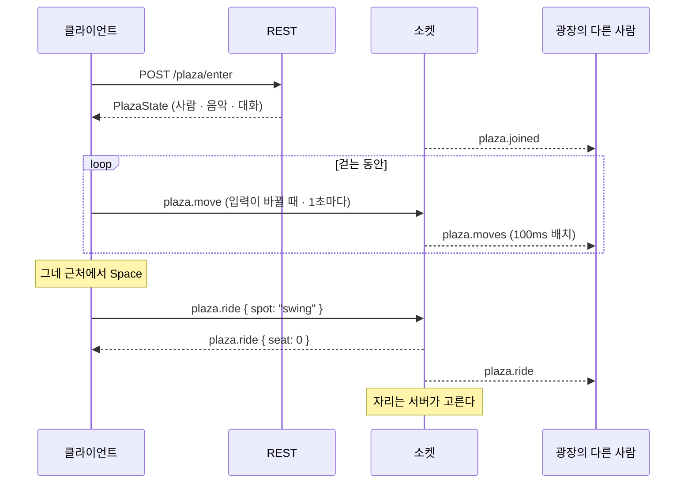
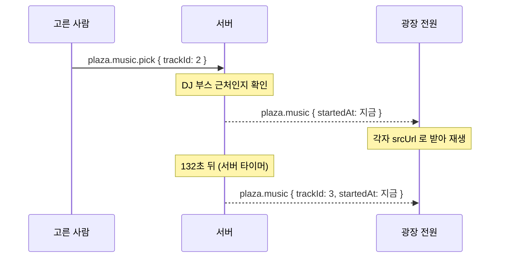

# 놀이터(Plaza) — API 명세서

2026-09-25 · [놀이터 명세](../planning/playground.md) · [놀이터 ERD](../erd/playground.md) 기준 · 허브 API는 [api.md](api.md)

## 1. 개요

놀이터의 **광장과 음악**을 다룬다. 공통 규약(Base URL·인증·응답 형식·공통 에러)과 소켓 연결·봉투는 [허브 API](api.md)에 있고, 여기서는 되풀이하지 않는다.

### 한번더와 무엇이 다른가

| 항목 | 한번더 | 놀이터 |
| --- | --- | --- |
| 단위 | 방 여러 개 | **공간 하나** |
| 상태 전달 | 이벤트마다 **전체 상태** | **바뀐 것만 100ms 배치** |
| 가장 잦은 메시지 | 주사위·조합 (턴당 몇 번) | **위치** (사람마다 수시로) |
| 어긋났을 때 | 판이 틀어진다 | 1초 보정으로 따라잡는다 |

이 차이가 전달 방식을 가른다. 한번더는 **정확성**이, 놀이터는 **양**이 문제다.

### 클라이언트가 계산해 보내면 안 되는 것

| 항목 | 이유 |
| --- | --- |
| 기구 자리 배정 | 두 사람이 동시에 같은 자리를 노리면 한 명만 앉아야 한다 (P-12) |
| 정원 초과 여부 | 20명을 넘겨 들어오면 안 된다 (P-22) |
| 곡의 재생 위치 | 모두가 같은 지점을 들어야 한다 (P-15) |
| 채팅 초기화 시점 | 10분 경계는 서버 시계가 기준이다 (P-23) |

**좌표는 예외다.** 클라이언트가 보낸 값을 받아 쓰되, 걷는 범위 안인지와 이동 속도가 말이 되는지만 검사한다. 매 프레임을 서버가 계산하면 반응이 굼떠 쓸 수 없다.

---

## 2. REST API

| 번호 | 메서드 | 경로 | Auth | 설명 |
| --- | --- | --- | --- | --- |
| P-1, P-22 | `POST` | `/plaza/enter` | Yes | 놀이터 입장 |

광장 인원은 별도 엔드포인트가 없다. 허브가 부르는 [`GET /games`](api.md#get-games)의 `liveCount`로 온다.

---

### POST /plaza/enter

> 놀이터에 입장합니다. 정원이 차 있으면 거절합니다. (P-1, P-22)

**Auth Required:** Yes

**Request:** 본문 없음

**Response `200`:** [`PlazaState`](#plazastate)

입장에 성공하면 **광장 안의 다른 사람들에게 소켓으로 `plaza.joined`가 나간다.** 캐릭터는 걷는 범위 안 임의의 위치에 서고, 색은 **남이 쓰지 않는 색 중 하나**가 자동 배정된다. 바꾸려면 소켓으로 `plaza.color`를 보낸다 (P-24).

**Errors:**

| Status | code | 설명 | 클라이언트 처리 |
| --- | --- | --- | --- |
| `409` | `PLAZA_FULL` | 정원 20명이 찼음 | 거절 안내. 카드로 돌아간다 |
| `409` | `ALREADY_IN_ROOM` | 이미 다른 곳에 있음 | — |

> 나가기는 엔드포인트가 없다. **소켓으로 `plaza.leave`를 보내거나 연결을 끊으면** 나간 것으로 처리한다 (0-4). 새로고침도 여기에 해당한다.

---

## 3. WebSocket 이벤트

연결·봉투·전송 규약은 [허브 API 4장](api.md#4-websocket)에 있다. 놀이터 이벤트는 모두 `plaza.` 접두사를 쓴다.

### 클라이언트 → 서버

| 번호 | type | payload | 설명 |
| --- | --- | --- | --- |
| P-2 | `plaza.move` | `{ "x": 42.5, "y": 71.2, "dir": 1 }` | **입력이 바뀔 때와 1초마다.** 매 프레임 보내지 않는다 |
| P-10 | `plaza.emote` | `{ "slot": 1 }` | 감정 표현. `1`~`4` |
| P-12 | `plaza.ride` | `{ "spot": "swing" }` | 기구 타기. **자리는 서버가 고른다** |
| P-12 | `plaza.dismount` | `{}` | 내리기 |
| P-6 | `plaza.chat` | `{ "body": "안녕하세요~" }` | 채팅 (최대 60자). 보낸 사람은 담지 않는다 |
| P-24 | `plaza.color` | `{ "color": "mint" }` | 캐릭터 색 변경. 남이 쓰는 색이면 거절 |
| P-15 | `plaza.music.pick` | `{ "trackId": 2 }` | 곡 선택. **DJ 부스 근처여야 한다** |
| P-15 | `plaza.music.stop` | `{}` | 음악 끄기 |
| P-1 | `plaza.leave` | `{}` | 나가기 |

`dir`는 바라보는 쪽으로 `-1` 왼쪽 / `0` 정면 / `1` 오른쪽이다.

### 서버 → 클라이언트

| 번호 | type | 언제 | payload |
| --- | --- | --- | --- |
| P-1 | `plaza.state` | 입장 직후 · 재동기화 | [`PlazaState`](#plazastate) 전체 |
| P-2 | `plaza.moves` | **100ms마다** | `{ "members": [{ "id": 7, "x": 42.5, "y": 71.2, "dir": 1 }] }` — 그 사이 움직인 사람만 |
| P-1 | `plaza.joined` | 누가 들어왔을 때 | [`PlazaMember`](#plazamember) 한 건 |
| P-1 | `plaza.left` | 누가 나갔을 때 | `{ "memberId": 7, "reason": "left" \| "disconnected" }` |
| P-10 | `plaza.emote` | 표정을 냈을 때 | `{ "memberId": 7, "slot": 1 }` |
| P-12 | `plaza.ride` | 기구에 앉았을 때 | `{ "memberId": 7, "spot": "swing", "seat": 0 }` |
| P-12 | `plaza.dismount` | 기구에서 내렸을 때 | `{ "memberId": 7, "spot": "swing", "x": 16, "y": 68 }` |
| 0-7 | `plaza.profile` | 광장 안의 누가 프로필을 바꿨을 때 | `{ "memberId": 7, "nickname": "곡괭이1007", "avatar": "⛏" }` — 본인 포함 전원 |
| P-24 | `plaza.color` | 누가 색을 바꿨을 때 | `{ "memberId": 7, "color": "mint" }` — 본인 포함 전원 |
| P-6 | `plaza.chat` | 채팅이 올 때 | [`ChatMessage`](api.md#chatmessage) 한 건 |
| P-23 | `plaza.chatReset` | 10분 경계 | `{ "at": "2026-09-25T10:20:00Z" }` — 목록을 비우고 안내 한 줄을 남긴다 |
| P-15~18 | `plaza.music` | 곡이 바뀌거나 꺼졌을 때 | [`PlazaMusic`](#plazamusic) 또는 `null` |
| — | `error` | 명령이 거절됐을 때 | 보낸 사람에게만 |

#### 왜 전체 상태를 매번 보내지 않는가

한번더는 이벤트마다 전체 상태를 싣는다. 상태가 작고, 한 번 어긋나면 판이 틀어지기 때문이다.

놀이터는 다르다. **20명이 동시에 걸으면 위치가 초당 수십 번 바뀐다.** 매번 전체를 보내면 대부분이 안 바뀐 값이다. 그리고 위치가 잠깐 어긋나도 **1초 보정이 따라잡는다** — 캐릭터가 조금 늦게 도착할 뿐 놀이터가 망가지지는 않는다.

그래서 **바뀐 사람만 100ms마다 묶어 보낸다.** 대신 어긋남이 쌓이지 않도록 재동기화 경로(`plaza.state`)를 남겨 둔다.

#### 위치를 보내는 규칙 (M-P10)

| 방향 | 언제 | 내용 |
| --- | --- | --- |
| 클라이언트 → 서버 | **입력이 바뀔 때** (걷기 시작·방향 전환·멈춤) | 그 순간의 좌표와 방향 |
| 클라이언트 → 서버 | **1초마다 한 번** | 좌표 보정 |
| 서버 → 클라이언트 | **100ms마다 묶어서** | 그 사이 바뀐 사람만 |

캐릭터가 등속으로 직선 이동하므로 **방향과 시작 좌표만 알면 그 뒤는 각자 계산할 수 있다.** 화면을 가로질러 걸어도 메시지는 시작·종료 두 번이다.

받은 위치로 **순간이동시키지 않고 100ms에 걸쳐 이어 준다.** 그냥 대입하면 초당 10번 뚝뚝 끊긴다. **내 캐릭터는 서버 확인을 기다리지 않고 누른 즉시 움직인다.**

정원 20명 기준 최악의 경우(전원이 동시에 계속 이동) 서버 송신이 초당 약 200 메시지, 클라이언트당 10KB/s 남짓이다. 실제로는 서서 이야기하는 시간이 훨씬 길어 이보다 적다.

---

## 4. 데이터 모양

### PlazaState

놀이터 화면 하나를 그리는 데 필요한 전부다. `POST /plaza/enter`의 `data`이자 소켓 `plaza.state`의 `payload`다.

```json
{
  "capacity": 20,
  "meId":     7,
  "members": [
    {
      "id":       7,
      "nickname": "두더지4821",
      "avatar":   "⛏",
      "color":    "red",
      "x":        42.5,
      "y":        71.2,
      "dir":      1,
      "riding":   null
    },
    {
      "id":       8,
      "nickname": "곡괭이",
      "avatar":   "💎",
      "color":    "blue",
      "x":        58.5,
      "y":        70.0,
      "dir":      0,
      "riding":   { "spot": "seesaw", "seat": 0 }
    }
  ],
  "music": {
    "trackId":     2,
    "title":       "잔잔한 오후",
    "mood":        "Calm",
    "srcUrl":      "https://cdn.playground.app/audio/02_calm_inst.mp3",
    "durationSec": 132,
    "startedAt":   "2026-09-25T10:03:14Z"
  },
  "tracks": [
    { "trackId": 1, "title": "신나는 하루", "mood": "Energetic", "durationSec": 132 },
    { "trackId": 2, "title": "잔잔한 오후", "mood": "Calm",      "durationSec": 132 }
  ],
  "chat": [
    {
      "id":       301,
      "playerId": 8,
      "nickname": "곡괭이",
      "avatar":   "💎",
      "color":    "blue",
      "body":     "안녕하세요~",
      "at":       "2026-09-25T10:01:02Z"
    }
  ],
  "chatResetAt": "2026-09-25T10:20:00Z",
  "colors": ["red", "blue", "green", "yellow", "purple", "pink", "teal", "orange", "navy", "mint", "…"]
}
```

| 필드 | 설명 |
| --- | --- |
| capacity | 정원. 지금은 20 (P-22) |
| meId | 받는 사람 자신의 `memberId`. **닉네임 중복을 허용하므로 이름으로 "나"를 찾으면 틀린다** |
| members | 지금 광장에 있는 사람 전부 |
| music | 지금 나오는 곡. 꺼져 있으면 `null` |
| tracks | 고를 수 있는 곡 목록. **`srcUrl`은 지금 나오는 곡에만 싣는다** — 나머지는 고를 때 받아도 늦지 않다 |
| chat | 지금 10분 구간에 쌓인 대화 |
| chatResetAt | **다음 초기화 시각.** 클라이언트가 남은 시간을 보여줄 수 있다 (P-23) |
| colors | 고를 수 있는 **24색 전체**, 모달 표시 순서대로 (P-24). 클라이언트가 10개씩 끊어 페이지를 만든다. 남이 쓰는 색은 `members[].color`로 알 수 있으므로 따로 싣지 않는다 |

### PlazaMember

`plaza.joined`의 payload이자 `PlazaState.members[]`의 원소다.

| 필드 | 타입 | 설명 |
| --- | --- | --- |
| id | number | 광장 안에서의 식별자 |
| nickname | string | 현재 이름. 프로필을 바꾸면 따라간다 |
| avatar | string | 현재 아바타. 프로필을 바꾸면 따라간다 |
| color | string | 캐릭터 색. **광장 안에서 바꿀 수 있다** (`plaza.color`) |
| x | number | 가로 위치(%). `6` ~ `94` |
| y | number | 세로 위치(%). `56` ~ `94` |
| dir | number | `-1` 왼쪽 / `0` 정면 / `1` 오른쪽 |
| riding | object \| null | `{ spot, seat }` 또는 타고 있지 않으면 `null` |

광장 안에서 프로필(`PATCH /sessions/me`)을 바꾸면 **즉시 반영된다.** 서버가 광장 전원에게 `plaza.profile`을 보낸다 (M-P13). 이미 보낸 채팅([`ChatMessage`](api.md#chatmessage))은 작성 시점 이름을 그대로 둔다.

### PlazaMusic

```json
{
  "trackId":     2,
  "title":       "잔잔한 오후",
  "mood":        "Calm",
  "srcUrl":      "https://cdn.playground.app/audio/02_calm_inst.mp3",
  "durationSec": 132,
  "startedAt":   "2026-09-25T10:03:14Z"
}
```

#### 재생 위치를 그리는 법

서버는 **`startedAt`만 준다.** 지금 몇 초인지를 계속 보내지 않는다.

```
재생 위치 = 지금(서버 시각 기준) − startedAt
```

서버 시각은 메시지의 `at`으로 보정한다. 진행바는 이 값으로 그리고, 오디오가 계산 위치에서 **1.5초 이상 벗어나면 다시 맞춘다.**

곡이 끝나면 **서버가 다음 곡을 정해 `plaza.music`을 새로 보낸다** (P-18). 클라이언트가 "끝났다"고 알리지 않는다 — 여러 명이 동시에 알리게 된다.

#### 음원은 서버가 중계하지 않는다

`srcUrl`로 **클라이언트가 직접 받는다.** 서버가 중계하면 동시 접속자 수만큼 대역폭이 곱해지는데 얻는 게 없다.

> **브라우저는 사용자가 클릭하기 전에는 소리를 내지 않는다.** 곡 선택이 곧 클릭이라 그 흐름에서는 허용되지만, 입장하자마자 음악이 흐르게 하려면 별도의 "참여" 버튼이 필요하다.

---

## 5. 주요 흐름

### 들어가서 기구를 타기까지



### 곡을 고르고 다음 곡으로 넘어가기



---

## 6. 부록

### 부록 A: 놀이터 에러 코드

[공통 에러](api.md#부록-a-공통-에러-코드)는 허브 문서에 있다. 아래는 놀이터에서만 나는 것들이다.

| Status | code | 문구 | 나는 곳 |
| --- | --- | --- | --- |
| `409` | `PLAZA_FULL` | 놀이터 정원(20명)이 찼습니다 | 입장 |
| `403` | `NOT_IN_PLAZA` | 놀이터에 있지 않습니다 | 모든 `plaza.*` |
| `400` | `OUT_OF_BOUNDS` | 갈 수 없는 위치입니다 | `plaza.move` |
| `403` | `TOO_FAR` | 너무 멀리 있습니다 | `plaza.ride` · `plaza.music.pick` |
| `409` | `SPOT_FULL` | 자리가 없습니다 | `plaza.ride` |
| `409` | `ALREADY_RIDING` | 이미 기구에 타고 있습니다 | `plaza.ride` |
| `404` | `TRACK_NOT_FOUND` | 없는 곡입니다 | `plaza.music.pick` |
| `400` | `INVALID_COLOR` | 고를 수 없는 색입니다 | `plaza.color` |
| `409` | `COLOR_TAKEN` | 다른 사람이 쓰는 색입니다 | `plaza.color` |

`OUT_OF_BOUNDS`는 **좌표를 되돌려 주는 편이 낫다.** 거절만 하면 클라이언트가 어디로 돌아가야 할지 모른다. 거절과 함께 `plaza.moves`로 서버가 아는 마지막 좌표를 보낸다.

### 부록 B: 명세 번호 ↔ API 대응

| 번호 | 기능 | API |
| --- | --- | --- |
| P-1 | 입장 / 퇴장 | `POST /plaza/enter`, `plaza.leave` → `plaza.joined` · `plaza.left` |
| P-2 | 캐릭터 이동 | `plaza.move` → `plaza.moves` |
| P-3 | 깊이 표현 | 클라이언트 전용 (`y` 순 정렬) |
| P-4 | 접속 인원 | `PlazaState.members.length` · `capacity` |
| P-5 | 배경 | 클라이언트 전용 |
| P-6 | 채팅 | `plaza.chat` → [`ChatMessage`](api.md#chatmessage) |
| P-7 | 말풍선 | `plaza.chat` (같은 이벤트) |
| P-8 | 채팅 글자 크기 | 클라이언트 전용 |
| P-9 | 채팅 포커스 | 클라이언트 전용 |
| P-10 | 감정 표현 | `plaza.emote` |
| P-11 | 근접 안내 | 클라이언트 전용 (지점은 코드 상수) |
| P-12 | 기구 타기 | `plaza.ride` · `plaza.dismount` |
| P-13 | 기구 움직임 | 클라이언트 전용 |
| P-14 | 시소 2인 규칙 | `PlazaMember.riding` 을 세어 판단 |
| P-15 | 곡 선택 | `plaza.music.pick` → `plaza.music` |
| P-16 | 지금 나오는 곡 | `PlazaState.music` |
| P-17 | 진행바 | `PlazaMusic.startedAt` |
| P-18 | 자동 넘김 | 서버 타이머 → `plaza.music` |
| P-19 | 볼륨 | 클라이언트 전용 |
| P-20 | 시계 | 클라이언트 전용 |
| P-21 | 낮과 밤 | 클라이언트 전용 |
| P-22 | 정원 | `POST /plaza/enter` · `GET /games` 의 `liveCount` |
| P-23 | 채팅 초기화 | `plaza.chatReset` · `PlazaState.chatResetAt` |
| P-24 | 캐릭터 색 | `plaza.color` · `PlazaState.colors` |
| 0-7 | 광장 안 프로필 변경 | `PATCH /sessions/me` → `plaza.profile` |
| P-25 | 빈 광장 음악 정지 | 서버 내부 처리 (다음 입장자는 `music: null`) |

### 부록 C: 구현 전 확인할 것

| 항목 | 메모 |
| --- | --- |
| 이동 검증 | 좌표 범위와 **속도**를 본다. 범위만 보면 순간이동이 통과한다 |
| 자리 경합 | 두 사람이 같은 순간에 같은 기구를 노린다. 자리 배정은 **한 번에 하나씩** 처리해야 한다 |
| 음악 타이머 | 곡마다 타이머가 돈다. 곡이 바뀌면 이전 타이머를 반드시 취소한다 |
| 채팅 초기화 타이머 | 10분 경계는 서버가 한 번만 재고, 결과를 전원에게 보낸다 |
| 빈 광장 | 사람이 없어도 광장은 사라지지 않는다. 마지막 사람이 나가면 **음악을 끄고 곡 타이머를 취소한다** (P-25). 채팅 초기화 타이머는 그대로 둔다 |
| 색 경합 | 두 사람이 같은 순간에 같은 색을 고른다. 자리 배정과 같이 **한 번에 하나씩** 처리한다 |

### 부록 D: 이번 범위에 없는 것

| 항목 | 이유 |
| --- | --- |
| 광장 여러 개 | 정원이 차면 거절한다 (E-P2) |
| DJ 권한 | 누구나 곡을 고른다 (M-P5) |
| 곡 신청 목록 | 고르면 즉시 바뀐다 |
| 기구 이용 기록 | 계정이 없어 누구의 기록인지 묶을 수 없다 |
| 게임으로 이어지는 길 | 만들지 않는다 (M-P2) |
