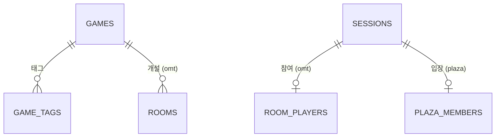

# 놀이터(playground) — 허브 ERD

2026-09-25 · [허브 명세](../planning/planning.md) 기준

## 1. 개요

허브가 들고 있는 것과 **카드가 공유하는 것**만 다룬다. 카드별 데이터는 카드 문서에 있다.

| 문서 | 다루는 것 |
| --- | --- |
| 이 문서 | 카드 카탈로그, 접속 세션 |
| [omt.md](omt.md) | 한번더 — 방·게임 |
| [playground.md](playground.md) | 놀이터 — 광장·음악 |

### 이 서비스의 특이한 점

일반적인 서비스와 데이터 성격이 많이 다르다. 세 문서 모두에 걸리는 이야기라 여기에 둔다.

- **계정이 없다.** 로그인하지 않고, 닉네임·아바타는 브라우저에 보관하며 중복도 허용한다. 따라서 **`users` 테이블이 없다.**
- **거의 모든 데이터가 휘발성이다.** 새로고침하면 있던 곳에서 나가고(0-4), 방이 사라지면 채팅도 함께 지워지며, 승자가 나오면 진행 상태를 버린다. 남겨서 다시 볼 데이터가 사실상 없다.
- **쓰기가 잦다.** 주사위 한 번, 한 칸 이동 한 번마다 상태가 바뀐다. 이걸 전부 RDB에 커밋하면 판당 수백 번의 트랜잭션이 생긴다.

### 무엇을 어디에 두는가

| 구분 | 저장 위치 | 무엇이 여기 오나 |
| --- | --- | --- |
| **영속** | **RDB** | 거의 안 바뀌는 카탈로그·참조 데이터 |
| **휘발** | **서버 메모리** | 방·광장·세션처럼 사라지면 그만인 것 |
| **상수** | **코드** | 갱도 깊이, 놀이기구 위치 같은 규칙 |

#### 결정: 단일 인스턴스와 서버 메모리

검토 끝에 **Redis를 쓰지 않고 단일 인스턴스의 JVM 메모리에 둔다.**

| 이유 | 내용 |
| --- | --- |
| 영속이 필요 없다 | 새로고침하면 나가고, 방이 사라지면 채팅도 지우고, 승자가 나오면 진행 상태를 버린다. 전적도 없다 |
| 쓰기가 너무 잦다 | 판당 수백 번인데 **버릴 데이터를 위한 왕복**이다 |
| 로직이 객체 그래프에 맞다 | 규칙 판정이 여러 테이블을 여러 번 훑는다. Redis면 결국 메모리로 읽어와 계산하게 되고, 그러면 Redis는 느린 백업일 뿐이다 |

**Redis만으로는 다중화가 되지 않는다는 점도 판단에 넣었다.** WebSocket 연결은 특정 인스턴스에 고정된다. 같은 방의 A가 1번 서버, B가 2번 서버에 붙어 있으면 상태가 Redis에 있어도 **1번 서버는 B의 소켓에 쓸 수 없다.** 확장은 `Redis(상태) + pub/sub(전파) + 방 단위 락`이 한 세트라, Redis 하나 넣는다고 얻어지지 않는다.

**대신 메모리 누수를 반드시 막아야 한다.** 이것이 이 선택의 유일한 실질 비용이다.

- 마지막 참여자가 나가면 방·채팅·타이머를 함께 지운다
- 타이머 스레드를 방과 같이 취소한다
- 소켓이 끊겼는데 정리되지 않은 고아 방을 주기적으로 쓸어내는 스위퍼를 둔다

**언제 바꾸나** — 한 대로 감당이 안 될 때다. 그때도 Redis가 첫 수단은 아니다. 먼저 **방 단위 sticky 라우팅**으로 메모리 구조를 그대로 두고 갈 수 있고, 그래도 부족할 때 Redis + pub/sub으로 옮긴다.

### 전제

- 방·광장은 `ConcurrentHashMap` 같은 동시성 컬렉션으로 관리한다. 여러 소켓이 같은 대상을 동시에 건드린다
- 모든 판정은 서버가 한다. 클라이언트가 보낸 값은 믿지 않는다
- `playgroundback/build.gradle`에 **`spring-boot-starter-websocket`이 빠져 있다.** 추가해야 한다

### ERD

허브 테이블은 셋뿐이고, 카드 테이블이 이 셋을 참조한다. 카드 안쪽 관계는 각 카드 문서의 ERD를 본다.

---

## 2. 테이블 목록

| 영역 | 테이블 | 설명 | 저장 |
| --- | --- | --- | --- |
| 카탈로그 | `games` | 허브에 올라가는 카드 | 영속 |
| 카탈로그 | `game_tags` | 카드에 붙는 태그 | 영속 |
| 접속 | `sessions` | 접속 중인 사람 | 휘발 |

### 카드 목록을 DB 에 두는 이유

`games` 에 행을 더하면 **배포 없이 카드를 붙이거나 내릴 수 있다.** "준비 중" 표시도 `is_playable` 한 칸으로 끝난다.

다만 **카드 화면 자체는 코드다.** 행만 넣는다고 없던 화면이 생기지는 않는다. `code` 값(`onemore`, `plaza`)이 어느 화면으로 보낼지를 정하는 열쇠다.

---

## 3. 테이블 명세

### GAMES: 놀이터에 올라가는 게임 (0-6)

| 컬럼 | 타입 | 제약 | 설명 |
| --- | --- | --- | --- |
| id | bigint | PK | 식별자 |
| code | varchar(30) | UK, NOT NULL | `onemore` 같은 코드. 클라이언트 라우팅 키 |
| name | varchar(30) | NOT NULL | 한글 이름 (한번더) |
| name_en | varchar(50) | NOT NULL | 영문 이름 (OneMoreTime). 준비 중인 카드는 `Coming Soon` |
| description | varchar(200) | NOT NULL | 카드 소개 문구 |
| thumbnail_url | varchar(500) |  | 카드 그림. 없으면 클라이언트가 기본 아이콘 표시 |
| min_players | smallint | NOT NULL | 카드에 표시할 최소 인원 |
| max_players | smallint | NOT NULL | 카드에 표시할 최대 인원 |
| play_minutes | varchar(20) |  | `15~20분` 같은 표시용 문자열 |
| is_playable | boolean | NOT NULL, DEFAULT false | false면 "준비 중" 배지 + 버튼 비활성 |
| sort_order | smallint | NOT NULL | 카드 넘김 순서 |
| created_at | timestamp | NOT NULL | 생성 시점 |
| updated_at | timestamp | NOT NULL | 최근 수정 시점 |

---

### GAME_TAGS: 게임 카드 태그 (0-6)

| 컬럼 | 타입 | 제약 | 설명 |
| --- | --- | --- | --- |
| id | bigint | PK | 식별자 |
| game_id | bigint | FK(GAMES), NOT NULL | 대상 게임 |
| name | varchar(20) | NOT NULL | `주사위`, `운과 배짱` 등. `#`은 클라이언트가 붙인다 |
| sort_order | smallint | NOT NULL | 표시 순서 |

- UK(`game_id`, `name`) — 같은 게임에 같은 태그 중복 방지

---

### SESSIONS: 접속 중인 사람 (1-13)

로그인이 없으므로 이 테이블이 사용자 테이블을 대신한다. **소켓 연결 하나가 한 행**이다.

| 컬럼 | 타입 | 제약 | 설명 |
| --- | --- | --- | --- |
| id | bigint | PK | 식별자 |
| session_key | varchar(64) | UK, NOT NULL | 소켓/쿠키 식별자 |
| nickname | varchar(20) | NOT NULL | 브라우저 프로필 이름. **중복 허용**(M-8) |
| avatar | varchar(8) | NOT NULL | 이모지 한 글자 |
| status | varchar(10) | NOT NULL | `idle` / `lobby` / `playing` |
| current_room_id | bigint | FK(ROOMS) | 들어가 있는 방. 없으면 NULL |
| connected_at | timestamp | NOT NULL | 접속 시점 |
| last_seen_at | timestamp | NOT NULL | 마지막 신호. 끊김 판정(5-2)에 쓴다 |

- INDEX(`status`) — 접속자 목록을 상태별로 세기 위해
- 연결이 끊기면 행을 **삭제**한다. 재접속 복구가 없으므로(0-4) 남길 이유가 없다

---

---

## 4. 카드가 공유하는 모양

각 카드가 자기 테이블을 갖되, **같은 모양을 쓰는 것**이 둘 있다.

### 채팅 메시지

한번더의 `chat_messages` 와 놀이터의 `plaza_chat` 은 부모만 다르고 컬럼이 같다.

| 컬럼 | 뜻 |
| --- | --- |
| `nickname` · `avatar` · `color_code` | **작성 시점 스냅샷** |
| `body` | 본문 (최대 60자) |
| `created_at` | 작성 시점 |

> **작성자 정보를 참조하지 않고 복사한다.** 참조만 하면 그 사람이 나가서 행이 사라졌을 때 **남긴 글의 작성자가 사라진다.** 값을 복사해 두면 나간 뒤에도 대화가 온전하다.

두 테이블을 하나로 합치지 않은 이유: 부모가 다르다(`room_id` vs 광장). 한 테이블에 두 부모를 넣으려면 다형 외래키가 되는데, 참조 무결성을 DB가 보장하지 못한다.

### 사람의 표시 정보

`room_players` 와 `plaza_members` 모두 `nickname` · `avatar` · `color_code` 를 **입장 시점에 복사**한다. 같은 이유다. 프로필을 바꿔도 이미 들어가 있는 공간의 표시 이름은 바뀌지 않는다.

---

## 5. 부록

### 부록 A: 그 밖의 enum 값

| 컬럼 | 값 |
| --- | --- |
| `sessions.status` | `idle`(대기 중) / `lobby`(방에 있음) / `playing`(게임 중) |

카드별 enum 은 각 카드 문서에 있다.

### 부록 B: 확장 여지

지금 범위에는 없지만, 요청이 생기면 이 자리에 붙는다.

| 기능 | 필요한 것 |
| --- | --- |
| 전적 기록 | 승리 판정 때 한 번만 쓰는 추가 전용 테이블. 다만 계정이 없어 "누구의 전적"인지 묶을 수 없으므로 **로그인이 먼저** 필요하다 |
| 서버 재시작 복구 | 휘발 영역을 RDB나 Redis로 옮긴다. 구조는 그대로 쓸 수 있다 |
| 새 카드 | `games` 에 행을 추가하고, 그 카드용 테이블을 새로 만든다. 세션·카탈로그는 그대로 재사용된다 |
| 게임 중 재접속 | `sessions` 에 재접속 유예 시간을 둔다. 명세상 지금은 하지 않는다 (0-4) |
