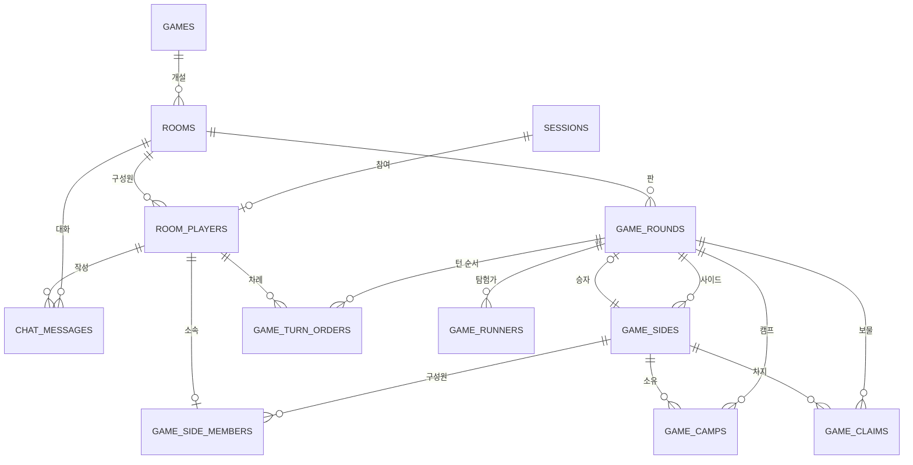

# 한번더(OneMoreTime) — ERD

2026-09-25 · [한번더 명세](../planning/omt.md) 기준 · 허브 ERD는 [erd.md](erd.md)

## 1. 개요

한번더의 **방과 게임 진행**을 담는다. 카드 카탈로그(`games`)와 접속 세션(`sessions`)은 허브 것을 참조한다.

저장 전략(영속 / 휘발 / 상수)과 "단일 인스턴스 + 서버 메모리" 결정은 [허브 ERD](erd.md#결정-단일-인스턴스와-서버-메모리)에 있다. **이 문서의 테이블은 모두 휘발성**이고 서버 메모리에 둔다.

### ERD



`GAMES` 와 `SESSIONS` 는 [허브](erd.md)에 정의돼 있다.

---

## 2. 테이블 목록

| 영역 | 테이블 | 설명 |
| --- | --- | --- |
| 방 | `rooms` | 게임방 |
| 방 | `room_players` | 방 참여자 |
| 방 | `chat_messages` | 방 채팅 |
| 게임 | `game_rounds` | 한 판의 진행 상태 |
| 게임 | `game_sides` | 점수 단위(개인전=사람, 팀전=팀) |
| 게임 | `game_side_members` | 사이드에 속한 참여자 |
| 게임 | `game_turn_orders` | 턴 순서 |
| 게임 | `game_camps` | 갱도에 설치된 캠프 |
| 게임 | `game_claims` | 보물을 찾은 갱도 |
| 게임 | `game_runners` | 이번 턴의 탐험가 |

모두 휘발성이다. 방이 사라지면 전부 함께 사라진다.

### 사이드(side)를 따로 둔 이유

개인전은 **사람**이, 팀전은 **팀**이 점수를 가진다. 캠프·보물·통계가 모두 이 단위에 붙는다. 두 경우를 하나로 묶지 않으면 `side_id`가 될 자리에 `player_id`와 `team_code` 중 무엇이 들어갈지가 모드마다 갈려서, 캠프·보물 테이블이 전부 두 갈래가 된다.

`game_sides`를 두면 모드와 무관하게 **캠프도 보물도 통계도 `side_id` 하나만 본다.** 개인전이면 사이드에 구성원이 1명, 팀전이면 2명일 뿐이다.

---

## 3. 테이블 명세

### ROOMS: 게임방 (1-1)

| 컬럼 | 타입 | 제약 | 설명 |
| --- | --- | --- | --- |
| id | bigint | PK | 식별자 |
| game_id | bigint | FK(GAMES), NOT NULL | 어떤 게임의 방인지 |
| title | varchar(30) | NOT NULL | 방 제목 |
| mode | varchar(10) | NOT NULL | `solo` / `team` (1-5) |
| max_players | smallint | NOT NULL | 개인전 2~6, 팀전 2·4·6·8 |
| is_secret | boolean | NOT NULL, DEFAULT false | 비밀방 여부 |
| password_hash | varchar(255) |  | 비밀방일 때만. **평문으로 두지 않는다** |
| status | varchar(10) | NOT NULL | `waiting` / `playing` / `closed` |
| created_at | timestamp | NOT NULL | 생성 시점 |
| closed_at | timestamp |  | 방이 사라진 시점 |

- INDEX(`game_id`, `status`) — 방 목록 조회(1-2)가 이 조합으로만 읽는다
- 방장은 `rooms`가 아니라 `room_players.is_host`로 둔다. 방장을 여기에 FK로 두면 `rooms` ↔ `room_players` 순환 참조가 생겨 삽입 순서가 꼬인다
- 마지막 참여자가 나가면 방을 삭제하고, **채팅도 함께 지운다**(M-6)

#### 비밀번호를 해시하는 이유

방 비밀번호는 개인 계정 비밀번호가 아니라 출입 암호에 가깝다. 그래도 해시한다. 사람들은 **아무 생각 없이 자기 비밀번호를 재사용하기 때문**이다. 입장 확인(1-3)은 대조만 하면 되므로 평문으로 들고 있을 이유도 없다.

---

### ROOM_PLAYERS: 방 참여자 (1-4)

| 컬럼 | 타입 | 제약 | 설명 |
| --- | --- | --- | --- |
| id | bigint | PK | 식별자 |
| room_id | bigint | FK(ROOMS), NOT NULL | 소속 방 |
| session_id | bigint | FK(SESSIONS) | 접속 세션. 나가면 NULL |
| nickname | varchar(20) | NOT NULL | 입장 시점 이름 **스냅샷** |
| avatar | varchar(8) | NOT NULL | 입장 시점 아바타 스냅샷 |
| color_code | varchar(10) | NOT NULL | `red`/`blue`/… 8색 중 하나 (1-7) |
| team_code | char(1) |  | `A`~`D`. 팀전에서만 (1-6) |
| seat_no | smallint |  | 팀 안의 자리 `0`/`1`. 팀전에서만 |
| is_host | boolean | NOT NULL, DEFAULT false | 방장 여부 |
| is_ready | boolean | NOT NULL, DEFAULT false | 준비 여부 (1-8) |
| joined_at | timestamp | NOT NULL | 입장 시점. **방장 위임 순서**가 이 값 순이다 (1-12) |
| left_at | timestamp |  | 퇴장 시점. 채팅 기록 때문에 행 자체는 남긴다 |

- UK(`room_id`, `color_code`) WHERE `left_at` IS NULL — 개인전 색 중복 방지
- UK(`room_id`, `team_code`, `seat_no`) WHERE `left_at` IS NULL — 팀 자리 중복 방지
- UK(`room_id`) WHERE `is_host` — 방장은 방마다 한 명

#### 닉네임을 세션에서 join하지 않고 복사하는 이유

`sessions`를 참조만 하면, 참여자가 나가서 세션이 지워졌을 때 **그 사람이 남긴 채팅의 작성자가 사라진다.** 결과 화면의 팀원 이름도 마찬가지다. 입장 시점 값을 복사해 두면 나간 뒤에도 화면이 온전하다. 방 안에서 이름을 바꿀 수단이 없으므로(프로필 수정은 홈에서만) 값이 어긋날 일도 없다.

---

### CHAT_MESSAGES: 방 채팅 (0-8)

| 컬럼 | 타입 | 제약 | 설명 |
| --- | --- | --- | --- |
| id | bigint | PK | 식별자. 정렬 키를 겸한다 |
| room_id | bigint | FK(ROOMS), NOT NULL | 소속 방 |
| room_player_id | bigint | FK(ROOM_PLAYERS), NOT NULL | 작성자 |
| nickname | varchar(20) | NOT NULL | 작성 시점 이름 스냅샷 |
| avatar | varchar(8) | NOT NULL | 작성 시점 아바타 스냅샷 |
| color_code | varchar(10) | NOT NULL | 말풍선 색 |
| body | varchar(60) | NOT NULL | 본문. 입력칸 제한과 같은 60자 |
| created_at | timestamp | NOT NULL | 작성 시점 |

- INDEX(`room_id`, `id`) — 방 단위로 순서대로만 읽는다
- 대기실과 게임이 같은 대화를 쓰므로 `room_id`에만 매달고 **화면은 구분하지 않는다**
- 개수 제한 없이 전부 보관하고, 방이 사라질 때 함께 삭제한다 (M-6)

---

### GAME_ROUNDS: 한 판의 진행 상태 (2장)

| 컬럼 | 타입 | 제약 | 설명 |
| --- | --- | --- | --- |
| id | bigint | PK | 식별자 |
| room_id | bigint | FK(ROOMS), NOT NULL | 어느 방의 판인지 |
| status | varchar(10) | NOT NULL | `playing` / `finished` |
| phase | varchar(10) | NOT NULL | 아래 [부록 B](#부록-b-phase-값) 참고 |
| phase_deadline_at | timestamp |  | 단계 제한 시간이 끝나는 시각 (5-3). 제한 없는 단계는 NULL |
| turn_no | smallint | NOT NULL, DEFAULT 0 | 지금 차례. `game_turn_orders.turn_no`를 가리킨다 |
| dice_1 | smallint |  | 마지막으로 굴린 주사위 (2-3) |
| dice_2 | smallint |  | 〃 |
| dice_3 | smallint |  | 〃 |
| dice_4 | smallint |  | 〃 |
| rolls_this_turn | smallint | NOT NULL, DEFAULT 0 | 이번 턴에 굴린 횟수. 최장 연속 기록에 쓴다 (2-8) |
| winner_side_id | bigint | FK(GAME_SIDES) | 승자 (2-10) |
| started_at | timestamp | NOT NULL | 시작 시점 |
| finished_at | timestamp |  | 종료 시점 |

- UK(`room_id`) WHERE `status` = `'playing'` — 한 방에 진행 중인 판은 하나뿐
- 주사위를 별도 테이블로 빼지 않은 이유: 항상 정확히 4개이고, 다음 굴림에 통째로 덮어쓴다. 행으로 쪼개면 이득 없이 삭제·삽입만 늘어난다
- `phase_deadline_at`을 **남은 초가 아니라 종료 시각으로** 두는 이유: 남은 초를 저장하면 서버가 매초 써야 한다. 종료 시각은 단계가 바뀔 때 한 번만 쓰면 되고, 클라이언트도 이 값 하나로 막대를 그릴 수 있다

---

### GAME_SIDES: 점수 단위 (2-2, 3-2)

| 컬럼 | 타입 | 제약 | 설명 |
| --- | --- | --- | --- |
| id | bigint | PK | 식별자 |
| round_id | bigint | FK(GAME_ROUNDS), NOT NULL | 소속 판 |
| side_no | smallint | NOT NULL | 헤더 참여자 칩 표시 순서 |
| label | varchar(20) | NOT NULL | 개인전은 닉네임, 팀전은 팀 이름(`빨강 팀`) |
| color_code | varchar(10) | NOT NULL | 사이드 색. 캠프·보물이 이 색으로 칠해진다 |
| team_code | char(1) |  | 팀전에서만. 개인전은 NULL |
| bust_count | smallint | NOT NULL, DEFAULT 0 | 붕괴 횟수 (2-6, 3-2) |
| max_streak | smallint | NOT NULL, DEFAULT 0 | 한 턴 최장 연속 굴림 (3-2) |

- UK(`round_id`, `side_no`)
- UK(`round_id`, `team_code`) WHERE `team_code` IS NOT NULL — 한 판에 같은 팀 사이드는 하나
- 통계를 별도 테이블로 빼지 않은 이유: 사이드마다 **항상 정확히 한 벌** 존재하고 선택적이지 않다. 1:1 테이블을 만들면 조인만 늘어난다
- 보물 개수는 컬럼으로 두지 않는다. `game_claims`를 세면 되고, 중복해서 들고 있으면 어긋날 수 있다

---

### GAME_SIDE_MEMBERS: 사이드 구성원

| 컬럼 | 타입 | 제약 | 설명 |
| --- | --- | --- | --- |
| id | bigint | PK | 식별자 |
| side_id | bigint | FK(GAME_SIDES), NOT NULL | 소속 사이드 |
| room_player_id | bigint | FK(ROOM_PLAYERS), NOT NULL | 참여자 |

- UK(`room_player_id`) — 한 사람은 한 판에서 한 사이드에만 속한다
- 개인전은 사이드마다 1행, 팀전은 1~2행 (팀 인원이 같아야 하는 조건은 1-11)

---

### GAME_TURN_ORDERS: 턴 순서 (1-10)

| 컬럼 | 타입 | 제약 | 설명 |
| --- | --- | --- | --- |
| id | bigint | PK | 식별자 |
| round_id | bigint | FK(GAME_ROUNDS), NOT NULL | 소속 판 |
| turn_no | smallint | NOT NULL | 0부터 시작하는 순번 |
| room_player_id | bigint | FK(ROOM_PLAYERS), NOT NULL | 그 순번의 참여자 |

- UK(`round_id`, `turn_no`)
- UK(`round_id`, `room_player_id`) — 한 사람이 두 번 들어가지 않는다
- 시작(1-11) 때 한 번 만들고 판이 끝날 때까지 바뀌지 않는다. 팀전은 같은 팀이 연달아 오지 않도록 섞어 넣는다
- 현재 차례는 `game_rounds.turn_no`와 맞춰 읽는다. 다음 차례는 `(turn_no + 1) % 전체 수`

---

### GAME_CAMPS: 설치된 캠프 (2-8)

멈추기를 했을 때 확정되는 진행 위치다. 판이 끝날 때까지 남는다.

| 컬럼 | 타입 | 제약 | 설명 |
| --- | --- | --- | --- |
| id | bigint | PK | 식별자 |
| round_id | bigint | FK(GAME_ROUNDS), NOT NULL | 소속 판 |
| side_id | bigint | FK(GAME_SIDES), NOT NULL | 캠프 주인 |
| shaft_no | smallint | NOT NULL, CHECK 2~12 | 갱도 번호 |
| depth | smallint | NOT NULL | 현재 깊이. `1` ~ 그 갱도의 깊이([부록 A](#부록-a-갱도-깊이-상수)) |

- UK(`round_id`, `side_id`, `shaft_no`) — 한 사이드는 한 갱도에 캠프 하나
- 보물이 발견되면(2-9) **그 갱도의 다른 사이드 캠프를 삭제**한다

---

### GAME_CLAIMS: 보물을 찾은 갱도 (2-9)

| 컬럼 | 타입 | 제약 | 설명 |
| --- | --- | --- | --- |
| id | bigint | PK | 식별자 |
| round_id | bigint | FK(GAME_ROUNDS), NOT NULL | 소속 판 |
| shaft_no | smallint | NOT NULL, CHECK 2~12 | 갱도 번호 |
| side_id | bigint | FK(GAME_SIDES), NOT NULL | 차지한 사이드 |
| claimed_at | timestamp | NOT NULL | 차지한 시점 |

- UK(`round_id`, `shaft_no`) — **갱도 하나는 한 사이드만.** 이 제약이 "이미 보물이 발견된 갱도는 누구도 못 쓴다"를 DB에서 보장한다
- 한 사이드의 행이 3개가 되면 승리 (2-10)

---

### GAME_RUNNERS: 이번 턴의 탐험가 (2-5)

한 턴 동안만 존재한다. 멈추면 캠프로 바뀌고, 붕괴하면 그냥 사라진다.

| 컬럼 | 타입 | 제약 | 설명 |
| --- | --- | --- | --- |
| id | bigint | PK | 식별자 |
| round_id | bigint | FK(GAME_ROUNDS), NOT NULL | 소속 판 |
| shaft_no | smallint | NOT NULL, CHECK 2~12 | 갱도 번호 |
| depth | smallint | NOT NULL | 현재 깊이 |

- UK(`round_id`, `shaft_no`) — 한 갱도에 탐험가는 하나
- **행 수는 최대 3개**(`MAX_RUNNERS`). 이건 DB 제약으로 표현할 수 없으므로 서버가 막는다
- 사이드 컬럼이 없는 이유: 탐험가는 항상 **지금 차례인 사이드의 것**이다. 턴이 끝나면 전부 비운다

---

---

## 4. 부록

### 부록 A: 갱도 깊이 상수

가운데가 깊고 바깥이 얕다. 주사위 두 개의 합이 잘 나오는 숫자일수록 멀다.

| 갱도 | 2 | 3 | 4 | 5 | 6 | 7 | 8 | 9 | 10 | 11 | 12 |
| --- | --- | --- | --- | --- | --- | --- | --- | --- | --- | --- | --- |
| 깊이 | 3 | 5 | 7 | 9 | 11 | 13 | 11 | 9 | 7 | 5 | 3 |

**이 값은 테이블이 아니라 코드 상수다.** 운영 중 바뀌지 않는 게임 규칙이고, 이 값을 쓰는 판정 로직과 같이 버전 관리되어야 한다. 불변 enum 하나면 충분하다.

```java
public enum Shaft {
    S2(2, 3),  S3(3, 5),  S4(4, 7),   S5(5, 9),   S6(6, 11), S7(7, 13),
    S8(8, 11), S9(9, 9),  S10(10, 7), S11(11, 5), S12(12, 3);

    private static final Map<Integer, Shaft> BY_NO =
            Arrays.stream(values()).collect(toUnmodifiableMap(Shaft::no, s -> s));

    private final int no;
    private final int depth;

    Shaft(int no, int depth) { this.no = no; this.depth = depth; }

    public int no() { return no; }
    public int depth() { return depth; }

    /** 주사위 두 개의 합으로 갱도를 찾는다. 2~12 밖이면 예외. */
    public static Shaft of(int sum) {
        Shaft s = BY_NO.get(sum);
        if (s == null) throw new IllegalArgumentException("갱도 번호 범위 밖: " + sum);
        return s;
    }
}
```

#### 테이블로 두지 않는 이유

처음에는 `mine_shafts` 테이블로 뒀다가 뺐다. 근거가 세 가지 다 약했다.

- **"서버 검증의 기준이 된다"** — 상수로도 똑같이 검증되고, 조회가 없으니 더 빠르다. DB에서 읽더라도 결국 캐싱할 텐데, 그러면 번거로운 절차를 거친 상수일 뿐이다.
- **"코드 상수와 DB가 따로 놀지 않는다"** — 거꾸로다. 양쪽에 있으면 어긋날 수 있고, 한쪽에만 있으면 어긋날 곳이 없다.
- **"FK로 갱도 번호를 보장한다"** — `game_*`은 메모리에 두기로 했으므로 **애초에 진짜 FK가 걸리지 않는다.** 나중에 RDB로 옮기더라도 `CHECK (shaft_no BETWEEN 2 AND 12)`이면 같은 일을 하고 조인이 없다.

깊이가 범위를 넘지 않는지는 어차피 서버가 봐야 한다 ([부록 D](#부록-d-db로-막을-수-없는-규칙)).

### 부록 B: phase 값

`game_rounds.phase`와 제한 시간(5-3)의 대응이다.

| phase | 뜻 | 제한 시간 | 초과 시 |
| --- | --- | --- | --- |
| `idle` | 턴 시작, 아직 안 굴림 | 10초 | 자동 멈추기 |
| `rolling` | 주사위가 구르는 중 | 없음 | — |
| `rolled` | 조합을 고르는 중 | 15초 | 첫 번째 가능한 조합 자동 선택 |
| `digging` | 파기 연출 진행 중 | 없음 | — |
| `moved` | 판 뒤, 계속/멈추기 선택 | 10초 | 자동 멈추기 |
| `bust` | 붕괴 연출 중 | 없음 | — |
| `wait` | 턴 마무리, 다음 사람 대기 | 없음 | — |

### 부록 C: 그 밖의 enum 값

| 컬럼 | 값 |
| --- | --- |
| `rooms.mode` | `solo` / `team` |
| `rooms.status` | `waiting` / `playing` / `closed` |
| `game_rounds.status` | `playing` / `finished` |
| `room_players.color_code` | `red` `blue` `green` `yellow` `purple` `pink` `teal` `orange` |
| `room_players.team_code` | `A`(빨강) `B`(파랑) `C`(초록) `D`(노랑) |

팀 이름은 팀 색 이름을 그대로 쓴다. 팀 색은 `color_code`의 앞 네 가지와 같은 값이다.

### 부록 D: DB로 막을 수 없는 규칙

제약으로 표현할 수 없어 **서버가 검증해야 하는** 것들이다. 놓치면 규칙이 깨진다.

| 규칙 | 근거 |
| --- | --- |
| 탐험가는 한 턴에 최대 3개 | 2-5 |
| 캠프·탐험가 깊이가 그 갱도의 깊이를 넘지 않는다 | 2-1 |
| 한 조합에서 쓸 수 있는 만큼 많이 써야 한다 (최대 사용 규칙) | 2-4 |
| 개인전 2~6명 / 팀전 2~4팀, 모든 팀의 인원이 같을 것 | 1-11 |
| 방 인원이 `rooms.max_players`를 넘지 않는다 | 1-11 |
| 보물 3개를 모으면 즉시 종료 | 2-10 |

