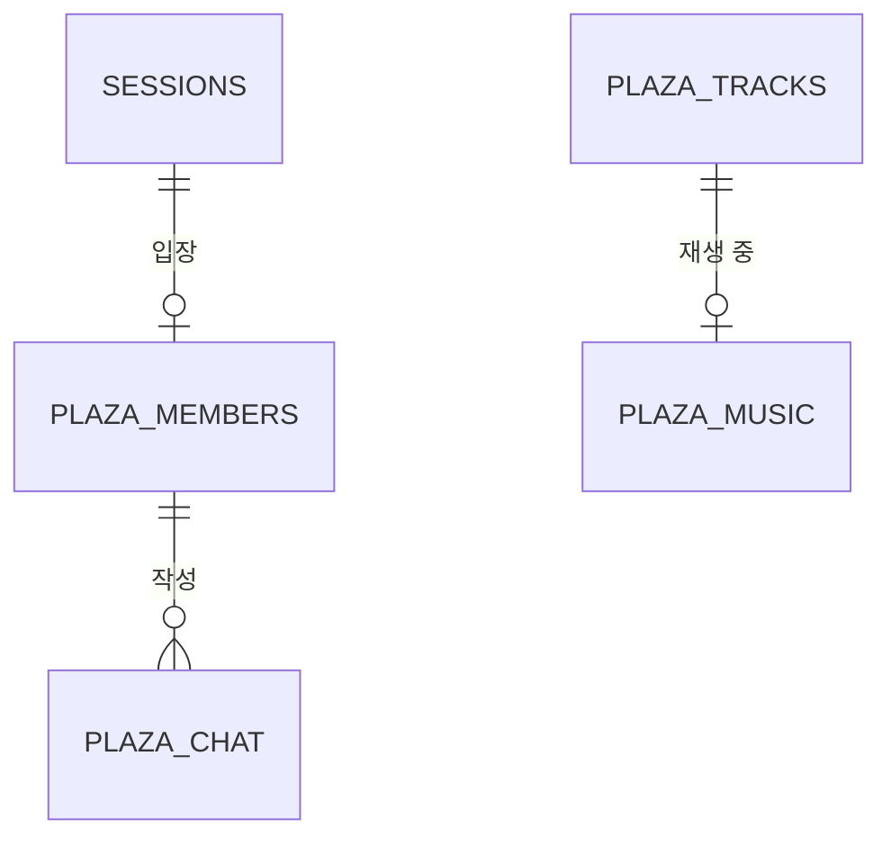

# 놀이터(Plaza) — ERD

2026-09-25 · [놀이터 명세](../planning/playground.md) 기준 · 허브 ERD는 [erd.md](erd.md)

## 1. 개요

놀이터의 **광장과 음악**을 담는다. 접속 세션(`sessions`)은 허브 것을 참조한다.

저장 전략과 "단일 인스턴스 + 서버 메모리" 결정은 [허브 ERD](erd.md#결정-단일-인스턴스와-서버-메모리)에 있다.

### 한번더와 다른 점

한번더는 **방이 여럿**이고 각 방이 자기 상태를 갖는다. 놀이터는 **공간이 하나**다. 방을 만들고 없애는 개념이 없고, 서버가 켜져 있는 동안 계속 열려 있다.

| 항목 | 한번더 | 놀이터 |
| --- | --- | --- |
| 단위 | 방 여러 개 | **공간 하나** |
| 정원 | 방마다 2~8명 | **전체 20명** |
| 생명주기 | 마지막 사람이 나가면 삭제 | 사람이 없어도 존재 |
| 좌표 | 없음 (고정 자리) | **x · y 를 계속 주고받는다** |

이 차이 때문에 `rooms` 같은 부모 테이블이 없고, 광장 상태가 곧 전역 상태다.

### ERD



`SESSIONS` 는 [허브](erd.md)에 정의돼 있다. `PLAZA_MUSIC` 은 **행이 항상 하나**인 전역 상태다.

---

## 2. 테이블 목록

| 영역 | 테이블 | 설명 | 저장 |
| --- | --- | --- | --- |
| 음악 | `plaza_tracks` | 틀 수 있는 곡 목록 | 영속 |
| 광장 | `plaza_members` | 지금 광장에 있는 사람 | 휘발 |
| 광장 | `plaza_chat` | 광장 채팅 | 휘발 |
| 음악 | `plaza_music` | 지금 나오는 곡 (한 행) | 휘발 |

놀이기구 위치·근접 반경·감정 표현 목록은 **테이블이 아니라 코드 상수**다. 이유는 [부록 A](#부록-a-놀이기구와-상호작용-지점)에 있다.

---

## 3. 테이블 명세

### PLAZA_TRACKS: 틀 수 있는 곡 (P-15)

곡을 추가·교체할 때 배포하지 않아도 되도록 테이블로 둔다. `games` 와 같은 성격의 카탈로그다.

| 컬럼 | 타입 | 제약 | 설명 |
| --- | --- | --- | --- |
| id | bigint | PK | 식별자 |
| code | varchar(30) | UK, NOT NULL | `energetic` 같은 코드 |
| title | varchar(40) | NOT NULL | 표시 제목 (`신나는 하루`) |
| mood | varchar(20) | NOT NULL | 분위기 표시 (`Energetic`) |
| src_url | varchar(500) | NOT NULL | 음원 경로 |
| duration_sec | smallint | NOT NULL | 길이(초). **진행바와 자동 넘김이 이 값을 쓴다** |
| sort_order | smallint | NOT NULL | 목록 순서이자 **다음 곡 순서** (P-18) |
| created_at | timestamp | NOT NULL | 생성 시점 |

- UK(`sort_order`) — 순서가 겹치면 다음 곡이 어느 쪽인지 정해지지 않는다
- **`duration_sec` 은 실제 음원 길이와 반드시 맞아야 한다.** 짧게 적으면 곡이 끝나기 전에 넘어가고, 길게 적으면 끝난 뒤 침묵이 흐른다
- 음원은 서버가 중계하지 않는다. 클라이언트가 `src_url` 로 직접 받는다

---

### PLAZA_MEMBERS: 광장에 있는 사람 (P-1, P-2)

| 컬럼 | 타입 | 제약 | 설명 |
| --- | --- | --- | --- |
| id | bigint | PK | 식별자 |
| session_id | bigint | FK(SESSIONS), UK, NOT NULL | 접속 세션. **한 사람은 한 번만 들어간다** |
| nickname | varchar(20) | NOT NULL | 입장 시점 이름 스냅샷 |
| avatar | varchar(8) | NOT NULL | 입장 시점 아바타 스냅샷 |
| color_code | varchar(10) | NOT NULL | 캐릭터 색 |
| pos_x | decimal(5,2) | NOT NULL | 가로 위치(%). `6.00` ~ `94.00` |
| pos_y | decimal(5,2) | NOT NULL | 세로 위치(%). `56.00` ~ `94.00` |
| facing | smallint | NOT NULL, DEFAULT 0 | 바라보는 쪽. `-1` 왼쪽 / `0` 정면 / `1` 오른쪽 |
| riding_spot | varchar(20) |  | 타고 있는 기구 코드 (`swing` `seesaw` `merry`). 없으면 NULL |
| riding_seat | smallint |  | 그 기구의 자리 번호 (`0` / `1`) |
| joined_at | timestamp | NOT NULL | 입장 시점 |
| moved_at | timestamp | NOT NULL | 마지막으로 위치가 바뀐 시점 |

- UK(`riding_spot`, `riding_seat`) WHERE `riding_spot` IS NOT NULL — **한 자리에 두 명이 앉을 수 없다**
- 정원 20명은 행 수로 막는다. DB 제약으로 표현할 수 없으므로 서버가 센다
- 소켓이 끊기면 행을 삭제한다. 재접속 복구가 없으므로(0-4) 남길 이유가 없다

#### 좌표를 왜 소수점까지 두는가

캐릭터는 초당 화면의 19%를 움직이고 프레임마다 조금씩 이동한다. 정수로 자르면 **한 칸씩 튀어 보인다.** 소수 둘째 자리면 화면 폭 1000px 기준 0.1px 단위라 충분하다.

#### 좌표를 매번 저장하지 않는다

`pos_x` · `pos_y` 는 **입력이 바뀔 때와 1초 보정 때만** 갱신한다 (M-P10). 프레임마다 쓰면 20명 × 60fps = 초당 1200번이다. 그 사이 위치는 각 클라이언트가 방향과 시작 좌표로 계산한다.

`moved_at` 은 보간과 오래된 값 판별에 쓴다.

---

### PLAZA_CHAT: 광장 채팅 (P-6)

컬럼은 한번더의 `chat_messages` 와 같다. 모양이 같은 이유와 스냅샷을 두는 이유는 [허브 ERD](erd.md#채팅-메시지)에 있다.

| 컬럼 | 타입 | 제약 | 설명 |
| --- | --- | --- | --- |
| id | bigint | PK | 식별자. 정렬 키를 겸한다 |
| member_id | bigint | FK(PLAZA_MEMBERS), NOT NULL | 작성자 |
| nickname | varchar(20) | NOT NULL | 작성 시점 이름 스냅샷 |
| avatar | varchar(8) | NOT NULL | 작성 시점 아바타 스냅샷 |
| color_code | varchar(10) | NOT NULL | 말풍선 색 |
| body | varchar(60) | NOT NULL | 본문. 입력칸 제한과 같은 60자 |
| created_at | timestamp | NOT NULL | 작성 시점 |

- INDEX(`id`) — 순서대로만 읽는다
- **10분 경계(`:00 :10 … :50`)마다 전부 지운다** (P-23). 광장은 사라지는 시점이 없어 자를 기회가 여기밖에 없다
- 벽시계 기준이라 서버가 알려주지 않아도 **모든 클라이언트가 같은 시점에 비운다.** 서버는 자기 쪽 행만 지우면 된다

---

### PLAZA_MUSIC: 지금 나오는 곡 (P-15 ~ P-18)

**행이 항상 하나인 전역 상태다.** 광장이 하나뿐이라 곡도 하나뿐이다.

| 컬럼 | 타입 | 제약 | 설명 |
| --- | --- | --- | --- |
| id | smallint | PK, CHECK = 1 | 항상 `1`. 행이 둘이 될 수 없게 막는다 |
| track_id | bigint | FK(PLAZA_TRACKS) | 지금 나오는 곡. 꺼져 있으면 NULL |
| started_at | timestamp |  | **그 곡이 시작된 시각.** 재생 위치는 여기서 계산한다 |
| changed_by | bigint | FK(PLAZA_MEMBERS) | 마지막으로 곡을 바꾼 사람. 나가면 NULL |

#### 남은 시간이 아니라 시작 시각을 저장하는 이유

```
재생 위치 = 지금 − started_at
```

남은 시간을 저장하면 **서버가 매초 써야 한다.** 시작 시각은 곡이 바뀔 때 한 번만 쓰면 되고, 늦게 들어온 사람도 같은 계산으로 지금 위치를 구할 수 있다. 제한 시간을 `phaseDeadlineAt` 으로 두는 한번더와 같은 방식이다.

곡이 끝났는지도 이 값으로 판단한다. 오디오의 종료 신호에 기대면 음원 로딩이 실패했을 때 그 곡에 영원히 멈춘다.

---

## 4. 부록

### 부록 A: 놀이기구와 상호작용 지점

**테이블이 아니라 코드 상수다.** 갱도 깊이를 테이블로 두지 않은 것과 같은 판단이다.

| 지점 | 종류 | 위치(x, y) | 반경(rx, ry) | 자리 | 필요 인원 |
| --- | --- | --- | --- | --- | --- |
| `dj` | 곡 선택 | 82%, 49% | 14, 10 | — | — |
| `swing` | 타기 | 16%, 66% | 11, 8 | 2 | 1 |
| `seesaw` | 타기 | 64%, 74% | 11, 8 | 2 | **2** |
| `merry` | 타기 | 9%, 88% | 10, 7 | 1 | 1 |

배경 기구(터널 아치·미끄럼틀·벤치·지그재그 바·가로등)는 상호작용이 없어 데이터가 없다.

#### 테이블로 두지 않는 이유

- 운영 중 바뀌지 않는 **공간 규칙**이고, 이 값을 쓰는 판정 로직과 같이 버전 관리되어야 한다
- 서버가 검증할 때 조회가 필요 없어 더 빠르다. DB에서 읽더라도 결국 캐싱할 텐데, 그러면 번거로운 절차를 거친 상수일 뿐이다
- 양쪽에 두면 어긋날 수 있고, 한쪽에만 있으면 어긋날 곳이 없다
- 위치는 **화면 마크업의 좌표와 반드시 일치해야 한다.** 코드 상수로 두면 한곳만 고치면 되고, 어긋나면 안내 문구가 엉뚱한 곳에 뜬다

#### 반경을 가로·세로 따로 두는 이유

걸어 다니는 범위가 가로 88% × 세로 38%로 비대칭이다. 원형 반경으로 잡으면 **세로로 과하게 걸려** 한참 떨어진 곳에서도 안내가 뜬다.

### 부록 B: DB로 막을 수 없는 규칙

제약으로 표현할 수 없어 **서버가 검증해야 하는** 것들이다.

| 규칙 | 근거 |
| --- | --- |
| 광장 정원 20명 | P-22 |
| 좌표가 걷는 범위 안에 있을 것 (`x 6~94`, `y 56~94`) | P-2 |
| 기구에 앉으려면 근접 반경 안에 있을 것 | P-11 |
| 시소는 두 자리가 다 차야 움직인다 | P-14 |
| 채팅 본문 60자 이하 | P-6 |
| 곡을 바꾸려면 DJ 부스 근처에 있을 것 | P-15 |

### 부록 C: 결정된 사항

| # | 질문 | 결정 |
| --- | --- | --- |
| E-P1 | 광장 채팅을 언제 비울지 | **10분 경계마다 전부 비운다** (`:00 :10 … :50`). 개수 기준이 아니라 시각 기준이다 |
| E-P2 | 정원이 찼을 때 | **입장을 거절한다.** 광장을 여러 개로 늘리지 않는다 |

남은 미정 사항은 없다.

### 부록 D: 확장 여지

| 기능 | 필요한 것 |
| --- | --- |
| 광장 여러 개 | 지금은 정원이 차면 거절한다(E-P2). 늘리려면 `plazas` 테이블을 두고 `plaza_members` · `plaza_chat` · `plaza_music` 에 `plaza_id` 를 붙인다. `plaza_music` 의 단일 행 제약은 `UK(plaza_id)` 로 바뀐다 |
| DJ 권한 | `plaza_music` 에 `dj_member_id` 를 두고, 그 사람만 곡을 바꿀 수 있게 한다. 지금은 누구나 바꾼다 (M-P5) |
| 곡 신청 목록 | `plaza_queue` 를 추가하고 `plaza_music` 이 그 순서를 따른다 |
| 기구 이용 기록 | 계정이 없어 누구의 기록인지 묶을 수 없다. **로그인이 먼저** 필요하다 |
