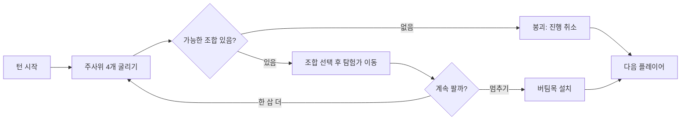

# 한번더(OneMoreTime) — 기능 명세서 (초안)

2026-09-24

## 개요

한번더(OneMoreTime)는 주사위 4개로 11개의 갱도를 파내려가, 가장 깊은 곳의 보물 3개를 먼저 찾는 사람이 이기는 웹 보드게임이다. 게임 방식은 캔트 스톱과 같고, 테마는 산 등반 대신 땅을 파는 던전 탐험이다.

문서 형식은 셀라 기능 명세서와 같이 **기능명 / 목적 / 위치 / 트리거 / 처리 로직** 중심으로 작성했다. 입출력·예외 처리 같은 데이터 상세는 이후 설계 문서에서 정의한다.

### 전제 및 가정

- 플랫폼: 모바일과 PC 브라우저에서 모두 동작하는 웹 게임
- 1차 버전(MVP): 각자 자기 기기로 접속하는 온라인 멀티플레이(서버 + 웹소켓), 로그인 없이 닉네임과 초대 코드로 참여
- 인원: 개인전 2~6명, 팀전 최대 4팀(8명)
- 방 만들기·초대 코드·대기실은 1장, 실시간 동기화는 5장에서 다룸
- 이름·그림·규칙서 문장은 모두 자체 제작 (원작 에셋 사용 없음)

### 용어 정의

| 게임 용어 | 원작 대응 | 설명 |
| --- | --- | --- |
| 갱도 | 열(2~12) | 주사위 합에 대응하는 11개의 길. 깊이는 2·12번 3칸, 7번 13칸 |
| 탐험가 | 중립(임시) 말 | 한 턴에 최대 3개 갱도에 투입하는 임시 말 |
| 버팀목 | 플레이어 말 | 멈추기를 했을 때 진행 위치를 저장하는 내 색 말 |
| 붕괴 | 버스트 | 어떤 조합으로도 탐험가를 움직일 수 없을 때, 이번 턴 진행이 모두 취소됨 |
| 보물 발견 | 열 차지 | 갱도 맨 아래에 도달해 그 갱도를 소유함, 타인은 더 이상 사용 불가 |

## 0. 공통

| 번호 | 기능명 | 목적 | 위치 | 트리거 | 처리 로직 |
| --- | --- | --- | --- | --- | --- |
| 0-1 | 화면 전환 | 홈/대기실/게임/결과/도움말 화면을 이동한다 | 전체 | 각 화면의 이동 버튼 클릭 또는 서버 이벤트 수신 | 현재 화면 상태값 변경 후 해당 화면 렌더링 |
| 0-2 | 토스트 알림 | 입장·턴 시작·붕괴·보물 발견 등 주요 이벤트를 짧게 안내한다 | 화면 상단 | 게임 이벤트 발생 시 | 약 2초간 메시지 노출 후 자동 소멸 |
| 0-3 | 게임 상태 서버 보관 | 새로고침이나 재접속 후에도 게임을 이어간다 | 서버 | 각 게임 이벤트 처리 시 | 방별 게임 상태(참여자, 버팀목·탐험가 위치, 턴 순서)를 서버에 보관 |
| 0-4 | 재접속 | 새로고침·네트워크 끊김 후 같은 방으로 복귀한다 | 앱 진입 시 자동 | 브라우저에 이전 방 정보가 있을 때 | 저장된 방 코드와 참여자 식별값으로 재입장 요청, 성공하면 현재 상태를 받아 복귀. 방이 사라졌으면 홈으로 이동 |
| 0-5 | 사운드 재생 | 주사위·파기·붕괴 등 상황에 맞는 효과음으로 몰입감을 높인다 | 전체 | 게임 이벤트 발생 시 | 사운드 설정이 on이면 이벤트별 효과음 재생 |

## 1. 로비 / 대기실

| 번호 | 기능명 | 목적 | 위치 | 트리거 | 처리 로직 |
| --- | --- | --- | --- | --- | --- |
| 1-1 | 방 만들기 | 온라인 게임방을 연다 | 홈 화면 | "방 만들기" 버튼 클릭 | 닉네임 입력 후 새 방과 초대 코드를 생성하고, 만든 사람을 방장으로 등록해 대기실로 이동 |
| 1-2 | 초대 코드로 참여 | 만들어진 방에 합류한다 | 홈 화면 → 참여 시트 | 코드·닉네임 입력 후 "참여하기" 클릭 | 코드와 일치하는 대기 중인 방에 참여자로 추가. 잘못된 코드·정원 초과·게임 진행 중이면 거절 안내 |
| 1-3 | 초대 코드 복사 | 다른 사람을 초대한다 | 대기실 상단 | "복사" 버튼 클릭 | 초대 코드(또는 참여 링크)를 클립보드에 복사하고 토스트 안내 |
| 1-4 | 참여자 목록 표시 | 누가 들어왔는지 확인한다 | 대기실 중앙 | 입장·퇴장·설정 변경 시 실시간 | 닉네임·색상·준비 상태·방장 표시를 소켓 이벤트로 전원 화면에 갱신 |
| 1-5 | 게임 모드 선택 | 개인전과 팀전 중 하나를 고른다 | 대기실 상단 (방장만 조작) | 모드 세그먼트 버튼 클릭 | 변경 내용을 전원 화면에 반영. 팀전이면 팀 배정 영역 노출 |
| 1-6 | 팀 배정 | 팀전의 팀을 구성한다 | 대기실 팀 영역 (팀전) | 참여자가 팀 선택 또는 방장이 이동 | 팀당 1~2명, 최대 4팀 범위에서 배정. 가득 찬 팀은 선택 불가 |
| 1-7 | 닉네임/색상 변경 | 참여자를 구분한다 | 대기실 내 내 프로필 | 편집 버튼 / 색상 칩 클릭 | 다른 참여자(팀)가 쓰는 색은 선택 불가, 입장 시 남은 색 자동 배정. 팀전은 팀 단위로 색상 사용 |
| 1-8 | 준비 | 시작할 준비가 됐음을 알린다 | 대기실 하단 | "준비" 토글 클릭 | 준비 상태를 전원 화면에 반영 |
| 1-9 | 참여자 내보내기 | 방장이 참여자를 정리한다 | 대기실 참여자 행 (방장만 노출) | "내보내기" 클릭 후 확인 | 해당 참여자를 방에서 제거하고 그 기기는 홈으로 이동 |
| 1-10 | 순서 정하기 | 턴 순서를 공정하게 정한다 | 대기실 하단 (방장만 조작) | "순서 섞기" 버튼 클릭 | 참여자 순서를 무작위로 섞어 전원에 반영. 팀전은 팀원이 번갈아 나오도록 배열(A1→B1→C1→A2→B2→C2) |
| 1-11 | 게임 시작 | 설정을 확정하고 보드를 연다 | 대기실 최하단 (방장만 노출) | "파기 시작" 버튼 클릭 | 인원 조건(개인전 2~6명, 팀전 2~4팀) 충족과 전원 준비 시에만 활성화. 서버가 게임 상태를 초기화하고 전원을 게임 화면으로 전환 |
| 1-12 | 방 나가기 | 대기실에서 빠진다 | 대기실 상단 | "나가기" 버튼 클릭 | 방에서 제거. 방장이 나가면 가장 먼저 들어온 참여자에게 방장 자동 위임, 남은 사람이 없으면 방 삭제 |

## 2. 게임 플레이

한 턴은 굴리기 → 조합 선택 → 계속/멈추기 선택을 반복하다가, 멈추거나 붕괴하면 끝난다.

| 번호 | 기능명 | 목적 | 위치 | 트리거 | 처리 로직 |
| --- | --- | --- | --- | --- | --- |
| 2-1 | 갱도 보드 표시 | 모든 플레이어의 진행 상황을 한눈에 보여준다 | 게임 화면 중앙 | 게임 화면 진입 및 상태 변경 시 | 11개 갱도를 역삼각형으로 렌더링(깊이: 2·12번 3칸 ~ 7번 13칸). 각 칸에 버팀목·탐험가를 표시하고 깊이에 따라 배경(흙→바위→수정→용암) 변경 |
| 2-2 | 현재 차례 표시 | 누구 차례인지 알려준다 | 게임 화면 상단 | 턴 시작 시 | 현재 플레이어 이름·색상 표시(팀전은 팀명 + 팀원명), 토스트로 "OO님 차례" 안내 |
| 2-3 | 주사위 굴리기 | 이번 턴의 주사위 값을 정한다 | 게임 화면 하단 | "파기(굴리기)" 버튼 클릭 | 서버가 1~6 무작위 값 4개를 생성해 방 전체에 전달하고 굴림 애니메이션 재생, 가능한 조합 계산 |
| 2-4 | 조합 선택 | 주사위 4개를 2개씩 묶어 합을 정한다 | 주사위 아래 조합 버튼 | 조합 버튼 클릭 | 3가지 페어링(예: 7+11 / 8+10 / 9+9)을 버튼으로 노출. 이동 불가능한 합은 비활성, 둘 중 하나만 가능하면 해당 합만 적용 |
| 2-5 | 탐험가 이동 | 선택한 합의 갱도를 한 칸 파낸다 | 갱도 보드 | 조합 선택 직후 자동 | 해당 갱도에 탐험가가 있으면 한 칸 아래로, 없으면 내 버팀목(없으면 입구) 다음 칸에 배치. 탐험가는 최대 3개, 보물이 발견된 갱도는 불가 |
| 2-6 | 붕괴 판정 | 더 파낼 수 없는 상황을 처리한다 | 게임 화면 전체 | 굴린 결과 가능한 조합이 하나도 없을 때 자동 | 붕괴 연출 후 이번 턴 탐험가를 모두 제거(버팀목은 그대로)하고 다음 플레이어로 넘김 |
| 2-7 | 한 삽 더(계속) | 위험을 감수하고 더 판다 | 게임 화면 하단 | 탐험가 이동 후 "한 삽 더" 버튼 클릭 | 현재 탐험가 위치를 유지한 채 2-3 재실행 |
| 2-8 | 멈추기(버팀목 설치) | 이번 턴의 진행을 확정한다 | 게임 화면 하단 | "버팀목 설치" 버튼 클릭 | 탐험가 위치로 내 버팀목을 이동하고 탐험가를 회수, 게임 상태 저장(0-3) 후 다음 플레이어로 넘김 |
| 2-9 | 보물 발견(갱도 소유) | 갱도 맨 아래 도달을 보상한다 | 갱도 보드 맨 아래 칸 | 버팀목이 마지막 칸에 설치될 때 | 갱도를 내 색으로 표시하고 다른 플레이어의 해당 갱도 버팀목 제거, 이후 모두에게 사용 불가 |
| 2-10 | 승리 판정 | 게임 종료 시점을 정한다 | 백그라운드 | 보물 발견(2-9) 직후 | 한 플레이어(팀)가 갱도 3개를 소유하면 즉시 종료하고 결과 화면으로 이동 |
| 2-11 | 게임 나가기 | 진행 중인 게임을 중단한다 | 게임 화면 우측 상단 메뉴 | "나가기" 클릭 후 확인 | 방에서 나가 홈으로 이동. 이후 해당 플레이어 차례는 건너뛰고, 남은 플레이어(팀)가 1명이면 게임 종료 |

## 3. 게임 결과

| 번호 | 기능명 | 목적 | 위치 | 트리거 | 처리 로직 |
| --- | --- | --- | --- | --- | --- |
| 3-1 | 승자 발표 | 승리한 플레이어(팀)를 축하한다 | 결과 화면 상단 | 승리 판정(2-10) 직후 | 승자 이름·색상과 보물 연출 표시, 저장된 진행 게임 삭제 |
| 3-2 | 게임 통계 표시 | 플레이를 되돌아보는 재미를 준다 | 결과 화면 중앙 | 결과 화면 진입 시 | 플레이어별 소유 갱도 수, 붕괴 횟수, 한 턴 최장 연속 파기 횟수 표시 |
| 3-3 | 다시 하기 | 같은 멤버로 바로 한 판 더 한다 | 결과 화면 하단 | "다시 하기" 버튼 클릭 | 같은 방의 참여자·색상 설정을 유지한 채 대기실로 돌아감 |
| 3-4 | 홈으로 | 게임을 마친다 | 결과 화면 하단 | "홈으로" 버튼 클릭 | 홈 화면으로 이동 |

## 4. 설정 / 도움말

| 번호 | 기능명 | 목적 | 위치 | 트리거 | 처리 로직 |
| --- | --- | --- | --- | --- | --- |
| 4-1 | 게임 규칙 보기 | 처음 하는 사람도 바로 이해하게 한다 | 홈 화면 / 게임 중 메뉴 | "규칙" 버튼 클릭 | 자체 작성한 규칙 설명을 단계별 카드(그림 + 짧은 문장)로 표시, 게임 중에는 진행 중단 없이 오버레이로 노출 |
| 4-2 | 사운드 on/off | 상황에 따라 소리를 끈다 | 설정 메뉴 | 스위치 클릭 | 사운드 상태를 브라우저에 저장하고 즉시 반영 |
| 4-3 | 애니메이션 속도 | 게임 템포를 조절한다 | 설정 메뉴 | 보통/빠름 선택 | 주사위·붕괴 연출 시간을 선택값에 맞게 조절 |

## 5. 온라인 동기화

1차 버전부터 서버와 웹소켓으로 모든 참여자의 화면을 실시간으로 맞춘다. 주사위를 포함한 게임 판정은 서버가 한다.

| 번호 | 기능명 | 목적 | 위치 | 트리거 | 처리 로직 |
| --- | --- | --- | --- | --- | --- |
| 5-1 | 실시간 동기화 | 모든 기기에 같은 보드를 보여준다 | 게임 화면 전체 | 주사위·조합 선택·턴 종료 시 | 서버가 판정한 게임 상태 변경을 방의 모든 참여자에게 소켓으로 전달, 내 차례가 아니면 조작 버튼 비활성화 |
| 5-2 | 연결 끊김 처리 | 한 명의 이탈로 게임이 멈추지 않게 한다 | 백그라운드 | 플레이어 소켓 연결 끊김 감지 시 | 다른 참여자에게 "연결 끊김" 표시, 일정 시간 재접속(0-4) 대기 후 미접속이면 해당 플레이어 차례를 자동 멈추기 처리 |
| 5-3 | 턴 제한 시간 | 대기 시간이 늘어지는 것을 막는다 | 게임 화면 상단 타이머 | 턴 시작 시 | 남은 시간을 전원에 표시하고, 초과 시 자동 멈추기 처리 |

## 참고

- 번호 체계는 셀라 명세서와 같이 이후 API/상태 설계 문서의 항목과 1:1로 연결할 수 있도록 맞췄다.
- 1차 버전부터 온라인(서버 + 웹소켓)으로 확정한다. 로그인 없이 닉네임과 초대 코드로 참여한다.
- 팀전은 팀원이 번갈아 차례를 맡는 방식(1-10)으로 확정한다. 게임 내 채팅은 이번 범위에 없으므로, 팀원 간 상의는 각자 음성통화 등으로 처리한다.
- 개인전 최대 인원은 6명으로 확정한다. 원작 4명에서 늘린 하우스 룰 기준이다.
- 특수 칸(보너스 수정, 낙석 함정 등)은 이번 버전에 넣지 않고, 원작과 같은 기본 규칙만 구현한다.
- 게임 이름은 '한번더(OneMoreTime)'로 확정한다.