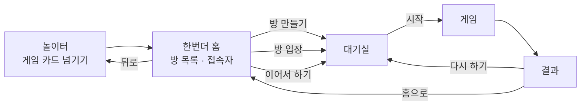
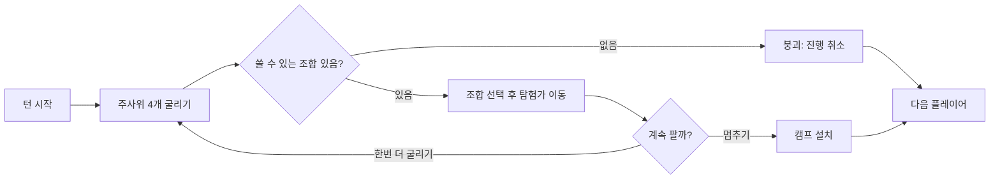

# 한번더(OneMoreTime) — 기능 명세서 v2

2026-09-25 · 클릭 가능한 프로토타입(`docs/prototype/`) 기준으로 재작성

## 개요

**놀이터(playground)** 는 여러 보드게임을 모아 두는 허브다. 그 안의 첫 번째 게임이 **한번더(OneMoreTime)** 로, 주사위 4개로 11개의 갱도를 파내려가 가장 깊은 곳의 보물 3개를 먼저 찾는 쪽이 이긴다. 게임 방식은 캔트 스톱과 같고, 테마는 산 등반 대신 땅을 파는 던전 탐험이다.

초안(v1)은 기획만 있는 상태에서 썼고, 이 문서는 **실제로 동작하는 프로토타입을 만들고 나서 확정된 내용**으로 다시 썼다. 화면·버튼·수치는 모두 프로토타입에서 그대로 가져왔으므로, 구현 중 이 문서와 프로토타입이 어긋나면 프로토타입이 맞다.

형식은 v1과 같이 **기능명 / 목적 / 위치 / 트리거 / 처리 로직** 중심이다. 번호 체계도 v1을 유지해 프로토타입 HTML의 `data-spec` 속성과 1:1로 대응한다. (설정에서 "명세 번호 표시"를 켜면 화면에 번호가 뜬다.)

### v1에서 바뀐 것

| 항목 | v1 (초안) | v2 (확정) |
| --- | --- | --- |
| 진입 구조 | 홈 → 대기실 → 게임 | **놀이터 → 게임 선택 → 한번더 홈 → 대기실 → 게임 → 결과** |
| 방 참여 | 초대 코드 입력 | **열린 방 목록에서 고르기**, 비밀방은 비밀번호 |
| 초대 코드 | 생성·복사 (1-2, 1-3) | **전면 삭제** |
| 닉네임 | 방 만들기·참여 때마다 입력 | **자동 생성 후 브라우저에 보관**, 프로필에서 수정 |
| 프로필 | 없음 | **이름 + 이모지 아바타** |
| 팀 이름 | 가 팀 / 나 팀 / … | **빨강 팀 / 파랑 팀 / 초록 팀 / 노랑 팀** (팀 = 색) |
| 팀 인원 | 팀당 1~2명 | **모든 팀의 인원이 같을 것** (팀당 최대 2명) |
| 턴 순서 | 방장이 "순서 섞기" 버튼 | **시작할 때 자동 무작위** |
| 제한 시간 | 턴 단위 | **단계 단위** (굴리기 10초 / 고르기 15초) |
| 규칙 안내 | 자체 제작 카드 모달 | **외부 영상 링크** |
| 채팅 | 범위 밖 ("음성통화로 처리") | **대기실·게임 공용 채팅 + 말풍선** |
| 용어 | 버팀목 | **캠프** |

### 전제 및 가정

- 플랫폼: **PC 브라우저 전용.** 가로로 넓은 화면을 전제로 설계하고, 모바일 대응은 이번 범위가 아니다
- 1차 버전(MVP): 각자 자기 기기로 접속하는 온라인 멀티플레이(서버 + 웹소켓), **로그인 없음**
- 사용자 식별: 브라우저에 보관한 프로필(이름·아바타). 계정·비밀번호 없음. **이름 중복을 허용**한다
- 인원: 개인전 2~6명, 팀전 2~8명(2~4팀, 모든 팀 인원이 같을 것)
- 주사위를 포함한 모든 게임 판정은 **서버**가 한다 (5장)
- **새로고침하면 방에서 나간다.** 재접속으로 원래 방에 복귀하는 기능은 넣지 않는다
- **설정 화면은 이번 범위가 아니다.** 사운드·연출 속도·제한 시간은 고정값으로 둔다
- 이름·그림·규칙 문장은 모두 자체 제작 (원작 에셋 사용 없음)

### 용어 정의

| 게임 용어 | 원작 대응 | 설명 |
| --- | --- | --- |
| 갱도 | 열(2~12) | 주사위 합에 대응하는 11개의 길 |
| 탐험가 | 중립(임시) 말 | 한 턴 동안만 존재하는 임시 말. 한 번에 최대 3개 |
| 캠프 | 플레이어 말 | 멈추기를 했을 때 진행 위치를 저장하는 내 색 말 (v1의 "버팀목") |
| 붕괴 | 버스트 | 어떤 조합으로도 탐험가를 움직일 수 없을 때, 이번 턴 진행이 모두 취소됨 |
| 보물 발견 | 열 차지 | 갱도 맨 아래에 도달해 그 갱도를 소유함. 이후 누구도 사용 불가 |
| 사이드(side) | — | 점수를 가지는 단위. 개인전은 플레이어, 팀전은 팀 |

### 화면 구조

---

## 0. 공통 / 앱 진입

| 번호 | 기능명 | 목적 | 위치 | 트리거 | 처리 로직 |
| --- | --- | --- | --- | --- | --- |
| 0-1 | 화면 전환 | 놀이터/홈/대기실/게임/결과를 이동한다 | 전체 | 이동 버튼 클릭 또는 서버 이벤트 수신 | 현재 화면 값을 바꾸고 해당 화면만 표시. 화면에 따라 채팅 위치·표시 여부가 함께 바뀐다 |
| 0-2 | 토스트 알림 | 입장·턴 시작·붕괴·보물 발견 등을 짧게 안내한다 | 화면 상단 | 이벤트 발생 시 | 약 2초간 노출 후 자동 소멸. 일반/성공/실패 세 종류 |
| 0-3 | 게임 상태 서버 보관 | 남은 사람들의 게임이 끊기지 않게 한다 | 서버 | 각 게임 이벤트 처리 시 | 방별 상태(참여자, 캠프·탐험가 위치, 턴 순서, 채팅)를 서버에 보관. **나간 사람을 위한 복귀용이 아니라, 방에 남아 있는 사람들의 화면을 맞추기 위한 것**이다 |
| 0-4 | 이탈 처리 (재접속 없음) | 나간 사람 때문에 판이 멈추지 않게 한다 | 백그라운드 | 새로고침 · 탭 닫기 · 연결 끊김 | **원래 방으로 돌아오는 기능은 두지 않는다.** 연결이 끊기면 그 사람을 방에서 제거하고, 남은 사람들에게 알린 뒤 게임 나가기(2-11)와 같은 처리를 한다. 그 기기가 다시 접속하면 놀이터부터 시작한다 |
| 0-5 | 사운드 재생 | 상황에 맞는 효과음으로 몰입감을 높인다 | 전체 | 게임 이벤트 발생 시 | 사운드 설정이 on이면 이벤트별 효과음 재생 (클릭·굴리기·파기·붕괴·보물·턴 시작·입장·승리) |
| 0-6 | 놀이터 — 게임 선택 | 여러 게임 중 하나를 고른다 | 놀이터 (앱 첫 화면) | 카드 좌우 넘기기 / 좌우 화살표 키 / 하단 점 클릭 | 게임 카드를 한 번에 하나씩 보여준다. 카드에는 그림·이름·소개·태그·인원·소요 시간과 상태 배지(플레이 가능 / 준비 중 / 진행 중·대기실)를 표시. "플레이"를 누르면 그 게임의 홈으로 이동. 준비 중인 게임은 버튼 비활성 |
| 0-7 | 내 프로필 | 다른 참여자에게 보일 이름과 아바타를 정한다 | 놀이터·홈 우측 상단 | 이름 클릭 → 이름 수정 모달 / 아바타 클릭 → 아바타 선택 모달 | 첫 방문 시 `{이름}{네 자리 숫자}` 형태로 자동 생성(예: `두더지4821`). 이름 모달에는 다시 뽑기(셔플) 버튼 제공. 아바타는 이모지 16종 중 선택. 값은 브라우저에 보관하고 방 입장 시 그대로 사용 |
| 0-8 | 채팅 | 같은 방 사람들과 대화한다 | 대기실·게임 화면 (화면마다 위치 다름) | 채팅 버튼 클릭으로 열고 닫음 | 대기실과 게임이 **같은 대화**를 쓴다. 내가 쓴 글은 오른쪽(이름·아바타 없이), 남의 글은 왼쪽(아바타 + 이름)에 표시. 대기실에서는 보낸 사람 캐릭터 위에 말풍선이 약 4초간 떴다 사라진다. **대화는 방이 살아 있는 동안 전부 남기고**(개수 제한 없음), 방이 사라질 때 함께 지운다 |

> 한글 입력 중 Enter는 글자를 확정하는 키이므로, 조합 중에는 전송하지 않는다. 조합 중에 전송하면 확정된 글자가 비워진 입력칸에 다시 남는다. (이름·비밀번호 입력칸도 같다.)

---

## 1. 한번더 홈 / 대기실

### 1-A. 홈 (방 찾기)

홈은 좌우 두 단이다. 왼쪽은 접속자 목록·방 만들기·규칙 보기, 오른쪽은 방 목록이다.

| 번호 | 기능명 | 목적 | 위치 | 트리거 | 처리 로직 |
| --- | --- | --- | --- | --- | --- |
| 1-1 | 방 만들기 | 새 게임방을 연다 | 홈 좌측 | "방 만들기" 클릭 → 모달 | 모달에서 **제목 / 게임 모드 / 최대 인원 / 비밀방 여부**를 정한다. 개인전 정원은 2~6명, **팀전 정원은 2·4·6·8명**(팀 인원이 같아야 하므로 짝수만, 2는 1대1). 모드를 바꾸면 정원이 가장 가까운 값으로 자동 조정. 비밀방을 켜면 비밀번호 입력칸이 열리고, 비어 있으면 생성 거절. 만든 사람이 방장이 되어 대기실로 이동 |
| 1-2 | 방 목록 표시 | 들어갈 방을 찾는다 | 홈 우측 | 홈 진입 / **10초 폴링** / "새로고침" 클릭 | 열린 방을 **한 페이지 6개**로 표시. 각 카드에 모드 아이콘, 자물쇠(비밀방), 상태 배지(대기 중 / 정원 초과 / 게임 중), 제목, 방장·모드·인원, 정원만큼의 자리 점을 표시. 대기 중인 방만 클릭 가능하고 나머지는 눌러도 거절 안내. **홈에 머무는 동안 10초마다 다시 불러온다**(소켓 푸시 아님) |
| 1-3 | 비밀방 입장 | 비밀번호로 보호된 방에 들어간다 | 방 카드 클릭 시 | 자물쇠가 있는 방 클릭 | 비밀번호 모달을 띄운다. 틀리면 안내 후 입력칸을 비우고 **모달을 유지**한다. 맞으면 입장 |
| 1-13 | 접속 중인 사람 | 지금 누가 있는지 보여준다 | 홈 좌측 | 홈 진입 / 10초 폴링 | **놀이터 전체 접속자**를 보여준다(한번더 참여자만이 아니다). 아바타·이름·상태 점·상태 글자를 목록으로 표시하고, 상태는 대기 중 / 방에 있음 / 게임 중. 본인은 맨 위에 "나" 표시와 함께 고정. 갱신 방식은 1-2와 같고, **같은 요청으로 함께 받는다** |
| 1-14 | 방 목록 페이지 이동 | 방이 많을 때 넘겨 본다 | 방 목록 하단 | ‹ / › 클릭 | 페이지를 이동하고 "현재 / 전체"를 표시. 페이지가 하나면 이동 UI를 숨긴다. **폴링으로 목록이 바뀌어도 보고 있던 페이지를 유지**한다 |

#### 홈 폴링 (1-2, 1-13)

| 항목 | 값 |
| --- | --- |
| 주기 | 10초 |
| 범위 | 방 목록 + 접속자 목록을 **한 요청**으로 |
| 동작 구간 | 한번더 홈에 머무는 동안만. 다른 화면으로 나가면 멈춘다 |
| 수동 새로고침 | 그대로 둔다. 누르면 즉시 갱신하고 다음 10초를 다시 센다 |

> 갱신 때문에 보고 있던 화면이 튀지 않아야 한다. 페이지 번호(1-14)를 유지하고, 목록이 짧아져 그 페이지가 사라진 경우에만 마지막 페이지로 당긴다.

### 1-B. 대기실

대기실은 **방 안을 비스듬히 내려다본 그림**이고, 참여자 캐릭터는 가운데 카펫 위 정해진 자리에 선다. 캐릭터 이동은 넣지 않는다 — 위치를 계속 주고받으면 트래픽이 커지기 때문이다. 인원에 따라 1~2줄로 자동 배치된다.

| 번호 | 기능명 | 목적 | 위치 | 트리거 | 처리 로직 |
| --- | --- | --- | --- | --- | --- |
| 1-4 | 참여자 목록 | 누가 들어왔는지 확인한다 | 대기실 좌측 상단 (방 그림 위에 겹침) | 입장·퇴장·준비·색상 변경 시 실시간 | 아바타·이름·준비 여부를 목록으로 표시. **방장을 맨 위**에 두고 왕관을 표시하며, 방장에게는 준비 체크를 붙이지 않는다(방장의 "시작"이 곧 준비) |
| 1-5 | 게임 모드 선택 | 개인전과 팀전 중 하나를 고른다 | 방 설정 모달 (방장만 조작) | 모드 버튼 클릭 | 전원 화면에 반영. 팀전으로 바꾸면 팀이 없는 사람을 자동 배정 |
| 1-6 | 팀 배정 | 팀전의 팀을 구성한다 | 색상/팀 모달 | 팀 자리 버튼 클릭 | 팀은 **색**이고, 팀마다 **자리 두 개**를 버튼으로 보여준다. 남이 앉은 자리는 X로 막고, 비어 있으면 위·아래 상관없이 아무 자리나 고를 수 있다. 고르는 즉시 모달이 닫힌다 |
| 1-7 | 색상 선택 | 참여자를 구분한다 | 대기실 색상 버튼 | 버튼 클릭 → 모달 | 버튼에는 **현재 내 색**이 동그랗게 표시된다. 개인전은 8색 중 남이 쓰지 않는 색만 선택 가능하고, 팀전은 이 모달이 그대로 **팀 선택**(1-6)이 된다. 이름 수정은 프로필(0-7)로 옮겼으므로 여기에 없다 |
| 1-8 | 준비 | 시작할 준비가 됐음을 알린다 | 대기실 하단 (방장이 아닐 때) | "준비" 토글 클릭 | 준비 상태를 전원 화면에 반영 |
| 1-9 | 참여자 내보내기 | 방장이 참여자를 정리한다 | 방 설정 모달의 참여자 행 (방장만 노출) | ✕ 클릭 | 해당 참여자를 방에서 제거하고 그 기기는 홈으로 이동 |
| 1-10 | 턴 순서 결정 | 순서를 공정하게 정한다 | 백그라운드 | 게임 시작(1-11) 시 자동 | **무작위로 섞는다.** 팀전은 같은 팀이 연달아 오지 않도록 팀을 번갈아 배열한다(A1→B1→C1→A2→B2→C2). v1의 "순서 섞기" 버튼은 없앴다 |
| 1-11 | 게임 시작 | 설정을 확정하고 보드를 연다 | 대기실 하단 (방장만 노출) | "시작" 클릭 | 아래 **시작 조건**을 모두 만족할 때만 활성화. 못 채운 조건은 버튼 툴팁과 토스트로 어떤 팀이 몇 명인지까지 알려준다. 서버가 게임 상태를 초기화하고 전원을 게임 화면으로 전환 |
| 1-12 | 방 나가기 | 대기실에서 빠진다 | 대기실 좌측 상단 | ← 클릭 후 확인 | 방에서 제거. 방장이 나가면 가장 먼저 들어온 참여자에게 방장 자동 위임, 남은 사람이 없으면 방 삭제 |
| 1-15 | 대기실 방 화면 | 기다리는 동안도 심심하지 않게 한다 | 대기실 중앙 | 대기실 진입 시 | 창문·화분·책장·전등을 배치한 방 그림을 그린다. 벽시계는 **실제 현재 시각**을 따라 움직인다. 캐릭터는 자기 색 캡슐 모양이고 이름은 아래에 표시된다 |

#### 시작 조건 (1-11)

| 모드 | 조건 |
| --- | --- |
| 공통 | 방장을 제외한 전원이 준비 완료 · 인원이 방 정원 이하 |
| 개인전 | 2명 이상 6명 이하 |
| 팀전 | 모든 참여자가 팀에 속함 · 2~4팀 · 팀당 2명 이하 · **모든 팀의 인원이 같을 것** |

가능한 팀 구성은 아래와 같다.

| 인원 | 가능한 구성 | 시작 |
| --- | --- | --- |
| 2명 | `1-1` | 가능 (1대1 팀전) |
| 3명 | `1-1-1` | 가능 |
| 4명 | `2-2` · `1-1-1-1` | 가능 |
| 5명 | — | **불가** — 어떻게 나눠도 인원이 다르다 |
| 6명 | `2-2-2` | 가능 |
| 7명 | — | **불가** — 어떻게 나눠도 인원이 다르다 |
| 8명 | `2-2-2-2` | 가능 |

> 한 팀이 1명인 구성(`1-1`, `1-1-1`, `1-1-1-1`)도 **모두 허용한다.** 사실상 개인전이지만 막지 않는다.
>
> 시작을 막을 때는 **어느 팀이 몇 명인지** 함께 알려준다. 예: `팀마다 인원이 같아야 합니다 (빨강 팀 2명 · 파랑 팀 2명 · 초록 팀 1명)`
>
> **정원을 다 채우지 않아도 시작된다.** 정원 8명 방에 4명만 있어도 `2-2`면 시작 가능하다. 개인전도 같다(정원 6명 방에 2명이면 시작 가능).
>
> 팀 자동 배정은 두 명씩 채우므로, 손대지 않으면 **홀수 인원일 때만** 시작이 막힌다. 3명을 `1-1-1`로 만들려면 직접 팀을 옮겨야 한다.

---

## 2. 게임 플레이

한 턴은 굴리기 → 조합 선택 → 계속/멈추기를 반복하다가, 멈추거나 붕괴하면 끝난다.

화면은 **보드가 거의 전부**다. 위에 얇은 헤더(참여자 칩·남은 시간·나가기·타이머 막대), 가운데에 보드, 오른쪽 아래에 떠 있는 버튼 두 개, 왼쪽 아래에 채팅 버튼이 있다.

| 번호 | 기능명 | 목적 | 위치 | 트리거 | 처리 로직 |
| --- | --- | --- | --- | --- | --- |
| 2-1 | 갱도 보드 표시 | 모두의 진행 상황을 한눈에 보여준다 | 게임 화면 전체 | 진입 및 상태 변경 시 | 11개 갱도를 역삼각형으로 그린다. **2번과 12번이 화면 좌우 끝, 7번 바닥이 화면 아래 끝에 닿도록** 칸 크기를 화면에 맞춰 계산한다(가로·세로를 따로 계산해 양쪽 모두 꽉 채운다). 깊이에 따라 배경이 흙 → 바위 → 수정 → 용암으로 바뀌고, 각 칸에 캠프(텐트)와 탐험가(캡슐)를 표시 |
| 2-2 | 현재 차례 표시 | 누구 차례인지 알려준다 | 헤더 + 화면 중앙 | 턴 시작 시 | **헤더**: 참여자 칩을 나열하고 지금 차례인 사람만 선명하게, 나머지는 흐리게 둔다. 개인전은 칩 하나가 사람 하나, **팀전은 칩 하나가 팀 하나**로 `(팀 색) (팀 이름) (팀원 둘) (보물)` 순으로 담는다 — 팀 전체를 강조하지 않고 **차례인 사람 이름 하나만** 선명하게 한다. **중앙**: "○○님 차례입니다"를 약 1.7초간 크게 띄웠다 사라진다 |
| 2-3 | 주사위 굴리기 | 이번 턴의 주사위 값을 정한다 | 우측 하단 떠 있는 버튼 | "굴리기" 클릭 | 서버가 1~6 값 4개를 정해 방 전체에 전달. 주사위 **4개가 3D로 날아와 보드 위에서 구르다 멈춘다**(하나씩 조금씩 늦게 멈춤). 완전히 멈추고 **0.6초 쉰 뒤** 조합표를 연다. 처음 굴릴 때 버튼 이름은 "굴리기", 이미 판 뒤에는 "한번 더 굴리기" |
| 2-4 | 조합 선택 | 주사위 4개를 2개씩 묶어 합을 정한다 | 조합표 (굴리기 버튼 위) | 조합 줄 클릭 | 4개를 2+2로 나누는 방법은 **3가지**다(6가지가 아니다). 각 줄은 `(주사위눈)(주사위눈) 합 + (주사위눈)(주사위눈) 합` 형태의 **한 세트**로 보여주고, 줄 전체를 누르면 **두 합을 모두** 판다. 둘 중 하나만 쓸 수 있을 때만 반쪽씩 나눠 고르게 하고, 아무것도 못 쓰는 줄은 흐리게 처리한다. 고르면 주사위가 사라진다 |
| 2-5 | 탐험가 이동 | 선택한 합의 갱도를 파낸다 | 보드 | 조합 선택 직후 자동 | 해당 갱도에 탐험가가 있으면 한 칸 아래로, 없으면 내 캠프(없으면 입구) 다음 칸에 배치. **한 칸씩 차례로, 칸마다 약 0.5초 간격으로 파고 내려가는 연출**을 보여준다. 같은 합이 두 번 나오면 두 칸 내려간다. 탐험가는 최대 3개, 보물이 발견된 갱도는 사용 불가 |
| 2-6 | 붕괴 판정 | 더 팔 수 없는 상황을 처리한다 | 게임 화면 전체 | 굴린 결과 쓸 수 있는 조합이 하나도 없을 때 자동 | 화면 흔들림 + "붕괴!" 연출을 약 1.5초 보여준 뒤, 이번 턴 탐험가를 모두 제거(캠프는 그대로)하고 다음 플레이어로 넘김. 붕괴 횟수를 기록 |
| 2-7 | 한번 더 굴리기 | 위험을 감수하고 더 판다 | 우측 하단 | 이동 후 "한번 더 굴리기" 클릭 | 현재 탐험가 위치를 유지한 채 2-3 재실행 |
| 2-8 | 멈추기 (캠프 설치) | 이번 턴 진행을 확정한다 | 우측 하단 | "멈추기" 클릭 | 탐험가 위치로 내 캠프를 옮기고 탐험가를 회수, 상태 저장 후 다음 플레이어로 넘김. 이번 턴의 연속 굴림 횟수를 최고 기록과 비교해 갱신 |
| 2-9 | 보물 발견 (갱도 소유) | 갱도 맨 아래 도달을 보상한다 | 보드 맨 아래 칸 | 캠프가 마지막 칸에 설치될 때 | 갱도를 내 색으로 칠하고 **다른 사이드의 그 갱도 캠프를 제거**, 이후 누구도 사용 불가. 보물 효과음과 토스트 |
| 2-10 | 승리 판정 | 게임 종료 시점을 정한다 | 백그라운드 | 보물 발견(2-9) 직후 | 한 사이드가 갱도 **3개**를 소유하면 즉시 종료하고 결과 화면으로 |
| 2-11 | 게임 나가기 | 진행 중인 게임을 중단한다 | 헤더 우측 | ⏻ 클릭 후 확인 | 방에서 나가 홈으로 이동. 이후 그 플레이어 차례는 건너뛰고, 남은 사이드가 하나면 게임 종료 |

### 게임 규칙 상세

**갱도 깊이** — 가운데가 깊고 바깥이 얕다. 합이 잘 나오는 숫자일수록 멀다.

| 갱도 | 2 | 3 | 4 | 5 | 6 | 7 | 8 | 9 | 10 | 11 | 12 |
| --- | --- | --- | --- | --- | --- | --- | --- | --- | --- | --- | --- |
| 깊이(칸) | 3 | 5 | 7 | 9 | 11 | 13 | 11 | 9 | 7 | 5 | 3 |

**조합 계산** — 주사위를 `d0 d1 d2 d3`라 하면 묶는 방법은 `(01)(23)`, `(02)(13)`, `(03)(12)` 세 가지다.

**최대 사용 규칙** — 한 조합에서 두 합을 **쓸 수 있는 만큼 많이** 써야 한다. 둘 다 쓸 수 있으면 둘 다 쓰고, 하나만 쓸 수 있으면 그 하나를 쓴다. 쓰는 순서에 따라 결과가 달라지는 경우(예: 탐험가를 한 개만 더 놓을 수 있어 먼저 쓰는 쪽이 자리를 차지하는 경우)에는 **둘 중 어느 것을 쓸지 고르게** 한다.

**탐험가 제한** — 한 턴에 탐험가는 최대 **3개**. 이미 탐험가가 있는 갱도는 계속 쓸 수 있지만, 네 번째 갱도는 열 수 없다.

**승리** — 갱도 **3개** 소유.

---

## 3. 게임 결과

| 번호 | 기능명 | 목적 | 위치 | 트리거 | 처리 로직 |
| --- | --- | --- | --- | --- | --- |
| 3-1 | 승자 발표 | 승리한 사이드를 축하한다 | 결과 화면 상단 | 승리 판정(2-10) 직후 | 보물 연출과 함께 승자 이름을 그 색으로 표시. 팀전이면 팀 이름 아래에 팀원 이름을 나란히 적는다. 저장된 진행 게임 삭제 |
| 3-2 | 게임 통계 표시 | 플레이를 되돌아보는 재미를 준다 | 결과 화면 중앙 | 결과 화면 진입 시 | 사이드별 **보물 수 / 붕괴 횟수 / 한 턴 최장 연속 굴림**을 표로 표시. 보물 수 → 최장 연속 순으로 정렬하고 승자 행을 강조 |
| 3-3 | 다시 하기 | 같은 멤버로 한 판 더 한다 | 결과 화면 하단 | "다시 하기" 클릭 | 참여자·색상·팀 설정을 유지한 채 대기실로 돌아감 |
| 3-4 | 홈으로 | 게임을 마친다 | 결과 화면 하단 | "홈으로" 클릭 | 한번더 홈으로 이동 |

---

## 4. 도움말

| 번호 | 기능명 | 목적 | 위치 | 트리거 | 처리 로직 |
| --- | --- | --- | --- | --- | --- |
| 4-1 | 게임 규칙 보기 | 처음 하는 사람도 바로 이해하게 한다 | 한번더 홈 좌측 | "규칙 보기" 클릭 | **규칙 설명 영상을 새 탭으로 연다.** 게임 중에는 규칙 진입점을 두지 않는다 |

### 설정 화면 — 이번 범위 아님

사용자가 조절하는 설정 화면은 **만들지 않는다.** 아래 값은 코드 고정으로 두고, 필요해지면 그때 설정을 붙인다.

| 값 | 고정값 |
| --- | --- |
| 사운드 | 켬 |
| 연출 속도 | 보통 |
| 단계별 제한 시간 (5-3) | 켬 |

> 프로토타입에는 이 셋을 바꾸는 토글이 남아 있지만 진입 버튼이 없다. 개발 중 확인용으로만 쓰고, 구현 대상이 아니다.

---

## 5. 온라인 동기화

서버와 웹소켓으로 모든 참여자의 화면을 실시간으로 맞춘다. 주사위를 포함한 게임 판정은 서버가 한다.

| 번호 | 기능명 | 목적 | 위치 | 트리거 | 처리 로직 |
| --- | --- | --- | --- | --- | --- |
| 5-1 | 실시간 동기화 | 모든 기기에 같은 보드를 보여준다 | 게임 화면 전체 | 주사위·조합 선택·턴 종료 시 | 서버가 판정한 상태 변경을 방의 모든 참여자에게 전달. 내 차례가 아니면 조작 버튼을 노출하지 않는다 |
| 5-2 | 연결 끊김 처리 | 한 명의 이탈로 게임이 멈추지 않게 한다 | 백그라운드 | 소켓 연결 끊김 감지 시 | **재접속을 기다리지 않는다.** 그 사람을 방에서 제거하고 남은 참여자에게 알린다. 진행 중이던 차례였으면 자동 멈추기로 마무리한 뒤 다음 사람에게 넘기고, 남은 사이드가 하나면 게임을 끝낸다 (0-4, 2-11과 같은 처리) |
| 5-3 | 단계별 제한 시간 | 대기 시간이 늘어지는 것을 막는다 | 헤더 하단 타이머 막대 | 각 단계 시작 시 | 아래 표대로 제한하고, **단계가 바뀔 때마다 가득 채워 다시 시작**한다 |

### 제한 시간 (5-3)

| 단계 | 제한 | 시간 초과 시 |
| --- | --- | --- |
| 굴리기 전 (턴 시작 직후) | 10초 | 자동 멈추기 |
| 굴린 뒤 조합 고르기 | 15초 | 가장 먼저 가능한 조합을 자동 선택 |
| 판 뒤 (한번 더 / 멈추기) | 10초 | 자동 멈추기 |
| 굴리는 중 · 파는 중 · 붕괴 연출 | 없음 | — (막대는 그 자리에 멈춘다) |

제한 시간은 **항상 켜져 있다.** 끄는 설정은 두지 않는다(4장).

막대는 제한 시간 동안 **오른쪽에서 왼쪽으로 한 번에 흘러 내려간다.** 매초 너비를 고쳐 쓰면 전환이 1초씩 뒤처져 시간이 다 돼도 막대가 남으므로, 단계가 시작될 때 한 번만 설정한다. 색은 시종 초록이며 중간에 빨강으로 바뀌지 않는다.

---

## 결정된 사항 (2026-09-25)

v2 초고에서 미정으로 남겨 둔 것들을 정했다. 본문에 이미 반영했고, 근거를 남기기 위해 표로 둔다.

| # | 질문 | 결정 |
| --- | --- | --- |
| M-1 | 설정 화면 진입점 | **설정 화면을 만들지 않는다.** 사운드·속도·제한 시간은 고정값 (4장) |
| M-2 | 팀전 1대1 허용 여부 | **허용한다.** 조건을 "팀당 정확히 2명"에서 **"모든 팀의 인원이 같을 것"** 으로 완화 (1-11) |
| M-3 | 정원을 다 채워야 시작 가능한지 | **아니다.** 정원은 상한일 뿐이고, 인원 조건만 맞으면 시작된다 (1-11) |
| M-4 | 방 목록 갱신 방식 | **주기적 폴링.** 소켓 푸시는 쓰지 않는다 (1-2) |
| M-5 | 접속자 목록의 범위 | **놀이터 서비스 전체** (1-13) |
| M-6 | 채팅 보관 기간 | **방이 살아 있는 동안 전부 보관**, 방이 사라지면 함께 삭제. 개수 제한 없음 (0-8) |
| M-7 | 규칙 영상 자체 제작 여부 | **만들지 않는다.** 외부 영상 링크를 그대로 쓴다 (4-1) |
| M-8 | 프로필 중복 이름 | **중복 허용.** 같은 이름이 있어도 막지 않는다 |
| M-9 | 폴링 주기 | **10초.** 방 목록(1-2)과 접속자(1-13)를 한 요청으로 함께 받는다 |
| M-10 | `1-1-1`·`1-1-1-1` 팀 구성 허용 여부 | **모두 허용한다.** 사실상 개인전이어도 막지 않는다 (1-11) |
| — | 플랫폼 | **PC 브라우저 전용.** 모바일은 계획 없음 |
| — | 새로고침 후 복귀 | **하지 않는다.** 새로고침하면 방에서 나간다 (0-4) |

## 남은 미정 사항

없음. 구현을 시작할 수 있다.

---

## 참고

- 번호 체계는 이후 API/상태 설계 문서의 항목과 1:1로 연결할 수 있도록 맞췄고, 프로토타입 HTML의 `data-spec` 속성과 같다.
- 팀전은 팀원이 번갈아 차례를 맡는 방식(1-10)으로 확정한다. v1에서 범위 밖이던 채팅을 넣었으므로(0-8) 팀원 간 상의는 채팅으로 할 수 있다.
- 개인전 최대 인원은 6명으로 확정한다. 원작 4명에서 늘린 하우스 룰 기준이다.
- 특수 칸(보너스 수정, 낙석 함정 등)은 이번 버전에 넣지 않고, 원작과 같은 기본 규칙만 구현한다.
- 게임 이름은 '한번더(OneMoreTime)', 허브 이름은 '놀이터(playground)'로 확정한다.

### 프로토타입 전용 (명세 아님)

`docs/prototype/`은 서버 없이 한 기기에서 동작하므로, 서버를 대신하는 장치가 들어 있다. **구현 대상이 아니다.**

- 방 목록·접속자 목록은 모의 데이터이고 수동 새로고침 때마다 다시 만들어진다 (비밀방 비밀번호는 `1234`). 폴링(1-2)은 서버가 생긴 뒤에 붙인다
- 대기실의 `+ 참여자`, `방장 되기` 버튼 — 다른 기기의 참여자와 방장을 대신한다
- 홈의 `이어서 하기` 버튼 — `localStorage`에 남은 판을 불러온다. **0-4에 따라 구현 대상이 아니다**
- 설정 모달(사운드 / 연출 속도 / 제한 시간 / `명세 번호 표시`) — 진입 버튼이 없고, 개발 중 확인용이다
- 게임 상태를 `localStorage`에 저장한다 (실제로는 0-3에 따라 서버가 보관)
