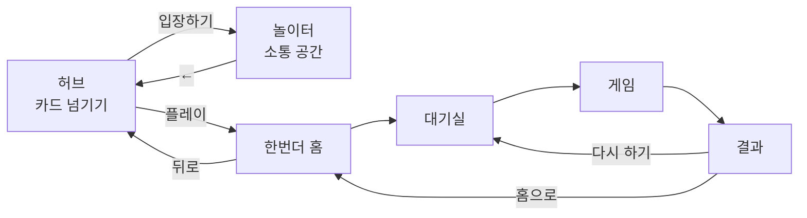

# 놀이터(playground) — 허브 기능 명세서

2026-09-25 · 프로토타입(`docs/prototype/`) 기준

## 1. 개요

**놀이터(playground)** 는 여러 놀 거리를 모아 두는 허브다. 첫 화면에서 카드를 좌우로 넘겨 고르고, 고른 카드로 들어간다.

이 문서는 **허브 자체와 카드가 공유하는 것**만 다룬다. 각 카드의 기능은 카드별 문서에 있다.

| 카드 | 종류 | 명세 |
| --- | --- | --- |
| 놀이터 | 소통 공간 | [playground.md](playground.md) |
| 한번더 (OneMoreTime) | 보드게임 | [omt.md](omt.md) |
| 게임 2·3·4 | 준비 중 | — |

> 허브와 첫 번째 카드가 이름이 같다. 허브는 서비스 전체를, 카드의 "놀이터"는 그 안의 **소통 공간 하나**를 가리킨다.

### 번호 체계

세 문서가 번호를 나눠 쓴다. 프로토타입 HTML의 `data-spec` 속성, [ERD](../erd/erd.md), [API 명세](../api/api.md)가 모두 이 번호를 참조하므로 **한번 붙인 번호는 바꾸지 않는다.**

| 접두사 | 범위 | 문서 |
| --- | --- | --- |
| `0-x` | 허브 공통 | 이 문서 |
| `1-x` ~ `5-x` | 한번더 | [omt.md](omt.md) |
| `P-x` | 놀이터 공간 | [playground.md](playground.md) |
| `M-x` | 결정·미정 사항 | 각 문서 |

### 전제 및 가정

- 플랫폼: **PC 브라우저 전용.** 가로로 넓은 화면을 전제로 설계하고, 모바일 대응은 이번 범위가 아니다
- 1차 버전(MVP): 각자 자기 기기로 접속하는 온라인 멀티플레이(서버 + 웹소켓), **로그인 없음**
- 사용자 식별: 브라우저에 보관한 프로필(이름·아바타). 계정·비밀번호 없음. **이름 중복을 허용**한다
- **새로고침하면 있던 곳에서 나간다.** 재접속으로 복귀하는 기능은 넣지 않는다
- **설정 화면은 이번 범위가 아니다.** 사운드·연출 속도는 고정값으로 둔다
- 서버는 단일 인스턴스, 상태는 서버 메모리에 둔다 ([ERD](../erd/erd.md) 참고)
- 이름·그림·문장은 모두 자체 제작. 음원은 AI 생성

### 화면 구조

---

## 2. 공통 기능

| 번호 | 기능명 | 목적 | 위치 | 트리거 | 처리 로직 |
| --- | --- | --- | --- | --- | --- |
| 0-1 | 화면 전환 | 놀이터/홈/대기실/게임/결과를 이동한다 | 전체 | 이동 버튼 클릭 또는 서버 이벤트 수신 | 현재 화면 값을 바꾸고 해당 화면만 표시. 화면에 따라 채팅 위치·표시 여부가 함께 바뀐다 |
| 0-2 | 토스트 알림 | 입장·턴 시작·붕괴·보물 발견 등을 짧게 안내한다 | 화면 상단 | 이벤트 발생 시 | 약 2초간 노출 후 자동 소멸. 일반/성공/실패 세 종류 |
| 0-3 | 게임 상태 서버 보관 | 남은 사람들의 게임이 끊기지 않게 한다 | 서버 | 각 게임 이벤트 처리 시 | 방별 상태(참여자, 캠프·탐험가 위치, 턴 순서, 채팅)를 서버에 보관. **나간 사람을 위한 복귀용이 아니라, 방에 남아 있는 사람들의 화면을 맞추기 위한 것**이다 |
| 0-4 | 이탈 처리 (재접속 없음) | 나간 사람 때문에 판이 멈추지 않게 한다 | 백그라운드 | 새로고침 · 탭 닫기 · 연결 끊김 | **원래 방으로 돌아오는 기능은 두지 않는다.** 연결이 끊기면 그 사람을 방에서 제거하고, 남은 사람들에게 알린 뒤 게임 나가기(2-11)와 같은 처리를 한다. 그 기기가 다시 접속하면 놀이터부터 시작한다 |
| 0-5 | 사운드 재생 | 상황에 맞는 효과음으로 몰입감을 높인다 | 전체 | 게임 이벤트 발생 시 | 사운드 설정이 on이면 이벤트별 효과음 재생 (클릭·굴리기·파기·붕괴·보물·턴 시작·입장·승리) |
| 0-6 | 카드 선택 | 여러 카드 중 하나를 고른다 | 허브 (앱 첫 화면) | 카드 좌우 넘기기 / 좌우 화살표 키 / 하단 점 클릭 | 게임 카드를 한 번에 하나씩 보여준다. 카드에는 그림·이름·소개·태그·인원·소요 시간과 상태 배지(플레이 가능 / 준비 중 / 진행 중·대기실)를 표시. 버튼을 누르면 그 카드로 이동. 준비 중인 카드는 버튼 비활성 |
| 0-7 | 내 프로필 | 다른 사람에게 보일 이름과 아바타를 정한다 | 허브·카드 화면 우측 상단 | 이름 클릭 → 이름 수정 모달 / 아바타 클릭 → 아바타 선택 모달 | 첫 방문 시 `{이름}{네 자리 숫자}` 형태로 자동 생성(예: `두더지4821`). 이름 모달에는 다시 뽑기(셔플) 버튼 제공. 아바타는 이모지 16종 중 선택. 값은 브라우저에 보관하고 방 입장 시 그대로 사용 |
| 0-8 | 채팅 | 같은 공간 사람들과 대화한다 | 카드마다 다름 | 카드마다 다름 | **글을 그리는 방식은 공통이다.** 내 글은 오른쪽(이름·아바타 없이), 남의 글은 왼쪽(아바타 + 이름). 보낸 사람 캐릭터 위에 말풍선이 잠깐 떴다 사라진다. **여는 방식·보관 기간은 카드가 정한다** — 한번더는 버튼으로 열고 닫으며([omt.md](omt.md) 1장), 놀이터는 항상 열려 있다([playground.md](playground.md) P-6) |

> 한글 입력 중 Enter는 글자를 확정하는 키이므로, 조합 중에는 전송하지 않는다. 조합 중에 전송하면 확정된 글자가 비워진 입력칸에 다시 남는다. (이름·비밀번호 입력칸도 같다.)

---

---

## 3. 카드 관리

| 번호 | 기능명 | 목적 | 위치 | 트리거 | 처리 로직 |
| --- | --- | --- | --- | --- | --- |
| 0-9 | 카드 목록 | 무엇이 있는지 보여준다 | 허브 | 앱 진입 시 | **DB(`games` · `game_tags`)에서 읽어** 그림·이름·소개·태그·인원·소요 시간과 상태 배지를 표시. 정렬 순서도 DB가 정한다 |
| 0-10 | 카드 상태 배지 | 지금 들어갈 수 있는지 알린다 | 카드 우측 상단 | 목록을 그릴 때 | `플레이 가능` / `준비 중` / `상시 열림`. 진행 중인 판이 있으면 그 카드에 별도 표시 |

**카드를 늘리려면 `games` 테이블에 한 행을 더한다.** 배포 없이 카드를 붙이거나 내릴 수 있고, "준비 중" 표시도 `is_playable` 한 칸으로 끝난다. 카드 화면·상태·경로는 카드가 알아서 처리하고, 허브는 목록과 이동만 맡는다.

> 카드 화면 자체는 코드다. DB에 행만 넣는다고 없던 화면이 생기지는 않는다. `code` 값(`onemore`, `plaza`)이 **어느 화면으로 보낼지를 정하는 열쇠**다.

---

## 4. 결정된 사항

서비스 전체에 걸리는 결정이다. 카드 안에서만 유효한 결정은 각 카드 문서에 있다.

| # | 질문 | 결정 |
| --- | --- | --- |
| M-1 | 설정 화면 진입점 | **설정 화면을 만들지 않는다.** 사운드·속도는 고정값 |
| M-8 | 프로필 중복 이름 | **중복 허용.** 같은 이름이 있어도 막지 않는다 |
| — | 플랫폼 | **PC 브라우저 전용.** 모바일은 계획 없음 |
| — | 새로고침 후 복귀 | **하지 않는다.** 새로고침하면 있던 곳에서 나간다 (0-4) |
| — | 상태 보관 | **단일 인스턴스 + 서버 메모리.** Redis는 쓰지 않는다 ([ERD](../erd/erd.md)) |
| — | 실시간 전송 | **원시 WebSocket.** STOMP는 쓰지 않는다 ([API](../api/api.md)) |
| M-H2 | 카드 목록을 어디서 관리할지 | **DB 테이블.** [ERD](../erd/erd.md)의 `games` · `game_tags`를 그대로 쓴다 |

## 5. 남은 미정 사항

| # | 내용 | 메모 |
| --- | --- | --- |
| M-H1 | **허브와 카드의 이름 중복** | 둘 다 "놀이터"다. 한쪽 이름을 바꿀지 |

---

## 6. 참고

- 데이터 구조는 [ERD](../erd/erd.md), 통신 규약은 [API 명세](../api/api.md)
- 카드가 늘어도 **프로필·세션·채팅 표시 방식은 공유한다.** 카드마다 다시 만들지 않는다
- 카드 안에서 승패·기록을 남기려면 **로그인이 먼저 필요하다.** 지금은 계정이 없어 누구의 기록인지 묶을 수 없다

### 프로토타입 전용 (명세 아님)

`docs/prototype/`은 서버 없이 한 기기에서 동작하므로, 서버를 대신하는 장치가 들어 있다. **구현 대상이 아니다.**

- 접속자·방 목록·함께 있는 사람들은 모두 모의 데이터다
- 설정 모달(사운드 / 연출 속도 / 제한 시간 / 명세 번호 표시) — 진입 버튼이 없고 개발 중 확인용이다
- 상태를 `localStorage`에 저장한다 (실제로는 `0-3`에 따라 서버가 보관)
