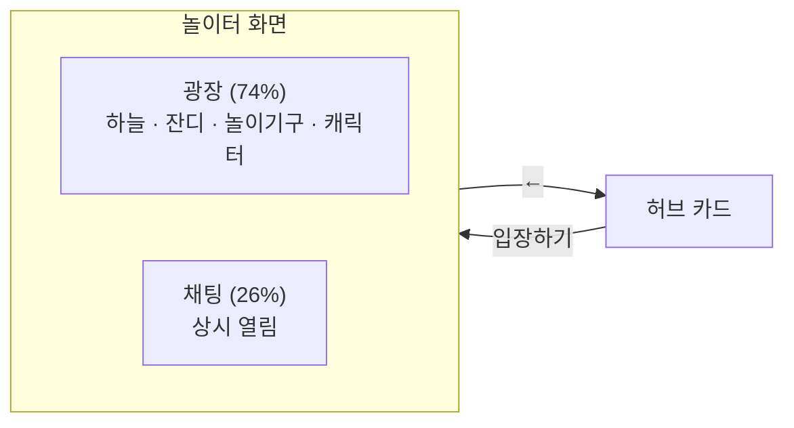

# 놀이터(Plaza) — 기능 명세서

2026-09-25 · 프로토타입(`docs/prototype/`) 기준 · 허브 명세는 [planning.md](planning.md)

## 1. 개요

**놀이터**는 게임이 아니라 **모이는 곳**이다. 캐릭터를 움직이며 이야기하고, 놀이기구를 타고, 같이 음악을 듣는다. 허브의 카드 목록에서 첫 번째 자리를 차지하며, 게임 카드와 같은 모양이지만 버튼이 "입장하기"다.

승패도 점수도 없다. **게임을 시작하기 전에 사람이 모이는 자리**가 이 공간의 목적이다.

번호는 `P-1` 형태를 쓴다. 허브의 `0-x`, 한번더의 `1-x`~`5-x`와 겹치지 않게 하기 위해서다.

### 다른 화면과 다른 점

| 항목 | 한번더 대기실 | 놀이터 |
| --- | --- | --- |
| 캐릭터 이동 | 없음 (고정 자리) | **있음** (방향키·WASD) |
| 채팅 | 버튼으로 열고 닫음 | **항상 열려 있는 오른쪽 열** |
| 인원 | 방 정원까지 (2~8명) | **정원 20명** (P-22) |
| 나가기 | 방에서 제거 | 허브로 복귀 |

한번더 대기실은 위치를 주고받지 않으려고 이동을 뺐지만(1-15), 놀이터는 **이동이 존재 이유**라 뺄 수 없다. 이 차이가 서버 설계에 미치는 영향은 [6장](#6-서버가-해야-할-일)에 정리했다.

### 화면 구성



채팅은 띄우지 않고 **자리를 준다.** 상시로 열어 둘 것이므로 오버레이로 덮으면 광장의 일부가 영구히 가려진다. 좌우로 나누면 광장은 좁아질 뿐 가려지는 곳이 없다 — 광장 좌표가 전부 `%`라 비례 축소되기 때문이다.

---

## 2. 공간과 이동

| 번호 | 기능명 | 목적 | 위치 | 트리거 | 처리 로직 |
| --- | --- | --- | --- | --- | --- |
| P-1 | 입장 / 퇴장 | 놀이터를 드나든다 | 허브 카드 / 놀이터 좌측 상단 | "입장하기" / ← 클릭 | 입장하면 캐릭터가 무작위 위치에 선다. 나가면 허브 카드 목록으로 돌아가고 **음악·애니메이션이 모두 멈춘다** |
| P-2 | 캐릭터 이동 | 공간을 돌아다닌다 | 광장 | 방향키 또는 `WASD` (누르고 있는 동안) | 초당 화면 너비의 19%를 움직인다. **세로는 가로의 60%**만 움직여 원근감을 준다. 대각선도 된다 |
| P-3 | 깊이 표현 | 앞뒤가 겹쳐 보이게 한다 | 광장 | 이동할 때마다 | 캐릭터·놀이기구 모두 **y 좌표 순서로 겹친다.** 미끄럼틀 뒤로 가면 가려지고 앞으로 나오면 위에 그려진다 |
| P-4 | 접속 인원 | 지금 몇 명인지 보여준다 | 좌측 상단 헤더 | 입장·퇴장 시 | `N / 20명` 표시 |
| P-22 | 정원 | 한 공간이 너무 붐비지 않게 한다 | 허브 카드 / 입장 시 | 카드를 그릴 때 · "입장하기" 클릭 | **정원 20명.** 허브 카드에 `현재 / 20명`을 보여주고, 차 있으면 입장을 거절한다 |
| P-24 | 캐릭터 색 | 여러 사람 속에서 나를 알아본다 | 좌측 상단 헤더 색상 버튼 → 모달 | 버튼 클릭 | 입장하면 남이 쓰지 않는 색이 자동 배정된다. 모달에서 **24색 중** 하나를 고르며, **한 페이지에 10개씩** 보여주고 ‹ / › 로 넘긴다. 남이 쓰는 색은 X로 막는다. 고르는 즉시 모달이 닫히고 전원 화면에 반영 |
| P-5 | 배경 | 공간을 알아보게 한다 | 광장 | 상시 | 하늘·구름·언덕·잔디와 가운데 흙빛 광장. 구름은 천천히 흐른다 |

### 걸어 다닐 수 있는 범위

| 축 | 범위 | 비고 |
| --- | --- | --- |
| 가로 | 화면의 `6% ~ 94%` | |
| 세로 | 화면의 `56% ~ 94%` | 위쪽은 하늘·언덕이라 걸을 수 없다 |

### 캐릭터 색 (P-24)

| 항목 | 값 |
| --- | --- |
| 색 수 | **24색** (정원 20명보다 많아, 마지막에 들어온 사람도 고를 여지가 있다) |
| 페이지 | 한 페이지 **10개**, 3페이지(`10 · 10 · 4`). 페이지가 하나뿐이면 이동 UI를 숨긴다 |
| 중복 | **한 색은 한 사람만** 쓴다. 두 사람이 같은 색을 동시에 고르면 서버가 먼저 온 쪽만 받는다 |
| 처음 여는 페이지 | 지금 내 색이 있는 페이지 |

색 목록과 순서는 서버가 `PlazaState.colors`로 내려준다. 한번더의 8색이 앞쪽에 그대로 들어 있다.

> 이름·아바타·색은 모두 **광장 안에서 바뀌면 즉시 반영된다**(이름·아바타는 프로필 `0-7`, 색은 이 모달). 바꾼 뒤에 보내는 채팅부터 새 값으로 그려지고, **이미 보낸 채팅은 그대로다.**

**놀이기구를 새로 놓을 때는 이 범위 안에서 닿는지 반드시 확인한다.** 특히 뒤쪽(y가 작은 쪽)에 두면 캐릭터가 접근하지 못해 상호작용이 영영 안 되는 일이 생긴다.

---

## 3. 소통

| 번호 | 기능명 | 목적 | 위치 | 트리거 | 처리 로직 |
| --- | --- | --- | --- | --- | --- |
| P-6 | 채팅 | 같은 공간 사람들과 이야기한다 | 우측 열 (상시) | 입력 후 `Enter` 또는 "전송" | 내 글은 오른쪽(이름·아바타 없이), 남의 글은 왼쪽(아바타 + 이름). 한글 조합 중 `Enter`는 전송하지 않는다 |
| P-7 | 말풍선 | 누가 말했는지 공간에서 보여준다 | 캐릭터 머리 위 | 채팅을 보낼 때 | 약 4.2초간 떴다 사라진다. 채팅 목록과 말풍선이 **같은 이벤트**로 그려진다 |
| P-8 | 채팅 글자 크기 | 화면·시력에 맞춘다 | 채팅 헤더 우측 | `−` / `+` 클릭 | `12 · 13 · 15 · 17 · 19px` 5단계, **기본 15px**. 말풍선·이름·아바타·입력칸이 함께 커진다. 브라우저에 보관 |
| P-9 | 채팅 포커스 | 손을 옮기지 않고 대화한다 | 광장 | `Enter` | 입력칸으로 포커스가 가고 **누르고 있던 방향키가 풀린다**. 전송하면 포커스가 빠져 바로 다시 움직일 수 있다. `Esc`로도 빠져나온다 |
| P-10 | 감정 표현 | 채팅 없이 반응한다 | 캐릭터 머리 위 | 숫자키 `1`~`4` | `👋` `❓` `😄` `🎉` 를 2.2초간 표시. 기구에 타고 있을 때도 된다 |
| P-23 | 채팅 초기화 | 대화가 무한히 쌓이는 것을 막는다 | 채팅 열 | **10분 경계** (`:00 :10 :20 :30 :40 :50`) | 대화를 모두 비우고 `10분마다 대화가 비워집니다` 한 줄만 남긴다 |

#### 채팅을 10분마다 비우는 이유 (P-23)

광장은 방과 달리 **사라지는 시점이 없다.** 한번더는 마지막 사람이 나가면 방과 함께 대화도 지워지지만, 광장은 서버가 켜져 있는 동안 계속 열려 있어 대화를 자를 기회가 없다.

**벽시계의 10분 경계**를 쓰면 서버가 알려주지 않아도 전원이 같은 시점에 비운다. 시각 자체가 약속이라 따로 맞출 필요가 없다.

> **채팅 입력 중에는 숫자키와 `Space`가 글자로 들어가야 한다.** 이동·이모트·기구 조작이 모두 키보드라, 입력칸에 포커스가 있을 때는 전부 막는다.

#### 조작 안내는 두지 않는다

화면에 조작 설명을 띄우지 않는다(M-P1). 기구 근처에서 뜨는 `Space` 안내(P-11)가 유일한 예외다. 나머지는 아래와 같고, 필요하면 서비스 밖에서 안내한다.

| 키 | 동작 |
| --- | --- |
| 방향키 · `WASD` | 이동 |
| `Enter` | 채팅 열기 / 보내기 |
| `Esc` | 채팅에서 빠져나오기 |
| `Space` | 기구 타기 · 내리기 · 곡 선택 |
| `1` ~ `4` | 감정 표현 |

---

## 4. 놀이기구

광장에는 놀이기구 9개가 있고, 그중 **셋은 실제로 탈 수 있다.**

| 기구 | 위치(x, y) | 탈 수 있나 | 자리 |
| --- | --- | --- | --- |
| 그네 | 16%, 66% | ✓ | 2 |
| 시소 | 64%, 74% | ✓ | 2 |
| 회전무대 | 9%, 88% | ✓ | 1 |
| DJ 부스 | 82%, 49% | — (곡 선택) | — |
| 터널 아치 | 45%, 60% | | |
| 미끄럼틀 | 88%, 90% | | |
| 벤치 | 94%, 74% | | |
| 지그재그 바 | 32%, 93% | | |
| 가로등 | 63%, 62% | | |

| 번호 | 기능명 | 목적 | 위치 | 트리거 | 처리 로직 |
| --- | --- | --- | --- | --- | --- |
| P-11 | 근접 안내 | 무엇을 할 수 있는지 알린다 | 기구 위 | 반경 안에 들어올 때 | `[Space] 타기` 같은 안내가 기구 위에 뜬다. **가로/세로 반경을 따로 둔다** — 걷는 범위가 가로 88% × 세로 38%라 원형으로 잡으면 세로가 과하게 걸린다 |
| P-12 | 기구 타기 | 공간을 놀이터답게 쓴다 | 그네 · 시소 · 회전무대 | 안내가 뜬 상태에서 `Space` | 빈 자리에 앉는다. **타는 동안 이동이 막히고** 안내가 "내리기"로 바뀐다. 다시 `Space`를 누르면 기구 앞에 내려선다 |
| P-13 | 기구 움직임 | 탄 것처럼 보이게 한다 | 기구 | 누가 타고 있는 동안 | 기구의 움직이는 부분과 캐릭터가 **같은 주기로** 움직인다. 주기가 다르면 캐릭터가 좌석에서 떨어져 보인다 |
| P-14 | 시소 2인 규칙 | 진짜 시소처럼 만든다 | 시소 | 탄 인원이 바뀔 때 | **두 명이 앉아야 움직인다.** 혼자면 그쪽으로 기운 채 멈춘다. 아래 표 참고 |

### 시소는 두 명이어야 움직인다 (P-14)

| 인원 | 상태 |
| --- | --- |
| 0명 | 판이 수평 |
| 1명 | **그쪽으로 기운 채 멈춘다.** 반대편은 들려 있다 |
| 2명 | 판이 흔들리고 두 사람이 **반대 위상**으로 오르내린다 |
| 다시 1명 | 남은 쪽으로 기운 채 멈춘다 |

그네·회전무대는 한 명이면 움직인다. 기구마다 **필요 인원**을 따로 둔다.

> 이 규칙이 성립하려면 **다른 사람도 기구에 앉을 수 있어야 한다.** 혼자만 탈 수 있으면 영원히 1명이라 시소가 움직이는 모습을 볼 수 없다.

---

## 5. DJ 부스와 음악

같은 공간에 있는 사람이 **같은 음악을 함께 듣는다.** 누구나 곡을 고를 수 있다.

| 번호 | 기능명 | 목적 | 위치 | 트리거 | 처리 로직 |
| --- | --- | --- | --- | --- | --- |
| P-15 | 곡 선택 | 틀 곡을 고른다 | DJ 부스 | 근처에서 `Space` → 모달 | 곡 목록에서 하나를 고르면 즉시 재생되고 모달이 닫힌다. 지금 나오는 곡은 목록에 표시된다. "음악 끄기"로 정지 |
| P-16 | 지금 나오는 곡 | 공간에서 알아본다 | DJ 부스 위 | 곡이 정해졌을 때 | `♪ 곡 제목` 표시 |
| P-17 | 진행바 | 어디쯤인지 보여준다 | 광장 좌측 상단 (하늘) | 재생 중 | 곡 제목·분위기와 `경과 / 전체` 시간, 진행 막대. **1초에 한 번만 갱신**하고 사이는 CSS 전환으로 잇는다 |
| P-18 | 자동 넘김 | 끊기지 않게 한다 | 백그라운드 | 곡이 끝났을 때 | 다음 곡으로 넘어간다. 마지막 곡 뒤에는 처음으로 돈다 |
| P-19 | 볼륨 | 소리 크기를 맞춘다 | 진행바 카드 | 슬라이더 | `0~100`, **기본 70**. 0이면 음소거. 아이콘이 단계를 따라간다. 브라우저에 보관 |
| P-20 | 시계 | 지금 몇 시인지 보여준다 | 광장 좌측 하단 | 분이 바뀔 때 | `9:47 PM` 형식(12시간제)과 시간대 아이콘. 분이 바뀔 때만 다시 그린다 |
| P-25 | 빈 광장 음악 정지 | 아무도 없는 곳에서 곡이 돌지 않게 한다 | 백그라운드 | 마지막 사람이 나갈 때 | 음악을 끄고 곡 타이머를 취소한다. 다음에 들어온 사람은 음악이 꺼진 상태로 시작한다 |
| P-21 | 낮과 밤 | 시간의 흐름을 느끼게 한다 | 광장 전체 | 실제 시각 | 아래 표대로 하늘·언덕·잔디 색이 바뀐다. 1.2초에 걸쳐 전환 |

### 재생 위치를 계산하는 방식

**남은 시간을 들고 있지 않고 "시작 시각"만 저장한다.**

```
재생 위치 = 지금 − startedAt
```

카운터를 따로 굴리면 탭이 백그라운드로 갔다 오거나 프레임이 밀렸을 때 실제 재생 위치와 어긋난다. 시작 시각 기준이면 언제 계산해도 정확하고, **늦게 들어온 사람도 같은 식으로 지금 위치를 구할 수 있다.**

곡이 끝났는지도 오디오의 `ended` 이벤트가 아니라 **경과 시간으로** 판단한다. `ended`에 기대면 음원 로딩이 실패했을 때 그 곡에 영원히 멈춘다.

오디오가 계산 위치에서 **1.5초 이상 벗어나면 다시 맞춘다.**

### 낮과 밤 (P-21)

| 시간 | 구간 | 하늘 | 가로등 |
| --- | --- | --- | --- |
| 05~07 | 새벽 | 주황빛 | |
| 07~17 | 낮 | 파랑 | |
| 17~19 | 노을 | 붉은빛 | 은은하게 |
| 19~05 | 밤 | 남색, 해가 달로 | **켜짐** |

### 음원

| 항목 | 내용 |
| --- | --- |
| 출처 | **AI 생성 음악** (저작권 문제를 피하기 위해) |
| 개수 | 6곡 |
| 길이 | 각 `2:12` |
| 형식 | mp3, 곡당 약 2.6MB |

> **자동재생은 브라우저가 막는다.** 사용자가 클릭하기 전에는 소리가 나지 않는다. 다행히 **곡 선택이 곧 클릭**이라 그 흐름에서는 허용된다. 입장하자마자 음악이 흐르게 하려면 별도의 "참여" 버튼이 필요하다.
>
> **음원은 저장소에 커밋한다**(M-P3). 6곡 약 16MB가 히스토리에 영구히 남으므로, 곡을 교체하거나 늘릴 때마다 저장소가 그만큼 커진다는 점을 감안한다. 곡 수가 크게 늘면 그때 외부 스토리지로 옮긴다.

---

## 6. 서버가 해야 할 일

놀이터는 한번더와 **성격이 다른 트래픽**을 만든다. 구현 전에 알아야 한다.

| 항목 | 내용 |
| --- | --- |
| **위치 동기화** | 이동이 핵심이라 위치를 주고받아야 한다. 한번더 대기실은 이걸 피하려고 이동을 뺐지만(1-15) 놀이터는 뺄 수 없다 |
| **한 번 깔면 나머지는 싸다** | 이모트·기구 타기·곡 선택은 같은 통로로 보내면 되고 데이터가 아주 작다. 위치가 가장 비싸다 |
| **음악** | 서버는 **오디오를 중계하지 않는다.** `{ trackId, startedAt }` 만 알려주고 음원은 각자 CDN에서 받는다 |
| **곡 종료** | 서버가 타이머로 다음 곡을 정해 알린다. 클라이언트가 알리면 여러 명이 동시에 알린다 |
| **신규 입장** | 들어올 때 현재 곡과 `startedAt`, 사람들 위치를 함께 받는다 |
| **빈 광장** | 마지막 사람이 나가면 **음악을 끄고 곡 타이머를 취소한다** (P-25). 채팅 초기화 타이머는 10분에 한 번이라 그대로 둔다 |

동기 정확도는 왕복 지연과 `currentTime` 대입 오차 때문에 **±0.1~0.3초** 수준이다. "다 같이 같은 노래를 듣는다"에는 충분하고, 박자까지 맞추는 용도로는 부족하다.

### 위치 전송 주기 (M-P10)

**좌표를 주기적으로 흘려보내지 않는다. 입력이 바뀔 때만 보낸다.**

| 방향 | 언제 | 내용 |
| --- | --- | --- |
| 클라이언트 → 서버 | **입력이 바뀔 때** (걷기 시작·방향 전환·멈춤) | 그 순간의 좌표와 방향 |
| 클라이언트 → 서버 | **1초마다 한 번** | 좌표 보정 (드리프트 방지) |
| 서버 → 클라이언트 | **100ms마다 묶어서** | 그 사이 바뀐 사람들만 한 메시지에 |

캐릭터가 등속으로 직선 이동하므로, **방향과 시작 좌표만 알면 그 뒤는 각자 계산할 수 있다.** 계속 걸어도 메시지는 시작·종료 두 번이다. 좌표를 초당 여러 번 흘려보내는 방식과 비교하면 대부분의 시간에 아무것도 보내지 않는다 — 광장에서는 서서 이야기하는 시간이 훨씬 길다.

받은 위치로 **순간이동시키지 않고 100ms에 걸쳐 이어 준다.** 그냥 대입하면 초당 10번 뚝뚝 끊긴다. 내 캐릭터는 서버 확인을 기다리지 않고 **누른 즉시 움직인다.**

정원 20명 기준 최악의 경우(전원이 동시에 계속 이동) 서버 송신이 초당 약 200 메시지, 클라이언트당 10KB/s 남짓이다. 실제로는 이보다 훨씬 적다.

> 5Hz(200ms)로 늦추면 트래픽이 절반이지만 보간을 해도 반응이 굼뜨게 느껴진다. **10Hz가 이 규모에서 가장 무난하다.**

---

## 7. 결정된 사항

| # | 질문 | 결정 |
| --- | --- | --- |
| M-P1 | 조작 안내를 보여줄까 | **보여주지 않는다.** 화면을 비워 둔다 |
| M-P2 | 게임으로 이어지는 길 | **만들지 않는다.** 놀이터에서 게임을 시작하려면 허브로 나갔다 들어온다 |
| M-P3 | 음원을 git에 넣을지 | **넣는다.** 6곡 약 16MB를 저장소에 커밋한다 |
| M-P4 | 음원 저작권 | **AI 생성 음악을 쓴다** |
| M-P5 | 곡을 누가 고르나 | **누구나 고를 수 있다** (DJ 권한 없음) |
| M-P6 | 채팅을 띄울까 자리를 줄까 | **오른쪽 열로 자리를 준다.** 상시로 열 것이므로 오버레이는 광장을 영구히 가린다 |
| M-P7 | 진행바 위치 | **광장 좌측 상단 하늘.** 채팅 열에 두면 대화가 밀린다 |
| M-P8 | 시소 1인 동작 | **움직이지 않는다.** 진짜 시소처럼 기운 채 멈춘다 |
| M-P9 | 정원 | **20명.** 허브 카드에 `현재 / 20명`을 표시한다 (P-22) |
| M-P10 | 위치 전송 주기 | **입력이 바뀔 때 보내고 1초마다 보정.** 서버는 100ms 간격으로 묶어 내보낸다 ([6장](#6-서버가-해야-할-일)) |
| M-P11 | 빈 광장에서 음악을 계속 틀지 | **멈춘다.** 들을 사람이 없다 (P-25) |
| M-P13 | 광장 안에서 프로필을 바꾸면 | **즉시 반영한다.** 한번더 방과 달리 입장 시점에 고정하지 않는다. 이미 보낸 채팅은 그대로 둔다 |
| M-P12 | 놀이터 캐릭터 색 | **24색 중 직접 고른다.** 한 페이지 10개, 색 중복 불가 (P-24) |

## 8. 남은 미정 사항

없다. 구현을 시작할 수 있다.

---

## 9. 참고

- 허브 공통 기능(화면 전환·토스트·프로필·세션)은 [planning.md](planning.md)에 있다. 놀이터는 허브의 프로필(`0-7`)을 그대로 쓴다
- 프로필(`0-7`)에서 이름·아바타를 바꾸면 **놀이터에 서 있는 내 캐릭터 이름표와 아바타가 즉시 따라가고, 광장의 다른 사람 화면에도 바로 반영된다** (M-P13). 이미 보낸 채팅의 이름은 바뀌지 않는다
- 한번더 명세는 [omt.md](omt.md)
- 놀이터에서 **승패·점수·기록을 남기지 않는다.** 계정이 없어 누구의 기록인지 묶을 수 없다

### 프로토타입 전용 (명세 아님)

- 함께 있는 사람들은 모의 데이터다. 스스로 돌아다니고, 7~16초마다 말을 걸고, 5~12초마다 표정을 낸다
- **내가 시소에 혼자 앉으면 잠시 뒤 한 명이 걸어와 반대편에 앉는다.** 서버가 없어 2인 규칙을 보여줄 방법이 없어서 넣은 장치다
- 음악이 각자 브라우저에서 따로 돈다. 실제로는 서버가 `startedAt`을 나눠줘야 모두가 같은 곡을 듣는다
